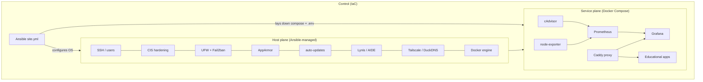
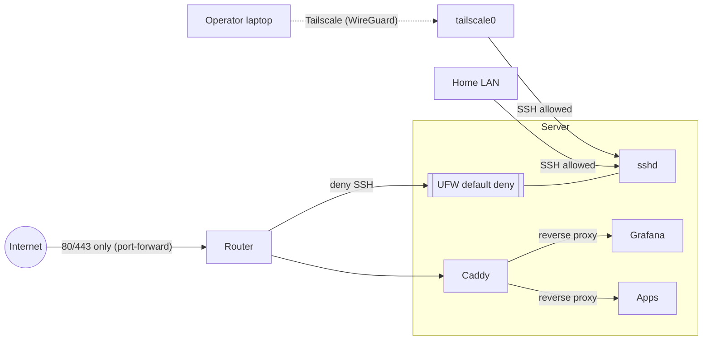
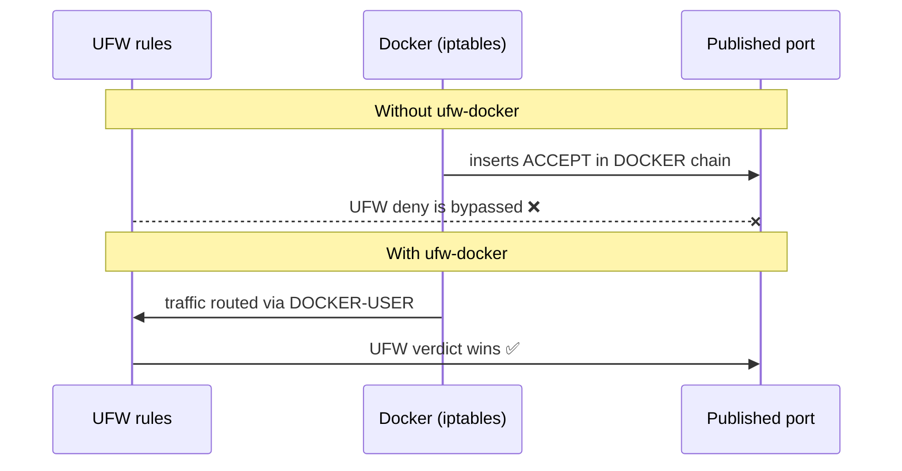
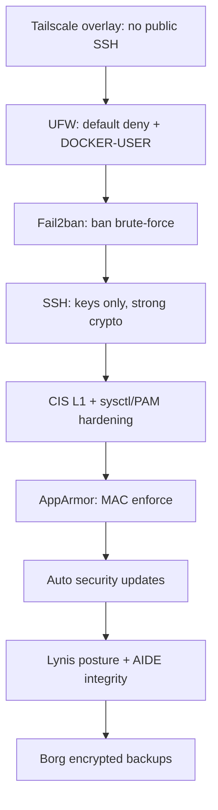

# Architecture & Design Decisions

## 1. Two-plane model

The core decision is separating the **host plane** from the **service plane**.

**Why:** the host changes rarely and wants declarative convergence; services
change often and want the fast Compose loop. Installing apps with Ansible `apt`
would couple them and make rollbacks painful. Ansible *deposits* compose files
and renders `.env` from Vault, Docker *runs* them.

## 2. Network & access model

- **SSH is never exposed to the internet.** UFW allows port 22 only from the LAN
  CIDR and the Tailscale CGNAT range (`100.64.0.0/10`); remote admin goes through
  Tailscale's WireGuard tunnel. This removes public brute-force surface entirely.
- **Only Caddy is public** (80/443). Backends bind to `127.0.0.1` or the internal
  `edge`/`monitoring` Docker networks — never a public host port.

## 3. The Docker × UFW trap (and the fix)

Docker programs iptables directly and **bypasses UFW**, so `docker run -p 8080:80`
is reachable even when UFW denies 8080. We mitigate two ways: publish backends on
`127.0.0.1` + front them with Caddy, and install `ufw-docker` so the `DOCKER-USER`
chain honours UFW. Without this, the firewall is cosmetic.

## 4. Hardening: why CIS **Level 1**, not Level 2

`usg` (Ubuntu Security Guide) applies CIS benchmarks. We pick **Level 1 Server**
deliberately:

- This is a **Desktop LTS** used interactively. Level 2 / STIG remounts `/tmp`,
  disables kernel modules and GDM features, and enforces auditd rules that break
  a GUI workstation.
- Level 1 gives strong, low-friction wins. We then **add** targeted controls
  `usg` doesn't cover well: sysctl network/kernel hardening, `pwquality`,
  `login.defs` aging, strict file perms, module blacklist, core-dump disabling.

Everything is auditable: `usg audit` runs report-only in the play; `usg fix`
applies remediation and is idempotent.

## 5. Defence-in-depth layers

Each layer is independent: compromise of one does not defeat the others.

## 6. Backups

Borg via **borgmatic** to a local encrypted, deduplicated repository (external
drive / NAS mount at `/mnt/backup`). The borgmatic config uses the flat schema
(borgmatic ≥ 1.8, Ubuntu 24.04+). Retention 7 daily / 4 weekly / 6 monthly,
pruned after each run; integrity checks every two weeks. Docker volumes, `/etc`,
`/opt/homelab` and the admin home are included. For databases, borgmatic dumps
them consistently *before* the filesystem snapshot (hook stubs in the config).

> Off-site is the one gap of a local-only repo. `borgmatic` can add a second
> `repositories:` entry (e.g. an SSH target or rclone remote) with no host changes.

## 7. Monitoring

Prometheus scrapes **node-exporter** (host metrics) and **cAdvisor** (per-container
metrics); Grafana visualises them with a pre-provisioned Prometheus datasource
**and a pre-provisioned "Homelab Overview" dashboard** (uptime, running
containers, memory/disk gauges, CPU, network I/O, per-container CPU & memory) that
loads automatically on first boot — no manual import. Grafana is the only
monitoring component reachable externally, and only through Caddy over HTTPS.
Prometheus binds to loopback.

Dashboards live in `compose/monitoring/grafana/provisioning/dashboards/json/`;
drop any additional `*.json` there and it is picked up within 30s.

## 8. Idempotency & testing strategy

Three levels, wired into the Makefile:

1. **Static** — `yamllint` + `ansible-lint` (production profile).
2. **Idempotence** — `make idempotence` runs the play twice and fails if the
   second run reports any `changed`.
3. **Behavioural** — `tests/verify.yml` (in-Ansible asserts) and
   `tests/test_homelab.py` (testinfra: sshd config, UFW active, Fail2ban jail,
   AppArmor enforce, sysctl values, timers enabled, containers running).

## 9. Secrets

Ansible Vault (`inventories/<env>/group_vars/all/vault.yml`, one per
environment) holds the Ubuntu Pro token, DuckDNS token, Grafana password and
Borg passphrase. It renders directly into systemd env files and compose `.env`
at deploy time; nothing secret is committed. Chosen over SOPS/age for zero extra
dependencies in a single-operator homelab.

## 10. Variable layering

Configuration is resolved in three precedence layers (lowest to highest):

1. **`roles/<role>/defaults/main.yml`** — each role owns its tunables and ships
   sane defaults, so a role is self-contained and reusable.
2. **`group_vars/all/main.yml`** — cross-role constants identical in every
   environment (`admin_user`, `ssh_port`, `apt_repo_release`, `stacks_root`).
3. **`inventories/<env>/group_vars/all/`** — per-environment identity, network,
   domain and secrets. This is the only layer that differs between prod and
   staging, and it wins over the two below it.

Select an environment with `-i inventories/production` or `-i inventories/staging`
(`make apply ENV=staging`).
