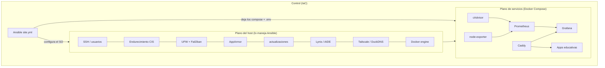
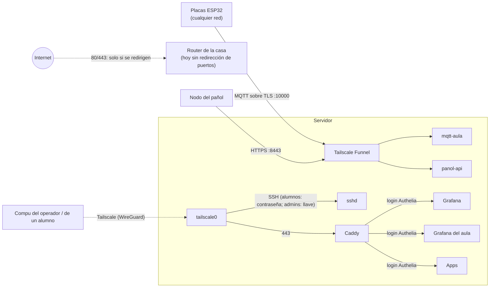
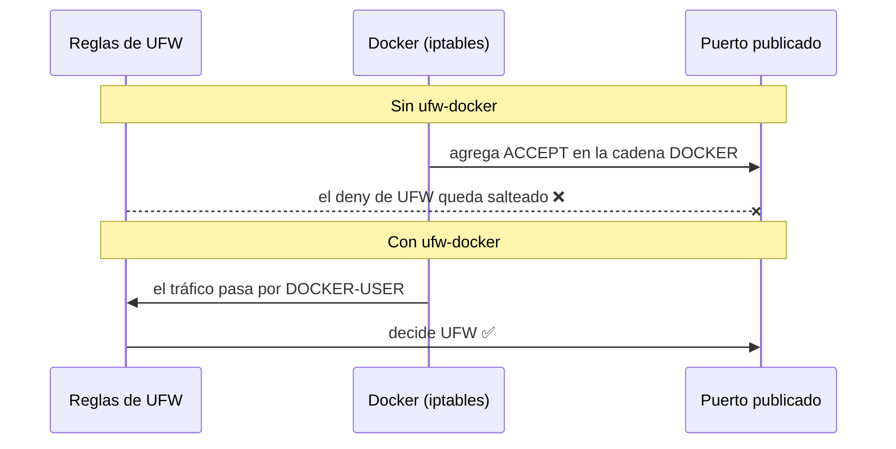
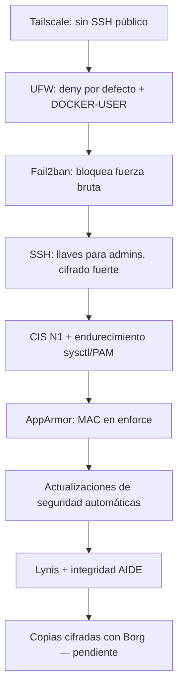

# Arquitectura y decisiones de diseño

Este documento es la referencia técnica del **operador**: los diagramas y el
porqué de cada decisión. La explicación para alumnos, desde cero, está en el
[manual](handbook/index.md) (capítulos 1, 7, 11 y 15).

## 1. Modelo de dos planos

La decisión central es separar el **plano del host** del **plano de servicios**.

```mermaid
flowchart TB
    subgraph Control["Control (IaC)"]
        A[Ansible site.yml] -->|configura el SO| HOST
        A -->|deja los compose + .env| SVC
    end
    subgraph HOST["Plano del host (lo maneja Ansible)"]
        direction LR
        H1[SSH / usuarios] --- H2[Endurecimiento CIS]
        H2 --- H3[UFW + Fail2ban]
        H3 --- H4[AppArmor]
        H4 --- H5[actualizaciones]
        H5 --- H6[Lynis / AIDE]
        H6 --- H7[Tailscale / DuckDNS]
        H7 --- H8[Docker engine]
    end
    subgraph SVC["Plano de servicios (Docker Compose)"]
        direction LR
        S1[Caddy] --> S2[Grafana]
        S1 --> S3[Apps educativas]
        S4[Prometheus] --> S2
        S5[node-exporter] --> S4
        S6[cAdvisor] --> S4
    end
    HOST --> SVC
```

**Por qué:** el host cambia poco y conviene que converja de forma declarativa; los
servicios cambian seguido y conviene el ciclo rápido de Compose. Instalar las apps
con `apt` desde Ansible las acoplaría al host y haría dolorosos los rollbacks.
Ansible **deja** los compose y arma los `.env` desde el vault; Docker los **corre**.

El diagrama muestra el plano de servicios **base**. Encima corren tres
subsistemas, cada uno con su propio documento:

- **Plataforma de aula:** sandbox multiusuario de Docker Compose para los equipos
  (`labctl`, redes por equipo, Postgres/Redis/Mailpit compartidos). Ver
  [classroom-architecture.md](classroom-architecture.md).
- **Aula IoT:** broker MQTT compartido (`mqtt-aula`) para las ESP32 de los
  equipos, y una capa de visualización (Telegraf → VictoriaMetrics → Grafana del
  aula, un folder por equipo). Ver [aula-iot.md](aula-iot.md); la explicación
  para principiantes (capas, decisiones, ciclo de vida) está en los capítulos 11
  y 15 del manual.
- **Pañol IoT:** plano de servicios del control de acceso (Mosquitto + Postgres de
  auditoría + Node-RED) para los nodos ESP32, desplegado por el rol `panol` y
  conectado a EMATP para los tickets. Ver [panol-iot.md](panol-iot.md).

El modelo de réplica es el mismo para todos: un inventario = un sitio; ver
[replicar-y-escalar.md](replicar-y-escalar.md) para montar todo en otra máquina.

## 2. Modelo de red y de acceso

```mermaid
flowchart LR
    Internet(("Internet"))
    Router["Router de la casa<br/>(hoy sin redirección de puertos)"]
    Internet -.->|"80/443: solo si se redirigen"| Router
    Laptop["Compu del operador / de un alumno"] -. "Tailscale (WireGuard)" .-> TS[tailscale0]
    ESP["Placas ESP32<br/>(cualquier red)"] -->|"MQTT sobre TLS :10000"| Funnel["Tailscale Funnel"]
    PanolNode["Nodo del pañol"] -->|"HTTPS :8443"| Funnel
    subgraph Server["Servidor"]
        TS -->|"SSH (alumnos: contraseña; admins: llave)"| SSHD[sshd]
        TS -->|"443"| Caddy
        Funnel --> Broker["mqtt-aula"]
        Funnel --> PanolAPI["panol-api"]
        Caddy -->|"login Authelia"| Grafana & GrafanaAula["Grafana del aula"] & Apps
    end
```

- **El SSH nunca está expuesto a internet.** UFW permite el puerto 22 solo desde
  la red de la casa (`lan_cidr`) y el rango de Tailscale (`100.64.0.0/10`); la
  administración remota va por el túnel WireGuard de Tailscale. Así no hay
  superficie pública para fuerza bruta.
- **Lo web se usa por el tailnet.** Los nombres de DuckDNS resuelven a la IP de
  Tailscale del servidor gracias al Split DNS (rol `dns`). El router actual no
  redirige 80/443, así que nada web es público mientras eso no cambie.
- **Los dispositivos usan Tailscale Funnel** (túnel saliente, sin redirección de
  puertos): `:10000` para el broker del aula (TLS + credencial por equipo + ACL)
  y `:8443` para la API del pañol (token). Funnel solo admite los puertos
  443/8443/10000; el 443 queda para Caddy en el tailnet.
- Los servicios internos escuchan en `127.0.0.1` o en redes internas de Docker:
  nunca en un puerto público del host.

> ⚠️ **Desajuste conocido (octubre 2026):** el servidor se mudó de red
> (192.168.100.x → 192.168.8.x); `lan_cidr` y el broker del pañol (atado a la IP
> de la LAN) siguen apuntando a la red vieja. Anotado en la hoja de ruta del
> capítulo 15 del manual.

## 3. La trampa Docker × UFW (y la solución)

```mermaid
sequenceDiagram
    participant U as Reglas de UFW
    participant D as Docker (iptables)
    participant P as Puerto publicado
    Note over U,P: Sin ufw-docker
    D->>P: agrega ACCEPT en la cadena DOCKER
    U--xP: el deny de UFW queda salteado ❌
    Note over U,P: Con ufw-docker
    D->>U: el tráfico pasa por DOCKER-USER
    U->>P: decide UFW ✅
```

Docker programa `iptables` directamente y **saltea UFW**: un `docker run -p
8080:80` queda accesible aunque UFW niegue el 8080. Se mitiga de dos formas:
publicar los servicios en `127.0.0.1` detrás de Caddy, e instalar `ufw-docker`
para que la cadena `DOCKER-USER` respete a UFW. Sin esto, el firewall es decorativo.

## 4. Endurecimiento: por qué CIS **nivel 1** y no nivel 2

`usg` (Ubuntu Security Guide) aplica los benchmarks CIS. Se eligió **nivel 1
Server** a propósito:

- La máquina es un **Ubuntu Desktop LTS** que también se usa con interfaz
  gráfica. El nivel 2 / STIG remonta `/tmp`, desactiva módulos del kernel y
  funciones de GDM, y fuerza reglas de auditd que rompen un escritorio.
- El nivel 1 da mejoras fuertes con poca fricción. Encima se **suman** controles
  que `usg` no cubre bien: sysctl de red y kernel, `pwquality`, vencimiento en
  `login.defs`, permisos estrictos, módulos bloqueados y core dumps desactivados.

Todo es auditable: `usg audit` corre en modo solo-reporte; `usg fix` aplica la
remediación y es idempotente. `usg` requiere Ubuntu Pro y hoy está **apagado**
(`usg_enabled: false`); los controles complementarios se aplican igual.

## 5. Capas de defensa en profundidad

```mermaid
flowchart TB
    L1[Tailscale: sin SSH público] --> L2[UFW: deny por defecto + DOCKER-USER]
    L2 --> L3[Fail2ban: bloquea fuerza bruta]
    L3 --> L4[SSH: llaves para admins, cifrado fuerte]
    L4 --> L5[CIS N1 + endurecimiento sysctl/PAM]
    L5 --> L6[AppArmor: MAC en enforce]
    L6 --> L7[Actualizaciones de seguridad automáticas]
    L7 --> L8[Lynis + integridad AIDE]
    L8 --> L9[Copias cifradas con Borg — pendiente]
```

Cada capa es independiente: comprometer una no anula a las demás. Detalle para
principiantes en el [capítulo 7 del manual](handbook/07-seguridad.md).

## 6. Copias de seguridad

> ⚠️ **Estado (octubre 2026): diseñadas pero no activas.** No hay un disco
> montado en `/mnt/backup`, así que la guarda del rol las saltea. Mientras tanto
> **no hay copias de seguridad**.

Borg con **borgmatic** hacia un repositorio local cifrado y deduplicado (disco
externo o NAS montado en `/mnt/backup`). La config de borgmatic usa el esquema
plano (borgmatic ≥ 1.8, Ubuntu 24.04+). Retención: 7 diarias / 4 semanales / 6
mensuales, con poda después de cada corrida y chequeo de integridad cada dos
semanas. Incluye los volúmenes de Docker, `/etc`, `/opt/homelab` y el home del
administrador. Las bases de datos se vuelcan de forma consistente **antes** de la
copia del filesystem (ganchos previstos en la config).

> La copia fuera del sitio es el único hueco de un repositorio local. borgmatic
> admite un segundo `repositories:` (un destino SSH o un remoto de rclone) sin
> cambios en el host.

## 7. Monitoreo

Prometheus scrapea **node-exporter** (métricas del host) y **cAdvisor** (métricas
por contenedor); Grafana las muestra con un datasource de Prometheus y tableros
provisionados (*Homelab Overview*, los tres del aula y los del pañol) que aparecen
solos al arrancar. Este Grafana de **operación** es el único componente de
monitoreo alcanzable por Caddy (HTTPS + login, **solo operadores**). Prometheus
escucha en loopback. Los logs (Loki + Alloy) se prenden a pedido (`make logs-on`)
y se apagan solos.

Los alumnos tienen un **Grafana del aula** aparte para sus datos MQTT (ver
[aula-iot.md](aula-iot.md)): una segunda instancia, porque Grafana OSS no tiene
permisos por datasource y la de operación lee la base de auditoría del pañol.

Los tableros de operación están en
`compose/monitoring/grafana/provisioning/dashboards/json/`; cualquier `*.json`
nuevo ahí aparece en unos 30 segundos.

## 8. Idempotencia y estrategia de pruebas

Cuatro niveles (detalle en el [capítulo 8 del manual](handbook/08-pipeline.md)):

1. **Estático** — `yamllint` + `ansible-lint` (perfil production) y tests
   unitarios en Python (política de Compose, tableros, stacks del pañol, del aula
   y de `aula-iot`), en el CI.
2. **Roles aislados** — Molecule (Ubuntu 24.04) para `ddns` y `backups`, en el CI.
3. **Idempotencia** — `make idempotence` corre el play dos veces y falla si la
   segunda reporta algún `changed`.
4. **Comportamiento** — `tests/verify.yml` (asserts dentro de Ansible) y
   testinfra (`tests/test_*.py`: sshd, UFW, Fail2ban, AppArmor, sysctl, timers,
   contenedores, permisos del aula), sobre el servidor real.

## 9. Secretos

Ansible Vault (`inventories/<entorno>/group_vars/all/vault.yml`, uno por entorno)
guarda los tokens (Ubuntu Pro, DuckDNS), las contraseñas (Grafana, aula,
Authelia) y la passphrase de Borg. Se vuelca a los archivos de entorno de systemd
y a los `.env` de Compose al desplegar; nada secreto queda en el repositorio. Se
eligió por sobre SOPS/age para no sumar dependencias en un homelab de un solo
operador.

Los secretos que **no** conviene cifrar en el repo (porque se agregan seguido) se
generan **en el host** la primera vez y quedan solo para `root`:
`/etc/classroom/secrets/` (claves MQTT por equipo, usuarios de servicio, admin
del Grafana del aula) y `/etc/panol/secrets/` (pañol). Así sumar un equipo o un
nodo no obliga a editar el vault.

## 10. Capas de variables

La configuración se resuelve en tres capas de precedencia (de menor a mayor):

1. **`roles/<rol>/defaults/main.yml`** — cada rol trae sus ajustes con valores
   razonables, así es autocontenido y reutilizable.
2. **`group_vars/all/main.yml`** — constantes comunes a todos los entornos
   (`admin_user`, `ssh_port`, `apt_repo_release`, `stacks_root`).
3. **`inventories/<entorno>/group_vars/all/`** — identidad, red, dominio, roster
   del aula y secretos de cada entorno. Es la única capa que cambia entre
   producción y staging, y le gana a las otras dos.

El entorno se elige con `-i inventories/production` o `-i inventories/staging`
(`make apply ENV=staging`).
