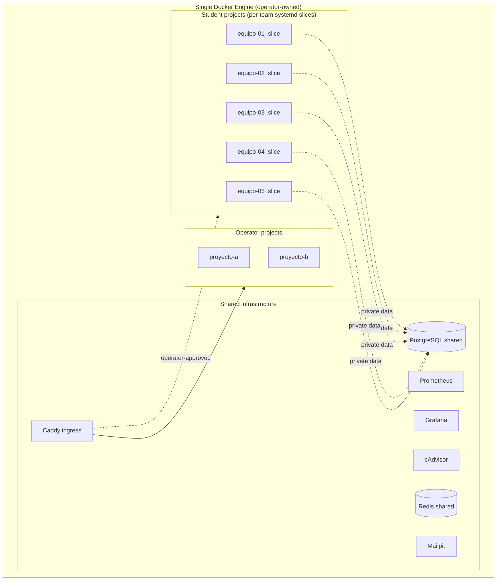
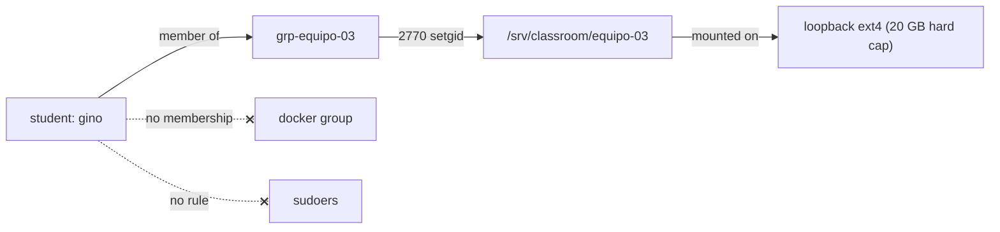

# Classroom Platform — Architecture

A multi-user **Docker Compose teaching lab** layered onto the existing homelab: 5
student teams develop, deploy and test real Compose stacks (the evaluation target
is a full IoT stack — **Mosquitto + Node-RED + n8n**) on a **single, shared,
operator-owned Docker Engine**, without ever getting Docker, sudo, or socket
access, and without being able to destabilise the server or each other.

> Status: **proposal / design of record.** Implemented in phases (see
> [Roadmap](#roadmap)). Confirmed decisions are marked ✅.

---

## 1. Goals & constraints

- **Single Docker Engine**, administered only by the operator. No per-student
  daemon, no Rootless-per-user, no Kubernetes/Nomad/Portainer, no heavy control
  plane. ✅
- **Hardware is modest and shared** — Intel i5-4460 (4 cores), **15 GiB RAM**,
  256 GB SSD, also used as a desktop/family workstation. Every decision optimises
  RAM/CPU/disk.
- **Reproducible, idempotent, Ansible-managed, secure, pedagogically clear.**
- Students interact **only** through one tool: `labctl`. ✅

## 2. Three planes on one engine



The three planes are isolated by **Linux users/groups**, **filesystem
permissions**, and **cgroup v2 systemd slices** — not by separate daemons.

## 3. Teams & the Linux model

Teams (confirmed) ✅:

| Team | Members | Group |
|---|---|---|
| equipo-01 | jessi | `grp-equipo-01` |
| equipo-02 | alan, gabi | `grp-equipo-02` |
| equipo-03 | santi, mijael, gino | `grp-equipo-03` |
| equipo-04 | mariano, jorge | `grp-equipo-04` |
| equipo-05 | guido | `grp-equipo-05` |

Defined declaratively in group_vars (`classroom_teams`), so onboarding/offboarding
is a one-line change re-applied by Ansible.

- Each student = a normal Linux user (uid ≥ 3000), shell access, **no sudo, not
  in the `docker` group, no access to the Docker socket**. ✅
- Each team = a Linux group `grp-equipo-NN`; members belong to it.
- Project dir `/srv/classroom/equipo-NN`:
  - owner `root`, group `grp-equipo-NN`, mode **2770** (setgid → new files inherit
    the team group), so **no cross-team access**. ✅
  - Backed by a **per-team loopback filesystem** (hard disk quota, see §6).



## 4. `labctl` — the only student interface ✅

Students run, from inside their team dir:

```
cd /srv/classroom/equipo-03
labctl up          # validate → enforce policy → deploy inside the team slice
labctl ps | logs | usage | status | restart | down | validate
```

### Trust boundary: client + privileged broker daemon

`labctl` (unprivileged, run by the student) never touches Docker. It talks to
**`labctld`**, a small root/docker-capable systemd service, over a
group-restricted Unix socket. The daemon is the **only** thing that can drive the
engine, and it only does what policy allows. **No setuid, no student sudo.** ✅
(Language: **Python** ✅.)

```mermaid
sequenceDiagram
  participant S as student (grp-equipo-03)
  participant C as labctl (unprivileged)
  participant D as labctld (daemon, docker-capable)
  participant E as Docker Engine
  S->>C: labctl up   (cwd=/srv/classroom/equipo-03)
  C->>C: resolve user→team, confirm cwd is the team's own dir
  C->>D: request{team, dir, action} over /run/labctld.sock (0660, grp)
  D->>D: re-check caller uid∈team; jail path to /srv/classroom/equipo-03
  D->>D: validate compose against policy (§5)
  D->>D: inject cgroup_parent = classroom-equipo-03.slice (§6)
  D->>E: docker compose -p equipo-03 up -d
  D->>D: append audit log (who/when/what/result)
  D-->>C: result (+ streamed logs)
  C-->>S: outcome
```

Every request is audited to `/var/log/labctl/audit.log`. `labctl` refuses to act
outside the caller's own team directory.

## 5. Docker Compose policy ✅

`labctld` **rejects** any Compose that contains:

- `privileged: true`, `network_mode: host`, `pid: host`, `ipc: host`
- the Docker socket (`/var/run/docker.sock`) or dangerous `cap_add`
- bind mounts of `/`, `/etc`, or anything **outside** the team project dir
- images with `:latest` or no tag
- missing resource limits (`cpus`, `memory`), missing log rotation
- ports published on `0.0.0.0` or outside the allowed range
- more than **5 services** per team

It **requires** on every service: CPU limit, memory limit, `pids_limit`, log
rotation, `restart` policy, and (where sensible) a `healthcheck`. Publishing is
allowed **only** on `127.0.0.1` (Caddy is the sole ingress, §7).

**IoT note (evaluation stack):** Mosquitto, Node-RED and n8n fit within 5
services and the RAM ceiling — especially if n8n/Node-RED use the **shared
Postgres** instead of their own DB. Inter-service traffic (Node-RED ⇄ Mosquitto
⇄ n8n) flows on the team's private Compose network. External MQTT/HTTP access, if
needed for grading, is granted per-team by the operator via the exposure registry
(§7), never by the student.

## 6. Resource model — hard ceilings on modest hardware ✅

Budget on the real box (**15 GiB / 4 cores**, measured):

| Consumer | RAM |
|---|---|
| OS + desktop / family (Firefox, streaming) | ~4.0 GiB reserved |
| Shared infra (Caddy, Prom, Grafana, exporters, homepage, **+ Postgres, Redis, Mailpit**) | ~2.5 GiB |
| 5 teams × 1.25 GiB max | 6.25 GiB |
| **Peak total** | **~12.75 / 15 GiB** (≈2 GiB headroom) |

Per team: **1 CPU** max, **1 GiB** recommended / **1.25 GiB** hard, **≤5
services**, **15 GB soft / 20 GB hard** disk.

**Two enforcement layers:**

1. **systemd slice per team** (cgroup v2, driver already `systemd` ✅):
   `classroom-equipo-NN.slice` with `MemoryMax=1.25G`, `MemoryHigh=1G`,
   `CPUQuota=100%`, `TasksMax`. `labctld` runs each team's containers under
   `cgroup_parent: classroom-equipo-NN.slice`, so the **kernel caps the whole
   team** regardless of what the student wrote. CPU is oversubscribed 5:4 on
   purpose (bursty lab loads); the desktop slice keeps priority.
2. **Compose-level limits**, checked by policy (§5) — teaches students to write
   correct limits, and bounds each individual service.

**Disk (hard):** each team dir is a **loopback filesystem** sized to the 20 GB
hard cap; the policy forces persistent data to live **inside** the project dir,
so a team physically cannot exceed its cap. The 15 GB **soft** threshold is a
monitored warning surfaced by `labctl usage` and Grafana. (Shared image layers
live in `/var/lib/docker` and are deliberately deduplicated across teams.)

## 7. Publication — operator-controlled ingress ✅

Students **never** expose public ports; Compose may only publish on `127.0.0.1`.
Caddy is the single ingress. A declarative registry decides what the world sees:

```yaml
student_exposures:
  - team: equipo-01
    hostname: equipo01.lucasland.duckdns.org   # real base domain
    service: web
    port: 8080
    enabled: true
```

Ansible renders these into Caddy vhosts. The **operator** flips `enabled`; nothing
is public until then.

## 8. Observability — provisioned as code

Extend the existing Prometheus + Grafana + cAdvisor with three dashboards:

- **Classroom Overview** — teams, members, CPU/RAM/disk, container counts,
  restarts, unhealthy, published projects.
- **Team Detail** — one team: every container, CPU/mem/disk/net, uptime, recent
  logs, restarts.
- **Capacity Planning** — free RAM/CPU/disk, image growth, per-team utilisation.

Container metrics come from cAdvisor; per-team aggregation uses the
`classroom-equipo-NN.slice` cgroup path / Compose project labels.

## 9. Security summary

Caddy is the only public entry; Prometheus, node-exporter, cAdvisor stay private;
Grafana sits behind Caddy. Students have no Docker/sudo/socket. Every deploy is
policy-validated and audited. Team isolation is enforced at three layers: Linux
perms (2770+setgid), cgroup slices, and the loopback filesystem.

## 10. Onboarding / offboarding

- **Onboard**: add the member to `classroom_teams` in group_vars, `make apply
  --tags classroom`. Ansible creates the user, group membership, home, and (for a
  new team) the dir, slice, loopback and shared-service credentials.
- **Offboard**: remove the member (or set `state: absent`); re-apply. Team data is
  retained or archived per policy.

## Roadmap

Atomic commits on `feat/classroom-platform`, one reviewable PR:

1. **Base** — `classroom` role: users, groups, `/srv/classroom/*` (2770+setgid),
   per-team loopback quotas, systemd slices, `classroom_teams` registry. + tests.
2. **`labctl` + `labctld`** — Python client + broker daemon + Compose policy
   validator + audit. + unit tests for the validator (reject privileged, socket,
   host net, missing limits, bad ports, >5 services…).
3. **Shared services** — Postgres (per-team DB/user/pass), Redis (per-team
   namespace), Mailpit; documented tenant contract; credentials generated and
   delivered to each team dir.
4. **Publication** — `student_exposures` registry → Caddy vhosts.
5. **Observability** — the three Grafana dashboards as provisioned JSON.
6. **Docs & tests** — `labctl.md`, `student-guide.md`, `operator-guide.md`,
   `docker-compose-policy.md`, `resource-model.md`; testinfra for permissions,
   isolation, policy rejection, limits, ports; idempotence; CI green.

Nothing is claimed "working" without a test that demonstrates it.
