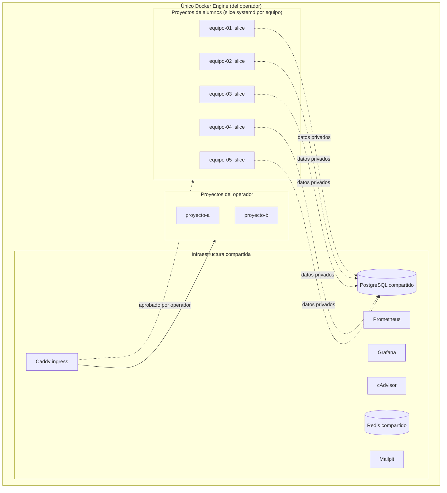
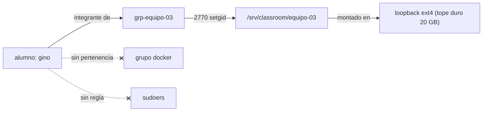

# Plataforma de Aula — Arquitectura

Un **laboratorio de Docker Compose multiusuario** montado sobre el homelab
existente: 5 equipos de alumnos desarrollan, despliegan y prueban stacks de
Compose reales (el objetivo de evaluación es un stack IoT completo —
**Mosquitto + Node-RED + n8n**) sobre un **único Docker Engine compartido y
administrado por el operador**, sin obtener nunca acceso a Docker, sudo ni al
socket, y sin poder desestabilizar el servidor ni afectarse entre equipos.

> Estado: **propuesta / diseño de referencia.** Se implementa por fases (ver
> [Hoja de ruta](#hoja-de-ruta)). Las decisiones confirmadas van marcadas con ✅.

---

## 1. Objetivos y restricciones

- **Un único Docker Engine**, administrado solo por el operador. Sin daemon por
  alumno, sin Rootless por usuario, sin Kubernetes/Nomad/Portainer, sin plano de
  control pesado. ✅
- **El hardware es modesto y compartido** — Intel i5-4460 (4 núcleos),
  **15 GiB de RAM**, SSD de 256 GB, usado también como workstation de
  escritorio/familiar. Cada decisión optimiza RAM/CPU/disco.
- **Reproducible, idempotente, administrado con Ansible, seguro y claro
  pedagógicamente.**
- Los alumnos interactúan **únicamente** a través de una herramienta: `labctl`. ✅

## 2. Tres planos sobre un solo engine



Los tres planos se aíslan mediante **usuarios/grupos de Linux**, **permisos de
archivos** y **slices systemd de cgroup v2** — no con daemons separados.

## 3. Equipos y modelo de Linux

Equipos (confirmado) ✅:

| Equipo | Integrantes | Grupo |
|---|---|---|
| equipo-01 | jessi | `grp-equipo-01` |
| equipo-02 | alan, gabi | `grp-equipo-02` |
| equipo-03 | santi, mijael, gino | `grp-equipo-03` |
| equipo-04 | mariano, jorge | `grp-equipo-04` |
| equipo-05 | guido | `grp-equipo-05` |

Se definen de forma declarativa en group_vars (`classroom_teams`), así que dar de
alta/baja es cambiar una línea y re-aplicar con Ansible.

- Cada alumno = un usuario Linux normal (uid ≥ 3000), con acceso a shell, **sin
  sudo, fuera del grupo `docker`, sin acceso al socket de Docker**. ✅
- Cada equipo = un grupo Linux `grp-equipo-NN`; sus integrantes pertenecen a él.
- Directorio del proyecto `/srv/classroom/equipo-NN`:
  - propietario `root`, grupo `grp-equipo-NN`, modo **2770** (setgid → los
    archivos nuevos heredan el grupo del equipo), por lo que **no hay acceso
    entre equipos**. ✅
  - respaldado por un **filesystem loopback por equipo** (cuota de disco dura,
    ver §6).



## 4. `labctl` — la única interfaz del alumno ✅

Los alumnos ejecutan, desde dentro del directorio de su equipo:

```
cd /srv/classroom/equipo-03
labctl up          # valida → aplica política → despliega dentro del slice del equipo
labctl ps | logs | usage | status | restart | down | validate
```

### Frontera de confianza: cliente + daemon broker privilegiado

`labctl` (sin privilegios, lo corre el alumno) nunca toca Docker. Habla con
**`labctld`**, un pequeño servicio systemd con acceso a docker (root/grupo
docker), a través de un socket Unix restringido por grupo. El daemon es lo
**único** que puede manejar el engine, y solo hace lo que la política permite.
**Sin setuid, sin sudo para el alumno.** ✅ (Lenguaje: **Python** ✅.)

```mermaid
sequenceDiagram
  participant S as alumno (grp-equipo-03)
  participant C as labctl (sin privilegios)
  participant D as labctld (daemon, con docker)
  participant E as Docker Engine
  S->>C: labctl up   (cwd=/srv/classroom/equipo-03)
  C->>C: resuelve usuario→equipo, confirma que el cwd es el dir propio del equipo
  C->>D: pedido{equipo, dir, acción} por /run/labctld.sock (0660, grupo)
  D->>D: revalida uid del que llama ∈ equipo; enjaula el path a /srv/classroom/equipo-03
  D->>D: valida el compose contra la política (§5)
  D->>D: inyecta cgroup_parent = classroom-equipo-03.slice (§6)
  D->>E: docker compose -p equipo-03 up -d
  D->>D: agrega registro de auditoría (quién/cuándo/qué/resultado)
  D-->>C: resultado (+ logs en streaming)
  C-->>S: resultado
```

Cada pedido se audita en `/var/log/labctl/audit.log`. `labctl` se niega a actuar
fuera del directorio del propio equipo del que llama.

## 5. Política de Docker Compose ✅

`labctld` **rechaza** cualquier Compose que contenga:

- `privileged: true`, `network_mode: host`, `pid: host`, `ipc: host`
- el socket de Docker (`/var/run/docker.sock`) o `cap_add` peligrosas
- bind mounts de `/`, `/etc`, o cualquier cosa **fuera** del directorio del equipo
- imágenes con `:latest` o sin tag
- ausencia de límites de recursos (`cpus`, `memory`), ausencia de rotación de logs
- puertos publicados en `0.0.0.0` o fuera del rango permitido
- más de **5 servicios** por equipo

**Exige** en cada servicio, bajo `deploy.resources.limits`: `cpus`, `memory` y
`pids` (los top-level `mem_limit`/`pids_limit` se rechazan porque chocan con el
bloque `deploy` en Compose v2), además de rotación de logs y política `restart`,
y (cuando tenga sentido) un `healthcheck`.
La publicación se permite **solo** en `127.0.0.1` (Caddy es el único ingress, §7).

**Nota IoT (stack de evaluación):** Mosquitto, Node-RED y n8n entran en 5
servicios y en el techo de RAM — sobre todo si n8n/Node-RED usan el **Postgres
compartido** en lugar de su propia base. El tráfico entre servicios (Node-RED ⇄
Mosquitto ⇄ n8n) va por la red privada del Compose del equipo. El acceso externo
MQTT/HTTP, si hace falta para corregir, lo habilita el operador por equipo vía el
registro de publicación (§7), nunca el alumno.

## 6. Modelo de recursos — techos duros en hardware modesto ✅

Presupuesto sobre la máquina real (**15 GiB / 4 núcleos**, medido):

| Consumidor | RAM |
|---|---|
| SO + escritorio / familia (Firefox, streaming) | ~4.0 GiB reservados |
| Infra compartida (Caddy, Prom, Grafana, exporters, homepage, **+ Postgres, Redis, Mailpit**) | ~2.5 GiB |
| 5 equipos × 1.25 GiB máx | 6.25 GiB |
| **Total pico** | **~12.75 / 15 GiB** (≈2 GiB de aire) |

Por equipo: **1 CPU** máx, **1 GiB** recomendado / **1.25 GiB** duro, **≤5
servicios**, **15 GB soft / 20 GB hard** de disco.

**Dos capas de aplicación de límites:**

1. **Slice systemd por equipo** (cgroup v2, driver ya en `systemd` ✅):
   `classroom-equipo-NN.slice` con `MemoryMax=1.25G`, `MemoryHigh=1G`,
   `CPUQuota=100%`, `TasksMax`. `labctld` corre los contenedores del equipo bajo
   `cgroup_parent: classroom-equipo-NN.slice`, así el **kernel capa a todo el
   equipo** sin importar lo que haya escrito el alumno. La CPU se sobre-suscribe
   5:4 a propósito (cargas de lab bursty); el slice del escritorio mantiene
   prioridad.
2. **Límites en el Compose**, verificados por la política (§5) — le enseña al
   alumno a escribir límites correctos y acota cada servicio individual.

**Disco (duro):** el directorio de cada equipo es un **filesystem loopback**
dimensionado al tope duro de 20 GB; la política obliga a que los datos
persistentes vivan **dentro** del directorio del proyecto, así un equipo no puede
físicamente exceder su cupo. El umbral **soft** de 15 GB es una advertencia
monitoreada que aparece en `labctl usage` y en Grafana. (Las capas de imagen
compartidas viven en `/var/lib/docker` y se deduplican deliberadamente entre
equipos.)

## 7. Publicación — ingress controlado por el operador ✅

Los alumnos **nunca** exponen puertos públicos; el Compose solo puede publicar en
`127.0.0.1`. Caddy es el único ingress. Un registro declarativo decide qué ve el
mundo:

```yaml
student_exposures:
  - team: equipo-01
    hostname: equipo01.lucasland.duckdns.org   # dominio base real
    service: web
    port: 8080
    enabled: true
```

Ansible los renderiza en vhosts de Caddy. El **operador** activa `enabled`; nada
es público hasta entonces.

## 8. Observabilidad — provisionada como código

Extender el Prometheus + Grafana + cAdvisor existente con tres dashboards:

- **Classroom Overview** — equipos, integrantes, CPU/RAM/disco, cantidad de
  contenedores, reinicios, unhealthy, proyectos publicados.
- **Team Detail** — un equipo: cada contenedor, CPU/mem/disco/red, uptime, logs
  recientes, reinicios.
- **Capacity Planning** — RAM/CPU/disco libres, crecimiento de imágenes,
  utilización por equipo.

Las métricas de contenedores vienen de cAdvisor; la agregación por equipo usa la
ruta cgroup del `classroom-equipo-NN.slice` / las labels del proyecto Compose.

## 9. Resumen de seguridad

Caddy es la única entrada pública; Prometheus, node-exporter y cAdvisor quedan
privados; Grafana detrás de Caddy. Los alumnos no tienen Docker/sudo/socket. Cada
despliegue se valida por política y se audita. El aislamiento entre equipos se
aplica en tres capas: permisos Linux (2770+setgid), slices cgroup y el filesystem
loopback.

## 10. Onboarding / offboarding

- **Alta**: agregar al integrante en `classroom_teams` en group_vars, `make apply
  --tags classroom`. Ansible crea el usuario, la pertenencia al grupo, el home y
  (para un equipo nuevo) el directorio, el slice, el loopback y las credenciales
  de los servicios compartidos.
- **Baja**: quitar al integrante (o poner `state: absent`); re-aplicar. Los datos
  del equipo se conservan o archivan según la política.

## Hoja de ruta

Commits atómicos en `feat/classroom-platform`, un PR revisable:

1. **Base** — rol `classroom`: usuarios, grupos, `/srv/classroom/*`
   (2770+setgid), cuotas loopback por equipo, slices systemd, registro
   `classroom_teams`. + tests.
2. **`labctl` + `labctld`** — cliente Python + daemon broker + validador de
   política de Compose + auditoría. + tests unitarios del validador (rechazar
   privileged, socket, host net, límites faltantes, puertos malos, >5
   servicios…).
3. **Servicios compartidos** — Postgres (DB/usuario/pass por equipo), Redis
   (namespace por equipo), Mailpit; contrato de tenancy documentado; credenciales
   generadas y entregadas al directorio de cada equipo.
4. **Publicación** — registro `student_exposures` → vhosts de Caddy.
5. **Observabilidad** — los tres dashboards de Grafana como JSON provisionado.
6. **Docs y tests** — `labctl.md`, `student-guide.md`, `operator-guide.md`,
   `docker-compose-policy.md`, `resource-model.md` (todos en español); testinfra
   para permisos, aislamiento, rechazo de política, límites, puertos;
   idempotencia; CI verde.

Nada se declara "funcionando" sin un test que lo demuestre.
