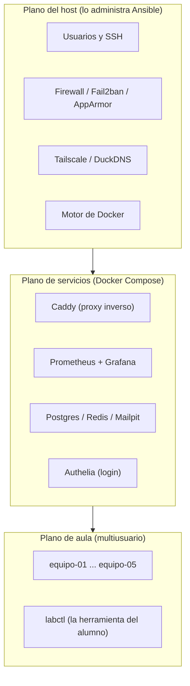
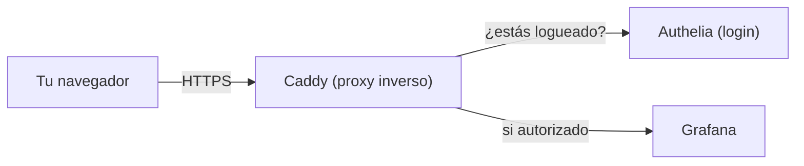
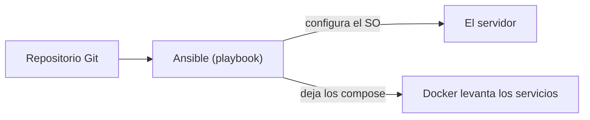

# 1. Visión general

🎯 **Objetivo:** entender **qué es** este laboratorio, de qué partes está hecho y
cómo se relacionan, sin entrar todavía en los detalles.

🧩 **Prerequisitos:** ninguno.

🆕 **Conceptos nuevos:** servidor, plano (capa), host, servicio, contenedor,
proxy inverso, infraestructura como código.

---

## 📖 ¿Qué es este laboratorio?

Es **una sola computadora** (un servidor) que hace tres trabajos a la vez:

1. **Servidor personal** del dueño (dashboards, monitoreo, proyectos propios).
2. **Laboratorio para alumnos**: varios equipos despliegan sus propias
   aplicaciones con Docker, aislados entre sí.
3. **Workstation ocasional** (a veces se usa como escritorio con Firefox, etc.).

> **¿Qué es un servidor?** Una computadora que está siempre prendida y ofrece
> "servicios" a otras computadoras por la red (mostrar una web, guardar datos,
> etc.). No tiene nada mágico: es una PC común con un rol.

El hardware es modesto a propósito (un Intel i5 de 4 núcleos, 15 GiB de RAM, un
disco SSD). Todo el diseño está pensado para **rendir en hardware limitado**.

## Los tres "planos"

Para no hacer un choclo, el sistema se organiza en **tres planos** (podés pensar
"capas" o "áreas de responsabilidad"). Cada uno resuelve un problema distinto:

- **Plano del host:** el sistema operativo y su seguridad. Cambia poco y se
  quiere "declarativo" (definido en archivos). Lo maneja **Ansible**.
- **Plano de servicios:** las aplicaciones que corren en **contenedores** (Caddy,
  Grafana…). Cambian seguido, y por eso usan **Docker Compose**, que permite
  prender/apagar rápido.
- **Plano de aula:** los proyectos de los alumnos, cada equipo aislado, manejados
  con una herramienta propia (`labctl`).

> **Idea central:** separar lo que cambia lento (el host) de lo que cambia rápido
> (los servicios). Si mezclás todo, cada cambio chico te obliga a tocar el
> sistema entero.

## ¿Cómo entra el tráfico? (el camino de una petición)

Cuando abrís `https://grafana.tudominio` desde el navegador, pasa esto:

**Caddy** es la **única puerta de entrada**. Recibe todo el tráfico web, se
encarga del **HTTPS** (el candado del navegador), pregunta a **Authelia** si el
usuario tiene permiso, y recién ahí manda la petición al servicio correcto
(Grafana, Prometheus, etc.). A esto se le llama **proxy inverso** (lo vemos en
detalle en el [capítulo 5](05-servicios.md)).

## ¿Cómo se administra todo? (Infraestructura como Código)

No se configura el server "a mano". Todo está escrito en archivos de texto
(**Ansible**) que se pueden versionar en Git y volver a aplicar. A esto se le
llama **Infraestructura como Código (IaC)**.

La ventaja: si el server se rompe, se puede **reconstruir** corriendo los mismos
archivos. Y como es **idempotente** (aplicarlo dos veces da el mismo resultado),
es seguro re-ejecutarlo.

## ¿Cómo se accede de forma segura?

- **SSH** para entrar a la terminal del server (administración).
- **Tailscale** crea una red privada propia (una "VPN" simple) para llegar al
  server desde cualquier lado sin exponerlo a Internet.
- **DuckDNS** le da un nombre de dominio gratis (para que no tengas que recordar
  números de IP).

Todo esto se explica en los capítulos [7 (Seguridad)](07-seguridad.md) y
[5 (Servicios)](05-servicios.md).

---

## 🧠 Ideas clave

- El laboratorio es **una sola computadora** con tres roles.
- Se organiza en **tres planos**: host, servicios y aula.
- **Caddy** es la única puerta web; **Ansible** administra todo como código.
- Se separa lo que cambia lento de lo que cambia rápido.

## ⚠️ Errores comunes

- Pensar que "servidor" es algo exótico: es una PC con un rol.
- Confundir el **plano del host** (SO, con Ansible) con el **de servicios**
  (contenedores, con Compose). Son mundos distintos.
- Creer que Caddy "es" la web: Caddy solo **enruta** hacia los servicios.

## ❓ Preguntas de repaso

1. ¿Cuáles son los tres planos y qué problema resuelve cada uno?
2. ¿Por qué se separa el host de los servicios?
3. ¿Qué hace Caddy cuando llega una petición web?
4. ¿Qué quiere decir que Ansible sea "idempotente"?

## 🛠️ Ejercicios

1. Dibujá, con tus palabras, el camino de una petición desde el navegador hasta
   Grafana.
2. Listá tres cosas que estén en el "plano del host" y tres en el "de servicios".
