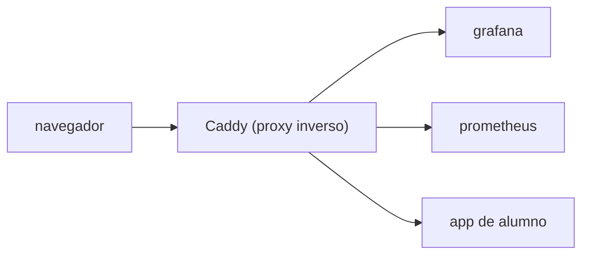

# 2. Fundamentos (computación, Linux y redes)

🎯 **Objetivo:** aprender las palabras básicas que se usan en todo el resto del
libro. Es un capítulo de "diccionario explicado". Podés volver a él cuando algo
no te cierre.

🧩 **Prerequisitos:** ninguno.

🆕 **Conceptos nuevos:** proceso, servicio, daemon, kernel, systemd, boot,
usuario, grupo, permisos, filesystem, inode, IP, puerto, TCP, DNS, HTTPS.

---

## Parte A — Computación básica

### ¿Qué es un proceso?
Un **programa en ejecución**. Cuando abrís Firefox, se crea un *proceso* Firefox.
El sistema operativo le da memoria (RAM) y turnos de CPU. Cada proceso tiene un
número (**PID**, Process ID). Un programa guardado en disco es solo un archivo;
cuando lo corrés, se vuelve un proceso.

### ¿Qué es un servicio?
Un proceso que corre **en segundo plano y de forma permanente** para ofrecer algo
(una web, una base de datos). No tiene ventana; lo usás por la red o por
comandos. En este proyecto, Grafana, Prometheus o la base de datos son servicios.

### ¿Qué es un daemon?
Es **otra palabra para "servicio de fondo"** en el mundo Unix/Linux. Los daemons
suelen terminar en `d`: `sshd` (el de SSH), `dockerd` (el de Docker),
`tailscaled` (el de Tailscale). Cuando veas un nombre con `d` al final, pensá
"servicio de fondo".

### ¿Qué es el kernel?
El **núcleo** del sistema operativo: el programa que habla directamente con el
hardware (CPU, memoria, disco, red) y reparte esos recursos entre los procesos.
En Linux, el kernel se llama, justamente, **Linux**. Todo lo demás (comandos,
servicios) corre *encima* del kernel.

### ¿Qué es el boot?
El **arranque**: la secuencia que ocurre cuando prendés la máquina, desde que el
hardware se inicializa hasta que el sistema operativo está listo y los servicios
levantados. "Al boot" = "cuando arranca la máquina".

### ¿Qué es systemd?
El **administrador de servicios** de las distribuciones Linux modernas (como
Ubuntu). Es el primer proceso que arranca (PID 1) y se encarga de **prender los
servicios en orden** durante el boot, reiniciarlos si se caen, y manejarlos.
Cuando escribís `systemctl start docker` o `systemctl status ssh`, le estás
hablando a systemd.

> En este proyecto, muchas cosas son **unidades de systemd**: los timers de
> backup, el daemon `labctld`, los "slices" de recursos por equipo (cap. 9).

---

## Parte B — Linux

Linux organiza **todo como archivos** y controla el acceso con **usuarios,
grupos y permisos**.

### Usuarios y grupos
Un **usuario** es una cuenta (una persona o un servicio): `homelab`, `ansible`,
`jessi`. Un **grupo** junta usuarios que comparten permisos: `grp-equipo-01`,
`docker`, `sudo`. Un usuario puede estar en varios grupos.

- Cada usuario tiene un número (**UID**) y cada grupo un **GID**.
- **`root`** es el superusuario (UID 0): puede hacer todo. Por eso se lo evita.

### Permisos, `chmod` y `chown`
Cada archivo/carpeta tiene permisos para tres categorías: **dueño (owner)**,
**grupo** y **otros**. Cada categoría puede tener: **leer (r)**, **escribir (w)**
y **ejecutar (x)**.

Se escriben como un número de tres dígitos (uno por categoría), donde
`r=4, w=2, x=1` se suman:

- `750` = dueño `rwx` (7), grupo `r-x` (5), otros nada (0).
- `2770` = como 770 pero con un bit especial adelante (ver **setgid**).

Comandos:

- **`chmod`** cambia los permisos: `chmod 750 archivo`.
- **`chown`** cambia el dueño/grupo: `chown root:grp-equipo-01 carpeta`.

### setgid (el "2" adelante)
El bit **setgid** en una carpeta hace que **los archivos nuevos hereden el grupo
de la carpeta** (en vez del grupo del usuario que los crea). En este proyecto,
las carpetas de cada equipo son `2770` con setgid: así todo lo que crea un alumno
queda con el grupo del equipo, y **nadie de otro equipo puede entrar**.

### `sudo`
Permite a un usuario común ejecutar un comando **como root**, puntualmente. En
este proyecto:

- La cuenta `ansible` tiene `sudo` **sin contraseña** (para que la automatización
  funcione sola).
- La cuenta `homelab` (vos) tiene `sudo` **con contraseña** (más seguro para una
  cuenta interactiva).
- Los alumnos **no tienen sudo** (por seguridad).

### PATH y variables de entorno
Una **variable de entorno** es un valor con nombre que el sistema le pasa a los
procesos (por ejemplo `TZ=America/Argentina/Buenos_Aires`). El **`PATH`** es una
variable especial: la lista de carpetas donde el sistema busca los comandos. Por
eso a veces `ansible-playbook` "no se encuentra": no está en el `PATH`, y hay que
llamarlo por su ruta completa (`~/homelab/.venv/bin/ansible-playbook`).

### Filesystem, jerarquía e inode
El **filesystem** (sistema de archivos) es cómo se organizan los datos en el
disco: una jerarquía de carpetas que arranca en `/` (la raíz). Algunas ramas
importantes:

- `/etc` → configuración del sistema.
- `/home` → carpetas de los usuarios.
- `/var` → datos variables (logs, etc.).
- `/opt` → software opcional (acá viven los stacks de Docker: `/opt/homelab/stacks`).
- `/srv` → datos servidos (acá viven los proyectos de los alumnos:
  `/srv/classroom`).

Un **inode** es la ficha interna que el filesystem usa para cada archivo (guarda
permisos, tamaño, y **dónde** están los datos), identificada por un número. El
*nombre* del archivo apunta a un inode. Esto importa por un detalle real de este
proyecto: cuando Ansible "reemplaza" un archivo, en realidad crea uno **nuevo**
(nuevo inode) y le pone el nombre viejo. Si un contenedor tenía montado el archivo
por su inode, sigue viendo el viejo hasta que se reinicia (nos pasó con el
Caddyfile — ver [cap. 10](10-casos-practicos.md)).

### Logs y `journalctl`
Un **log** es un registro de lo que fue pasando (mensajes de un servicio). En
systemd, los logs se consultan con **`journalctl`** (ej: `journalctl -u ssh`
muestra los del servicio SSH). Docker tiene sus propios logs: `docker logs
<contenedor>`.

---

## Parte C — Redes

### ¿Qué es una IP?
Una **dirección IP** es el "número de teléfono" de una computadora en una red
(ej: `192.168.100.48`). Sirve para que los datos sepan a quién llegar.

### ¿Qué es una IP privada?
Los rangos como `192.168.x.x`, `10.x.x.x` o `172.16-31.x.x` son **privados**:
solo existen dentro de tu red local (casa, aula). No son alcanzables desde
Internet. Tu router tiene además una **IP pública** (la que te ve el mundo).

### ¿Qué es NAT?
**Network Address Translation.** Es el truco del router para que muchos
dispositivos con IP privada compartan una sola IP pública. Cuando salís a
Internet, el router traduce tu IP privada por la pública (y al revés). Por eso,
para que alguien de afuera llegue a tu server, hay que configurar un
**port-forward** (redirigir un puerto de la IP pública hacia la IP privada del
server).

### ¿Qué es un puerto?
Si la IP es el teléfono, el **puerto** es el interno. Una misma computadora ofrece
muchos servicios, cada uno en un puerto: **80** (web HTTP), **443** (web HTTPS),
**22** (SSH), **5432** (Postgres), **9090** (Prometheus)… Publicar algo "en
`127.0.0.1:8080`" significa: en el puerto 8080, pero **solo accesible desde la
propia máquina** (`127.0.0.1` = "yo mismo", loopback).

### ¿Qué es TCP?
**Transmission Control Protocol.** La forma más común de enviar datos por la red
de manera **confiable** (verifica que todo llegue y en orden). La web, SSH y las
bases de datos usan TCP. (Hay otro, UDP, más rápido pero sin garantías.)

### ¿Qué es DNS? ¿Y un dominio?
Un **dominio** es un nombre fácil de recordar (`grafana.lucasland.duckdns.org`).
El **DNS** (Domain Name System) es la "guía telefónica" que traduce ese nombre a
una IP. Cuando el navegador quiere entrar a un dominio, primero le pregunta al DNS
"¿qué IP es?".

### ¿Qué es DuckDNS?
Un servicio **gratuito** de **DNS dinámico (DDNS)**. Te da un dominio
(`tunombre.duckdns.org`) y, como tu IP pública de casa **cambia** cada tanto,
DuckDNS la mantiene actualizada automáticamente (un timer en el server le avisa
la IP nueva). Así el dominio siempre apunta a tu casa.

### ¿Qué es HTTPS? ¿Y TLS/certificados?
**HTTP** es el idioma de la web. **HTTPS** es HTTP **cifrado** con **TLS**: nadie
en el medio puede leer ni modificar lo que va y viene (es el candado del
navegador). Para eso, el servidor necesita un **certificado**: un documento
firmado por una autoridad (como Let's Encrypt o ZeroSSL) que prueba que ese
dominio es realmente ese servidor. En este proyecto, **Caddy** obtiene y renueva
los certificados **solo**, automáticamente.

### ¿Qué es un proxy inverso?
Un **proxy inverso** es un servidor que se pone **adelante** de otros y recibe
todas las peticiones, para después repartirlas. Ventajas: un solo punto de
entrada, un solo lugar donde manejar HTTPS, y un lugar donde poner el login.
**Caddy** es el proxy inverso de este proyecto.

---

## 🧠 Ideas clave

- Un **proceso** es un programa corriendo; un **servicio/daemon** es un proceso de
  fondo permanente; **systemd** los administra.
- Linux controla el acceso con **usuarios, grupos y permisos** (`rwx`, números
  como `750`, `setgid`).
- Una **IP** identifica una máquina; un **puerto**, un servicio dentro de ella;
  el **DNS** traduce nombres a IPs; **HTTPS** es la web cifrada.
- Un **proxy inverso** (Caddy) es la puerta única de entrada web.

## ⚠️ Errores comunes

- Confundir `127.0.0.1` (solo la propia máquina) con `0.0.0.0` (todas las
  interfaces, accesible desde afuera).
- Olvidar que las IP privadas no se alcanzan desde Internet sin port-forward.
- Editar permisos con `chmod` y romper el acceso de un servicio (ej: Grafana no
  podía leer una carpeta `750` — ver [cap. 10](10-casos-practicos.md)).

## ❓ Preguntas de repaso

1. Diferencia entre proceso, servicio y daemon.
2. ¿Qué hace el bit **setgid** en una carpeta y por qué importa acá?
3. ¿Qué traduce el DNS? ¿Y qué mantiene actualizado DuckDNS?
4. ¿Por qué `127.0.0.1:8080` no es accesible desde otra computadora?

## 🛠️ Ejercicios

1. Convertí a `rwx` estos permisos: `640`, `755`, `700`.
2. Explicá con tus palabras qué pasa desde que escribís un dominio en el navegador
   hasta que ves la página (mencioná DNS, IP, puerto, TLS).
3. Buscá tres daemons en tu propia máquina Linux (pista: terminan en `d`).
