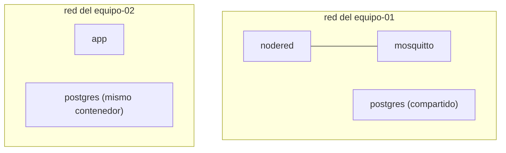

# 3. Docker y contenedores

🎯 **Objetivo:** entender qué es Docker, la diferencia entre imagen y contenedor,
y cómo se describen aplicaciones con Docker Compose. Es la base para todo el
plano de servicios y el de aula.

🧩 **Prerequisitos:** [cap. 2 (Fundamentos)](02-fundamentos.md).

🆕 **Conceptos nuevos:** imagen, contenedor, engine, Compose, red Docker,
volumen, bind mount, healthcheck, límites de recursos, cgroup.

---

## 📖 El problema que resuelve Docker

Antes, instalar una aplicación en un servidor era un dolor: dependencias que
chocan, "en mi máquina funcionaba", versiones distintas. **Docker** empaqueta una
aplicación **con todo lo que necesita** (librerías, configuración) en una unidad
que corre igual en cualquier lado.

### Imagen vs. contenedor
Ésta es **la** distinción clave:

- Una **imagen** es una **plantilla de solo lectura**: la app + sus dependencias,
  congeladas. Ejemplo: `postgres:16.4-alpine`. Es como el molde de una torta.
- Un **contenedor** es una **imagen en ejecución**: una copia viva y aislada.
  De una imagen podés prender muchos contenedores. Es la torta hecha con ese
  molde.


> **Analogía:** la imagen es la *clase*, el contenedor es el *objeto*. O: la
> imagen es la receta, el contenedor es el plato servido.

### El engine
El **motor de Docker** (`dockerd`, un daemon) es el que construye imágenes, y
prende/apaga contenedores. En este proyecto hay **un solo engine**, administrado
por el operador. Los alumnos **no** lo tocan directo (ver [cap. 9](09-plataforma-aula.md)).

### ¿Por qué "aislado"?
Cada contenedor corre como si tuviera su propio mini-sistema: su propio filesystem,
su propia red, sus propios procesos. Ese aislamiento lo da el **kernel** de Linux
con dos mecanismos: **namespaces** (qué ve el contenedor) y **cgroups** (cuántos
recursos puede usar — ver abajo).

---

## Docker Compose

Prender un contenedor a mano (`docker run` con veinte flags) es incómodo.
**Docker Compose** permite describir uno o varios contenedores en un archivo
**YAML** (`compose.yml`) y prenderlos juntos con `docker compose up`.

Ejemplo mínimo (de este proyecto):

```yaml
services:
  web:
    image: nginxdemos/hello:plain-text   # qué imagen usar
    restart: unless-stopped              # reiniciar si se cae
    logging: { driver: json-file, options: { max-size: 10m, max-file: "3" } }
    deploy:
      resources:
        limits: { cpus: "0.25", memory: 128M, pids: 100 }   # topes
    ports: ["127.0.0.1:8080:80"]         # publicar puerto (solo local)
```

- **`services:`** — la lista de contenedores.
- **`image:`** — la imagen (siempre con versión fija, nunca `latest`).
- **`ports:`** — "publica" un puerto del contenedor en la máquina anfitriona.
  `127.0.0.1:8080:80` = el puerto 80 del contenedor se ve como 8080, **solo en
  loopback**.

### Redes Docker
Cuando levantás un proyecto Compose, Docker le crea una **red privada** propia.
Los contenedores de ese proyecto se ven entre sí **por su nombre** (`web` puede
hablar con `db`), pero **no ven** a los de otro proyecto. Este aislamiento por red
es la base del aula: cada equipo tiene su red, y los servicios compartidos
(Postgres) se conectan a la red de cada equipo sin que los equipos se vean entre
sí.



> **Ejemplo completo:** [`ejemplos/nodered-mqtt/`](ejemplos/nodered-mqtt/) — un
> `compose.yml` de laboratorio (Node-RED + Mosquitto + Postgres) que cumple la
> política del aula y se levanta con `labctl validate && labctl up`.

### Volúmenes y bind mounts
Un contenedor es **efímero**: si lo borrás, se pierde lo que escribió adentro.
Para **guardar datos**, se montan carpetas desde afuera:

- **Bind mount:** montás una carpeta del host dentro del contenedor
  (`./datos:/var/lib/algo`). Los datos viven en el host, en una ruta que vos
  controlás. En el aula, la política **obliga** a usar bind mounts dentro de la
  carpeta del equipo (para que cuenten contra su cuota de disco).
- **Volumen con nombre:** Docker administra un espacio en `/var/lib/docker`. Es
  cómodo, pero los datos quedan "escondidos" en un lugar compartido. En el aula
  están **prohibidos** para los alumnos (romperían la cuota).

### healthcheck
Un **healthcheck** es un comando que Docker corre periódicamente para saber si el
contenedor está **sano** (no solo "prendido", sino "funcionando"). Si falla varias
veces, Docker lo marca `unhealthy`. Por ejemplo, Postgres usa `pg_isready`.

### restart
La política **`restart`** dice qué hacer si el contenedor se cae:
`unless-stopped` = reinicialo solo, salvo que yo lo haya apagado a propósito. Así
los servicios vuelven después de un reinicio del server.

### Límites de recursos y cgroups
Un **cgroup** (control group) es un mecanismo del kernel para **limitar** cuánta
CPU, RAM o cuántos procesos puede usar un grupo de contenedores. En Compose se
declaran en `deploy.resources.limits`:

```yaml
deploy:
  resources:
    limits: { cpus: "0.5", memory: 256M, pids: 200 }
```

Esto es clave en hardware modesto: sin límites, un error de un alumno (un bucle
infinito, una fuga de memoria) podría **tumbar el servidor entero**. En el aula se
usa una **doble capa**: los límites del compose **y** un cgroup de systemd por
equipo (ver [cap. 9](09-plataforma-aula.md)).

### logging
Sin límite, los logs de un contenedor pueden **llenar el disco**. Por eso se
configura **rotación**: `max-size: 10m, max-file: 3` = guardá hasta 3 archivos de
10 MB y después descartá lo viejo.

---

## 🧠 Ideas clave

- **Imagen = plantilla; contenedor = imagen corriendo.** De una imagen salen
  muchos contenedores.
- **Compose** describe contenedores en YAML y los prende juntos.
- El aislamiento (namespaces + cgroups) permite correr muchos proyectos en una
  sola máquina sin que se pisen.
- **Bind mounts** guardan datos; **límites** y **rotación de logs** evitan que un
  contenedor se coma la máquina.

## ⚠️ Errores comunes

- Usar imágenes `:latest` → despliegues no reproducibles (hoy anda, mañana no).
- Olvidar los **límites** → un contenedor se come toda la RAM.
- Guardar datos **dentro** del contenedor (se pierden) en vez de en un bind mount.
- Publicar en `0.0.0.0` sin querer → exponés el servicio a toda la red.

## ❓ Preguntas de repaso

1. Explicá la diferencia entre imagen y contenedor con una analogía propia.
2. ¿Para qué sirve un healthcheck? Dá un ejemplo.
3. ¿Qué diferencia hay entre un bind mount y un volumen con nombre?
4. ¿Qué es un cgroup y por qué importa en hardware limitado?

## 🛠️ Ejercicios

1. Escribí un `compose.yml` mínimo que cumpla la política (imagen con tag,
   límites, logging, restart, puerto en 127.0.0.1).
2. Explicá qué pasaría si dos equipos usan la imagen `postgres:16.4-alpine`:
   ¿se descarga dos veces? (pista: capas de imagen compartidas).
