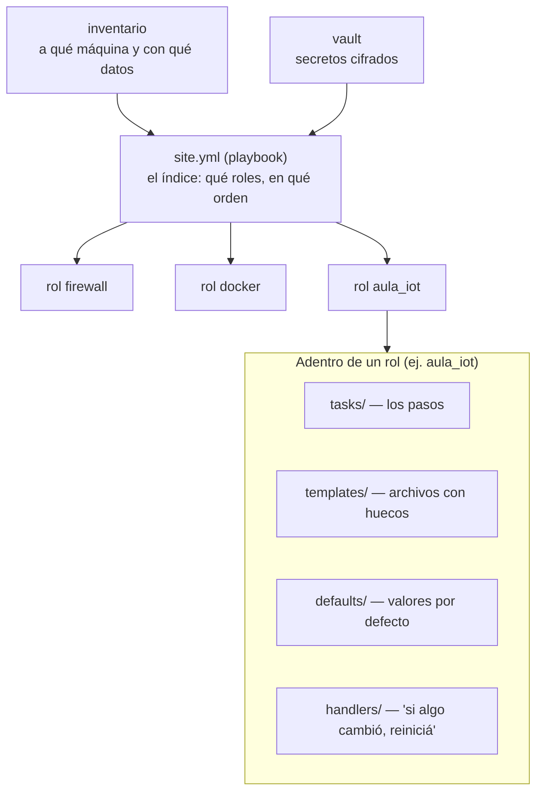
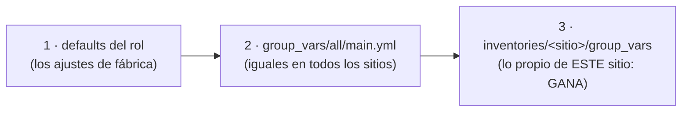
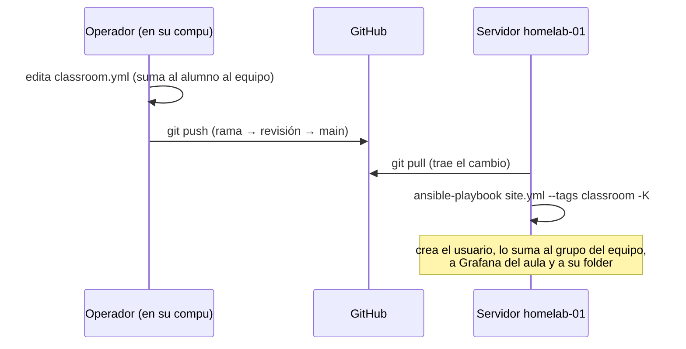

# 4. Ansible e Infraestructura como Código

🎯 **Objetivo:** entender cómo se configura todo el servidor **escribiendo
archivos** en vez de tocar cosas a mano, cómo está organizado este repositorio y
cómo se aplica un cambio sin miedo a romper.

🧩 **Prerequisitos:** [cap. 2 (Fundamentos)](02-fundamentos.md),
[cap. 3 (Docker)](03-docker.md).

🆕 **Conceptos nuevos:** infraestructura como código (IaC), Ansible, playbook,
rol, tarea, handler, template, inventario, variable, vault, tag, idempotencia,
drift.

---

## 📖 Empecemos por lo cercano: armar un mueble

Hay dos formas de armar un mueble:

1. **"A ojo":** vas probando, atornillás donde parece, y queda. Funciona… hasta
   que querés armar **otro igual**, o se desarma y no te acordás cómo era.
2. **Con el manual de armado:** paso a paso, con las piezas numeradas. Cualquiera
   lo arma igual, las veces que quiera.

Configurar un servidor "a mano" (entrar, instalar, editar archivos) es armar a
ojo. **Infraestructura como Código** es escribir el **manual de armado** del
servidor, en archivos de texto, y dejar que un programa lo siga al pie de la
letra. Ese programa es **Ansible**.

---

## ¿Qué es Infraestructura como Código (IaC)?

**IaC** (*Infrastructure as Code*) es describir **cómo tiene que estar** un
servidor (qué programas, qué usuarios, qué reglas de firewall, qué servicios) en
**archivos**, en vez de configurarlo a mano. Las ventajas, con ejemplos de este
proyecto:

| Ventaja | Qué significa | Ejemplo real |
|---|---|---|
| **Reproducible** | se puede reconstruir igual | si el servidor se rompe, se reinstala Ubuntu y se aplica el repo |
| **Revisable** | los cambios se leen antes de aplicarse | cada cambio pasa por una rama y una revisión ([cap. 8](08-pipeline.md)) |
| **Con historia** | se sabe qué cambió, cuándo y por qué | la línea de tiempo del [cap. 15](15-ciclo-de-vida-y-madurez.md) sale de ahí |
| **Escalable** | lo mismo sirve para otro servidor | `make new-site NAME=colegio-norte` arma otro sitio igual |

---

## Las piezas de Ansible (con ejemplos de este repo)



### Playbook: el índice

El **playbook** es el archivo principal: dice **qué roles** se aplican y **en qué
orden**. El de este repo es `ansible/site.yml`, y está ordenado por "planos"
(ver [cap. 1](01-vision-general.md)):

| Orden | Plano | Roles |
|---|---|---|
| 1 | Base del host | `bootstrap`, `users_ssh` |
| 2 | Red | `tailscale`, `dns`, `ddns` |
| 3 | Seguridad | `firewall`, `fail2ban`, `apparmor`, `hardening`, `auto_updates`, `audit` |
| 4 | Servicios | `docker`, `authelia`, `monitoring`, `backups`, `panol` |
| 5 | Aula | `classroom`, `shared_services`, `aula_iot`, `labctl`, `classroom_publish` |

El orden importa: no se puede levantar un contenedor (plano 4) sin haber
instalado Docker antes.

### Rol: una caja con un solo trabajo

Un **rol** es una carpeta con todo lo necesario para **una** responsabilidad.
Está en `ansible/roles/<nombre>/`. Por ejemplo, `aula_iot` levanta la capa de
Grafana del aula. Adentro:

- **`tasks/main.yml` — las tareas:** los pasos, en orden. Cada tarea usa un
  **módulo** (una herramienta de Ansible: copiar un archivo, instalar un paquete,
  levantar un compose). Ejemplo real:

  ```yaml
  - name: Bring up the aula-iot stack
    community.docker.docker_compose_v2:
      project_src: "{{ aula_iot_dir }}"
      state: present
  ```

  Se lee: "que el stack de `aula_iot_dir` esté **presente** (levantado)". Fijate
  que no dice "levantalo": dice **cómo tiene que quedar**. Eso se llama ser
  **declarativo**.

- **`templates/` — archivos con huecos:** un archivo de configuración con partes
  que se completan solas. En `telegraf.conf.j2` hay una lista de topics que se
  arma con los equipos del aula: si se suma un equipo, el archivo se actualiza
  solo. Los huecos se escriben `{{ así }}` (es el formato **Jinja2**, de ahí la
  extensión `.j2`).

- **`defaults/main.yml` — valores por defecto:** los "ajustes de fábrica" del rol.
  Ejemplo: `aula_iot_retention: "15d"` (cuánto historial se guarda).

- **`handlers/` — "si algo cambió, hacé esto":** una tarea que corre **solo** si
  otra avisó que cambió algo. Ejemplo real: si cambia el `Caddyfile`, se
  **reinicia** Caddy. Si no cambió nada, no se reinicia nadie (así no se cortan
  servicios de gusto).

### Inventario: a qué máquina y con qué datos

El **inventario** dice **a qué servidores** se aplica y con **qué datos propios**
de ese lugar. Hay dos en `ansible/inventories/`:

- `production/` — el servidor real del aula (`homelab-01`).
- `staging/` — un servidor de **prueba**, para ensayar antes.

Adentro de cada uno, `group_vars/all/` tiene los datos del sitio: el dominio
(`lucasland.duckdns.org`), la red de la casa (`lan_cidr`), y el **roster** del
aula (`classroom.yml`: equipos, alumnos y lo que se publica).

### Las tres capas de variables

Una **variable** es un dato con nombre que se usa en muchos lados
(`aula_iot_retention`, `lan_cidr`). En este repo vienen de tres lugares, y gana
el más específico, como un estatuto escolar, el reglamento del curso y lo que
acuerda tu equipo:



### Vault: la caja fuerte

Las contraseñas no pueden estar en texto común dentro del repositorio. **Ansible
Vault** guarda los secretos **cifrados** en `vault.yml`, y solo se abren con una
clave que vive **en el servidor** (`~/.vault_pass`), nunca en el repo.

> Algunos secretos ni siquiera van al vault: se **generan en el servidor** la
> primera vez (por ejemplo, la clave MQTT de cada equipo, en
> `/etc/classroom/secrets/`). Así sumar un equipo no obliga a tocar secretos
> cifrados.

### Tags: aplicar solo una parte

Cada rol tiene **etiquetas** (*tags*). Con `--tags` se aplica solo lo que tiene
esa etiqueta. Ejemplo: `--tags classroom` aplica todo lo del aula (usuarios,
servicios compartidos, broker, Grafana del aula, labctl) y no toca el firewall.

---

## Idempotencia: aplicar dos veces da lo mismo

Un interruptor de luz común **cambia** de estado cada vez que lo apretás: si lo
apretás dos veces, volvés al principio. Ansible no funciona así: funciona como
decir "**que la luz quede prendida**". Si ya está prendida, no hace nada.

Eso es **idempotencia**: aplicar el playbook **una o diez veces da el mismo
resultado**. Por eso es seguro volver a correrlo. Hay una prueba automática que
lo verifica: `make idempotence` corre todo **dos veces** y falla si la segunda
vez cambió algo.

---

## Cómo se aplica un cambio, paso a paso

El ejemplo real: dar de alta a un alumno.



En el servidor, como usuario `homelab`:

```
cd ~/homelab && git pull
cd ~/homelab/ansible
~/homelab/.venv/bin/ansible-playbook site.yml --tags classroom -K
```

Cada parte del último comando:

| Parte | Qué es |
|---|---|
| `~/homelab/.venv/bin/ansible-playbook` | el programa, por su ruta completa (está instalado en un entorno propio, `.venv`, y no en el `PATH`; ver [cap. 2](02-fundamentos.md)) |
| `site.yml` | el playbook |
| `--tags classroom` | solo la parte del aula |
| `-K` | "preguntame la contraseña de `sudo`" (la cuenta `homelab` necesita contraseña para hacer cosas de administrador) |

> **Antes de aplicar algo grande:** `make dry-run` muestra **qué cambiaría** sin
> cambiar nada (modo *check*). Es mirar el plano antes de mover paredes.

---

## Drift: cuando el servidor y el repo no coinciden

**Drift** (deriva) es cuando el servidor real **ya no es** lo que dicen los
archivos, porque alguien cambió algo a mano. Es peligroso porque la próxima vez
que se aplique Ansible, **pisa** lo hecho a mano, o al revés: lo de a mano queda
como un misterio que nadie puede reconstruir.

**Caso real (septiembre 2026):** el broker del aula (`mqtt-aula`) se levantó
primero a mano, para que las placas pudieran conectarse ese mismo día. Durante
unos días existió **solo en el servidor**: si alguien corría Ansible desde la rama
principal, las placas de tres equipos se iban a desconectar. Se resolvió pasando
todo al repositorio y verificando que el servidor y el repo coincidieran. La
regla que quedó: **lo de a mano es provisorio y se anota**.

---

## Comandos del operador (`make`)

El `Makefile` de la raíz junta los comandos más usados con nombres simples.
Algunos:

| Comando | Qué hace |
|---|---|
| `make dry-run` | muestra qué cambiaría, sin cambiar nada |
| `make apply` | aplica todo |
| `make harden` | aplica solo la seguridad |
| `make firewall` | aplica solo el firewall |
| `make panol` | redespliega el pañol |
| `make idempotence` | prueba que una segunda corrida no cambia nada |
| `make test` | pruebas sobre el servidor ya armado |
| `make logs-on` / `make logs-off` | prende o apaga los logs en vivo |
| `make como-conectar` | dice cuál es la mejor forma de entrar al servidor ahora |

---

## 🧠 Ideas clave

- **IaC** = el servidor descripto en archivos: reproducible, revisable, con historia.
- **Playbook** (el índice) → **roles** (una responsabilidad cada uno) → **tareas**
  (los pasos), **templates** (archivos con huecos), **handlers** (reiniciar solo
  si cambió algo).
- El **inventario** dice dónde y con qué datos; el **vault** guarda los secretos.
- **Idempotencia:** aplicar dos veces da lo mismo, por eso es seguro.
- **Drift:** lo hecho a mano y no anotado es una bomba de tiempo.

## ⚠️ Errores comunes

- **Cambiar cosas a mano en el servidor** y no pasarlas al repo (drift).
- Olvidar el `-K` → Ansible no puede usar `sudo` y falla.
- Correr Ansible desde otra carpeta que no sea `~/homelab/ansible` → no encuentra
  su configuración (`ansible.cfg`) ni la clave del vault.
- Poner un secreto en un archivo común del repo en vez del vault.

## ❓ Preguntas de repaso

1. ¿Qué diferencia hay entre configurar "a mano" y con IaC? Usá la analogía del mueble.
2. ¿Qué es un rol y qué partes tiene?
3. ¿Qué quiere decir que Ansible sea idempotente? ¿Por qué es importante?
4. ¿Qué es el drift y cómo se evita?

## 🛠️ Ejercicios

1. Abrí `ansible/site.yml` y ubicá cada rol en uno de los cinco planos.
2. Abrí `ansible/roles/aula_iot/defaults/main.yml` y explicá con tus palabras tres
   de sus variables.
3. Escribí, en orden, los pasos para sumar un alumno nuevo a un equipo (dónde se
   edita, cómo llega al servidor, qué comando se corre).
