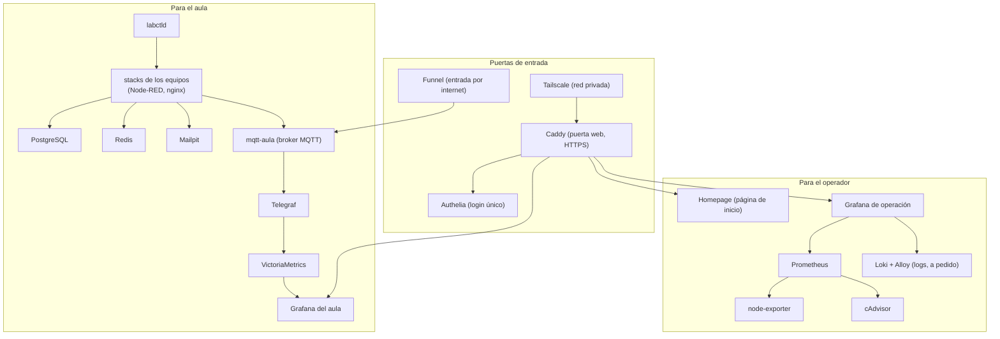

# 5. Los servicios uno por uno

🎯 **Objetivo:** conocer cada servicio del laboratorio: qué es, para qué sirve,
dónde corre, qué expone, de qué depende y **qué pasa si se cae**.

🧩 **Prerequisitos:** [cap. 3 (Docker)](03-docker.md). Para los servicios de las
placas, conviene haber leído el [cap. 11 (Arquitectura IoT)](11-arquitectura-iot.md).

🆕 **Conceptos nuevos:** proxy inverso, SSO, exporter, scrape, ficha de servicio,
dependencia, punto único de falla.

---

## 📖 Empecemos por lo cercano: los oficios de un barrio

En un barrio cada uno tiene su oficio: el portero, el cartero, el que anota en el
libro de actas, la biblioteca. Si se enferma el cartero, las cartas no llegan,
pero la biblioteca sigue abierta. Si se enferma el portero, **nadie entra** a
ningún lado.

En el servidor pasa lo mismo: cada **servicio** tiene un oficio, y algunos son
"porteros" de los que dependen muchos otros. Conocer **quién depende de quién**
es lo que permite saber qué se rompe cuando algo se cae.

---

## El mapa completo

---

## Las fichas

Cada ficha responde siempre lo mismo: **qué es** (con algo cercano), **para qué**,
**dónde corre**, **qué expone**, **de qué depende** y **qué pasa si se cae**.

### Puertas de entrada

**Tailscale** — *la red privada del aula*

- **Qué es:** una red privada entre las compus de ustedes y el servidor, como si
  estuvieran en la misma casa aunque estén lejos. Por adentro usa **WireGuard**,
  un sistema de túneles cifrados.
- **Dónde corre:** en el servidor (`tailscaled`, un daemon) y en cada compu.
- **Expone:** la IP privada `100.110.123.76`.
- **Si se cae:** nadie entra desde afuera de la casa (ni SSH ni web). La consola
  física del servidor sigue funcionando.
- **Para entenderlo desde cero** (qué problema resuelve, qué es un túnel) →
  [Red y accesos](red-y-accesos.md).

**Tailscale Funnel** — *el portero de internet*

- **Qué es:** publica un puerto del servidor **en internet** sin abrir puertas en
  el router.
- **Expone:** `:10000` → broker del aula (placas); `:8443` → API del pañol.
- **Si se cae:** las placas no llegan al broker. Ojo: lo opera la empresa
  Tailscale; a veces falla **una** de sus entradas (ver
  [caso 7](10-casos-practicos.md#caso-7-mbedtls_err_ssl_conn_eof-una-puerta-de-entrada-caida)).

**Caddy** — *la puerta web*

- **Qué es:** un **proxy inverso**: recibe todos los pedidos web y los manda al
  servicio que corresponde (como una recepción que deriva a cada oficina). Además
  pone el **HTTPS** (el candado) solo, con certificados gratuitos que renueva solo.
- **Dónde corre:** contenedor `caddy`. Configuración en `compose/proxy/Caddyfile`.
- **Expone:** puertos 80 y 443.
- **Si se cae:** **ninguna página web** del servidor responde. Es un **punto único
  de falla** (si falla, falla todo lo que pasa por él).

**Authelia** — *el login único*

- **Qué es:** un **SSO** (*Single Sign-On*, "inicio de sesión único"): te logueás
  una vez y entrás a todo lo que tenés permitido. Sabe a qué **grupo** pertenecés
  (`operators` u `students`) y decide.
- **Dónde corre:** contenedor `authelia`. Caddy le pregunta antes de dejar pasar.
- **Si se cae:** las páginas protegidas no dejan entrar a nadie.

### Para el operador

**Homepage** — página de inicio con enlaces a todo. Si se cae, se pierde el
"menú", pero cada servicio sigue andando.

**Prometheus** — *el que pasa a leer los medidores*

- **Qué es:** cada 15 segundos **va a buscar** (*scrape*) números a los
  *exporters* y los guarda 15 días. Como el empleado que pasa a leer el medidor de
  luz de cada casa.
- **Expone:** solo `127.0.0.1:9090` (adentro del servidor).
- **Si se cae:** los tableros de operación se quedan sin datos nuevos.

**node-exporter** y **cAdvisor** — *los medidores*

- **node-exporter** mide el **servidor** (CPU, RAM, disco, red).
- **cAdvisor** mide **cada contenedor** (cuánto usa cada uno). De ahí salen los
  tableros por equipo.
- **Ojo:** cAdvisor anda cerca de su tope de memoria; si se pasa, el sistema lo
  corta y se pierden las métricas por contenedor un rato.

**Grafana de operación** — tableros del servidor, del aula (consumo por equipo) y
del pañol. **Solo operadores**, porque muestra la auditoría del pañol (quién
entró y cuándo).

**Loki + Alloy** — *logs a pedido*

- **Qué son:** Alloy junta los **logs** (registros) de todos los contenedores y
  Loki los guarda para buscarlos desde Grafana.
- **Por qué a pedido:** guardar todos los logs todo el tiempo gasta RAM y disco
  que necesita el aula. Se prenden con `make logs-on` y se apagan solos.

### Para el aula

**PostgreSQL, Redis, Mailpit** — *los servicios comunes*

- **PostgreSQL:** base de datos; cada equipo tiene la suya, con su usuario.
- **Redis:** memoria rápida de "clave → valor" (para caché o colas chicas).
- **Mailpit:** un correo de mentira que **atrapa** los mails para probar envíos
  sin mandarlos de verdad.
- **Si se cae** uno: se rompe solo lo de los equipos que lo usan.

**`mqtt-aula`** — *el cartero de las placas*

- **Qué es:** el **broker MQTT** del aula (Mosquitto 2.0). Detalle en el
  [cap. 11](11-arquitectura-iot.md).
- **Expone:** `127.0.0.1:18830`, que Funnel publica en `:10000` con TLS.
- **Depende de:** Funnel (para las placas), la red de cada equipo (para su Node-RED).
- **Si se cae:** ninguna placa puede mandar ni recibir. Las placas reintentan
  solas y vuelven cuando el broker vuelve.

**Telegraf, VictoriaMetrics y el exporter del broker** — *el escribano y el archivo*

- **Telegraf** escucha los topics de los equipos (solo puede **leer**), traduce a
  números y escribe en **VictoriaMetrics**, que guarda 15 días.
- **El exporter** lee las estadísticas del propio broker (cuántos clientes,
  cuántos mensajes).
- **Si se caen:** las placas siguen funcionando entre ellas y con Node-RED; solo
  se deja de **guardar** historial para Grafana.

**Grafana del aula** — un tablero por equipo, que solo ese equipo ve y edita, y uno
general para el operador. Ver [cap. 13](13-usar-grafana.md).

**`labctld`** — *el encargado del edificio* (ver [cap. 9](09-plataforma-aula.md)).
Si se cae, los alumnos no pueden hacer `labctl up/down`, pero lo que ya está
corriendo **sigue corriendo**.

**Stacks de los equipos** — el Node-RED y el nginx de cada equipo, adentro de su
carpeta, con sus propios puertos (ver la [guía del equipo](guia-equipo.md#12-el-tunel-ssh-traer-tus-servicios-a-tu-compu)).

### En el servidor, sin contenedor

- **DuckDNS** (un temporizador cada 5 minutos): mantiene el nombre
  `lucasland.duckdns.org` apuntando a la IP pública de la casa.
- **dnsmasq** (rol `dns`): adentro de la red privada, hace que esos nombres
  apunten a la IP de Tailscale (eso se llama **Split DNS**: el mismo nombre
  responde distinto según desde dónde preguntes).

---

## ¿Qué pasa si se cae…? (resumen)

| Si se cae… | Se rompe | Sigue andando |
|---|---|---|
| Tailscale | entrar desde afuera de la casa | todo lo que corre adentro, las placas (van por Funnel) |
| Funnel | las placas no llegan al broker | todo lo web y el SSH por Tailscale |
| Caddy | **todas** las páginas web | SSH, placas, servicios internos |
| Authelia | entrar a páginas protegidas | lo demás |
| `mqtt-aula` | mensajes de **todas** las placas | lo web, las bases de datos |
| Telegraf / VictoriaMetrics | el historial en Grafana | las placas y Node-RED |
| PostgreSQL | apps de los equipos que guardan datos | placas, tableros |

## 🧠 Ideas clave

- Cada servicio tiene **un oficio**. Saber **de qué depende** es saber qué se rompe.
- **Caddy** y **`mqtt-aula`** son **puntos únicos de falla**: si caen, afectan a
  muchos.
- Prometheus **va a buscar** los datos (los medidores); las placas, en cambio,
  **mandan** sus mensajes (MQTT).

## ❓ Preguntas de repaso

1. ¿Qué es un proxy inverso? Usá la analogía de la recepción.
2. ¿Por qué el Grafana de operación es solo para operadores?
3. Si se cae Funnel, ¿pueden los alumnos entrar a su Node-RED? ¿Y sus placas al broker?
4. ¿Qué es un punto único de falla? Nombrá dos en este sistema.

## 🛠️ Ejercicios

1. Elegí un servicio y armá su ficha completa con tus palabras.
2. Dibujá de qué servicios depende **tu** proyecto, desde la placa hasta Grafana.
