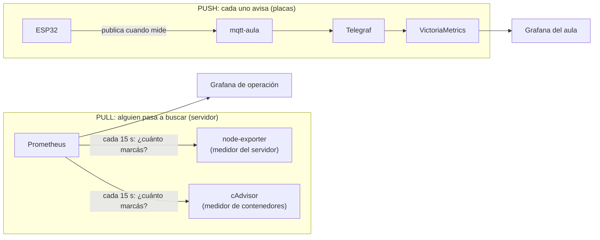

# 6. Observabilidad

🎯 **Objetivo:** entender qué significa **observar** un sistema, cómo se hace en
el servidor (Prometheus, Grafana, logs) y en las placas (MQTT → Grafana del
aula), y cómo leer los tableros.

🧩 **Prerequisitos:** [cap. 3 (Docker)](03-docker.md),
[cap. 5 (Servicios)](05-servicios.md).

🆕 **Conceptos nuevos:** observabilidad, métrica, serie temporal, etiqueta, log,
exporter, scrape, *pull* y *push*, PromQL, dashboard, alerta.

---

## 📖 Empecemos por lo cercano: el médico

Cuando vas al médico, no te abre para ver qué pasa adentro. **Observa desde
afuera** con tres herramientas:

| El médico usa… | En un sistema se llama… | Qué es |
|---|---|---|
| el **termómetro** y la presión | **métricas** | números medidos cada tanto: temperatura, RAM usada, mensajes por minuto |
| la **historia clínica** | **logs** (registros) | lo que fue pasando, anotado con fecha: "10:32 se conectó la placa de Jorge" |
| un **estudio con contraste** que sigue un recorrido | **trazas** (*traces*) | el camino completo de un pedido por todos los servicios |

**Observabilidad** es poder entender **qué pasa adentro** de un sistema mirando
lo que muestra **desde afuera**. En este sistema usamos métricas y logs (las
trazas quedan para más adelante).

---

## Métricas y series temporales

Una **métrica** es un número que se mide **muchas veces**. Guardado con la hora de
cada medición, forma una **serie temporal**: una planilla de "hora | valor".

Cada serie tiene **etiquetas** (*labels*): datos que la acompañan para poder
filtrarla, como las columnas de una planilla. Por ejemplo:

```
container_memory_usage_bytes{name="equipo-04-nodered-1"}  =  69 000 000
mqtt_valor{equipo="equipo-04", dispositivo="enchufe", magnitud="estado"}  =  1
```

La primera dice "el Node-RED del equipo-04 usa 69 MB de RAM". La segunda, "el
enchufe de Jorge está prendido".

---

## Dos formas de juntar datos: *pull* y *push*



- **Pull ("ir a buscar"):** como el empleado que pasa a leer el medidor de luz de
  cada casa. **Prometheus** visita cada 15 segundos a los **exporters** (programas
  que exponen números: `node-exporter` mide el servidor; `cAdvisor`, cada
  contenedor). A esa visita se le dice **scrape**.
- **Push ("avisar"):** como mandar un mensaje cuando pasa algo. Las **placas**
  publican por MQTT cuando miden o cambian; **Telegraf** los anota en
  **VictoriaMetrics**.

¿Por qué distinto? Porque una placa puede estar detrás de cualquier router y
apagarse cuando quiera: nadie podría "pasar a buscarla". Es más simple que ella
avise.

---

## Logs: la historia clínica

Un **log** es una línea de texto con fecha que un programa escribe cuando pasa
algo. Los logs **cuentan lo que pasó**; las métricas, **cuánto**.

El log del broker fue la herramienta clave de casi todos los
[casos prácticos](10-casos-practicos.md) de las placas:

```
New client connected from 172.21.0.1 as esp32-equipo-04-enchufe (u'equipo_04').
Client esp32-equipo-03 disconnected, not authorised.
```

Dónde se miran:

| Qué | Cómo |
|---|---|
| un contenedor | `docker logs <nombre>` (lo corre el operador) |
| tus contenedores | `labctl logs` (lo corrés vos) |
| un servicio del servidor | `journalctl -u <servicio>` |
| todos juntos, con búsqueda | **Loki** en Grafana, prendiéndolo con `make logs-on` |

Loki está **apagado por defecto** a propósito: guardar todos los logs todo el
tiempo cuesta RAM y disco que necesita el aula. "Un observador que consume más que
lo observado no sirve."

---

## PromQL: preguntarle a los datos

**PromQL** (*Prometheus Query Language*) es el idioma para hacer **preguntas** a
las series temporales. Lo usan Prometheus y VictoriaMetrics. Con tres ideas
alcanza para empezar:

| Idea | Ejemplo | Se lee |
|---|---|---|
| **Elegir** una serie | `mqtt_valor` | "todos los valores" |
| **Filtrar** con etiquetas `{}` | `mqtt_valor{dispositivo="enchufe"}` | "los del enchufe" |
| **Resumir** en el tiempo `[...]` | `avg_over_time(mqtt_valor[1h])` | "el promedio de la última hora" |
| **Agrupar** | `sum by (equipo) (...)` | "sumado por equipo" |

Un ejemplo real del tablero de consumo por equipo: los contenedores se llaman
`equipo-04-nodered-1`, `equipo-04-web-1`… La consulta saca el `equipo-04` del
nombre y suma la RAM de todos los suyos:

```
sum by (team) (
  label_replace(container_memory_usage_bytes{name=~"equipo-.*"},
                "team", "$1", "name", "(equipo-[0-9]+)-.*")
)
```

No hace falta escribir esto de memoria: el recetario del
[cap. 13](13-usar-grafana.md#6-recetario-de-consultas) tiene las consultas más usadas
para copiar.

---

## Los tableros (dashboards)

Un **dashboard** es una pantalla con varios gráficos (**paneles**), cada uno
haciendo una consulta. Hay dos Grafana, para dos públicos:

| Grafana | Quién lo ve | Tableros |
|---|---|---|
| **De operación** (`grafana.`) | solo operadores | *Homelab Overview* (el servidor), *Classroom Overview / Team Detail / Capacity* (consumo de cada equipo), *Pañol IoT* (auditoría y logs) |
| **Del aula** (`grafana-aula.`) | operadores y alumnos | *Aula — todos los equipos* (operador) y **un tablero por equipo** con sus placas |

Cómo leer el tablero de un equipo: [capítulo 13](13-usar-grafana.md).

---

## Alertas: lo que todavía falta

Hoy el sistema **muestra**, pero no **avisa**. Una **alerta** es una regla que
mira una métrica y manda un aviso si pasa algo ("hace 15 minutos que la placa del
equipo-04 no publica", "el disco está al 90%"). Es lo que convierte un tablero que
alguien tiene que mirar en un sistema que **te busca a vos** cuando algo anda mal.
Está anotado en la hoja de ruta del [capítulo 15](15-ciclo-de-vida-y-madurez.md).

---

## 🧠 Ideas clave

- **Observar** = entender lo de adentro mirando desde afuera: **métricas** (cuánto),
  **logs** (qué pasó), **trazas** (por dónde pasó).
- **Pull:** Prometheus va a buscar a los exporters. **Push:** las placas avisan por MQTT.
- **PromQL:** elegir, filtrar `{}`, resumir `[...]`, agrupar `by`.
- Dos Grafana: el de **operación** (solo operadores) y el **del aula** (un tablero
  por equipo).
- Falta: **alertas**.

## ⚠️ Errores comunes

- Mirar solo las métricas y no los **logs**: el número te dice que algo falla, el
  log te dice **por qué**.
- Guardar **todo** "por las dudas": cuesta recursos (por eso Loki va a pedido).
- Un tablero que nadie mira no observa nada: hacen falta **alertas**.

## ❓ Preguntas de repaso

1. ¿Qué diferencia hay entre una métrica y un log? Usá la analogía del médico.
2. ¿Por qué las placas **avisan** (push) en vez de que alguien las vaya a buscar (pull)?
3. ¿Qué hace `avg_over_time(mqtt_valor[1h])`?
4. ¿Por qué hay dos Grafana distintos?

## 🛠️ Ejercicios

1. Abrí el tablero de tu equipo y explicá qué responde cada panel.
2. Escribí una consulta para ver **solo** la magnitud `estado` de tu dispositivo.
3. Proponé **una** alerta útil para tu proyecto: qué mira y cuándo avisa.
