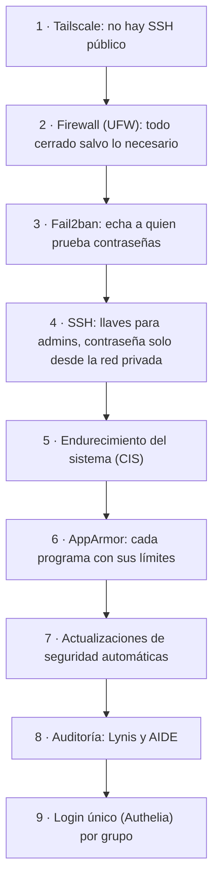

# 7. Seguridad (defensa en profundidad)

🎯 **Objetivo:** entender cómo se protege el sistema **en varias capas**, de modo
que si una falla, otra sigue cubriendo, y qué protege a cada cosa que se ve desde
afuera (incluido el broker de las placas).

🧩 **Prerequisitos:** [cap. 2 (Fundamentos)](02-fundamentos.md).

🆕 **Conceptos nuevos:** defensa en profundidad, superficie de ataque, firewall,
fuerza bruta, clave pública, mínimo privilegio, cifrado, secreto, endurecimiento
(*hardening*).

---

## 📖 Empecemos por lo cercano: un boliche

Pensá en cómo cuida un boliche a la gente de adentro:

1. Hay **una sola puerta** de entrada (no se entra por la ventana).
2. En la puerta, un **patovica** mira la lista: si no estás, no pasás.
3. Si alguien intenta colarse varias veces, **lo echan** por un rato.
4. Adentro, la **pulsera** dice a qué sector podés ir (pista o VIP).
5. Hay **cámaras** que graban lo que pasa.
6. Si algo falla, hay **salidas de emergencia** y un plan.

Ninguna de esas medidas sola alcanza: un patovica distraído no sirve si no hay
pulseras, y las pulseras no sirven si se puede entrar por la ventana. **Juntas**,
sí. Eso se llama **defensa en profundidad**: varias capas **independientes**, para
que romper una no alcance.

> **Este capítulo mira la seguridad desde el servidor.** Si querés la vista **del
> alumno** (qué puertas cruzás vos, con qué llave y por qué son distintas) →
> [Red y accesos: ¿por qué me autentico tantas veces?](red-y-accesos.md#5-por-que-me-autentico-tantas-veces).

---

## Las capas de este sistema

Las vemos con lo que hay **realmente configurado**.

### 1 · Tailscale: la puerta no da a la calle

El acceso de administración (**SSH**, la terminal remota) **no está en
internet**. Solo se llega desde la red de la casa o desde la red privada de
Tailscale. Así, los miles de robots que prueban contraseñas en internet **ni
siquiera encuentran la puerta**. A todo lo que se puede atacar desde afuera se le
llama **superficie de ataque**: esta capa la achica al mínimo.

### 2 · Firewall: el patovica de la red

Un **firewall** ("cortafuegos") decide qué conexiones dejar entrar. En el
servidor se llama **UFW** (*Uncomplicated Firewall*). La regla base: **todo lo
que entra está prohibido**, salvo lo que se habilita a propósito:

| Permitido | Desde | Para qué |
|---|---|---|
| SSH (22) | red de la casa y Tailscale | administrar |
| Web (80, 443) | cualquiera | Caddy (si el router lo deja pasar) |
| Todo | la red de Tailscale | es nuestra red privada |

> **La trampa de Docker:** Docker escribe sus propias reglas de red y puede
> "saltarse" el firewall. Por eso se instala **ufw-docker**, que hace que el
> firewall también mande sobre los contenedores, y por eso los servicios se
> publican en `127.0.0.1` (solo adentro del servidor).

### 3 · Fail2ban: el que echa a los insistentes

**Fail2ban** lee los registros y, si una IP **falla 4 veces en 10 minutos**, la
**bloquea 1 hora**. Frena la **fuerza bruta** (probar contraseñas una tras otra
hasta acertar). No bloquea a la red de la casa ni a Tailscale, para no dejar
afuera a los propios.

### 4 · SSH: quién entra y cómo

- **Administradores:** entran **solo con llave** (*clave pública*). Es un par de
  archivos: uno **público** que se deja en el servidor (como un candado) y uno
  **privado** que queda en tu compu (la única llave que lo abre). Sin la llave
  privada no se entra, aunque se sepa la contraseña.
- **Alumnos:** entran con **contraseña**, pero **solo** desde la red de la casa o
  Tailscale, y solo pueden abrir túneles **locales** (`-L`, ver la
  [guía del equipo](guia-equipo.md#12-el-tunel-ssh-traer-tus-servicios-a-tu-compu)).
- Para todos: `root` no puede entrar, máximo **3 intentos** por conexión, y
  cifrados modernos.

### 5 · Endurecimiento (*hardening*)

**Endurecer** es sacar o ajustar todo lo que un sistema trae "por si acaso" y no
hace falta. Se sigue la guía **CIS** (*Center for Internet Security*, una
organización que publica recetas de seguridad), nivel 1:

- ajustes del kernel para la red (no aceptar redirecciones raras, etc.),
- contraseñas fuertes obligatorias,
- archivos sensibles con permisos estrictos,
- sin volcados de memoria (*core dumps*) de programas privilegiados,
- módulos del kernel que no se usan, bloqueados,
- un cartel legal al entrar.

### 6 · AppArmor: cada programa en su carril

**AppArmor** le pone a cada programa una **lista de lo que puede tocar**. Si un
programa es engañado, igual no puede salirse de su lista. Está en modo
**enforce** (obligatorio), no solo "avisar".

### 7 · Actualizaciones automáticas

Las **actualizaciones de seguridad** se instalan solas, y si hace falta reiniciar,
el servidor lo hace a las **04:30**, cuando nadie lo usa.

### 8 · Auditoría

- **Lynis** revisa la configuración **una vez por semana** y da un puntaje.
- **AIDE** guarda una "huella" de los archivos del sistema y avisa **todos los
  días** si alguno cambió sin permiso (como un precinto).

### 9 · Login único por grupo (Authelia)

Para las páginas web, **Authelia** pide usuario y contraseña **una vez** y decide
según tu **grupo**:

| Página | `operators` | `students` |
|---|---|---|
| Grafana de operación (incluye la auditoría del pañol) | ✅ | ❌ |
| Grafana del aula | ✅ | ✅ (solo el folder de su equipo) |
| Tablero del pañol | ✅ | ❌ |
| Prometheus, cAdvisor | ✅ | ❌ |

---

## Lo que se ve desde internet, y qué lo protege

Con **Tailscale Funnel**, dos cosas quedan alcanzables desde internet. Cada una
tiene su propia defensa en capas:

| Qué | Qué lo protege |
|---|---|
| **Broker de las placas** (`:10000`) | cifrado (TLS) · usuario y clave por equipo · reglas (ACL) que encierran a cada equipo en sus topics · sin anónimos |
| **API del pañol** (`:8443`) | cifrado · token secreto en cada pedido · límite de pedidos por minuto · solo las rutas que usa un nodo |

---

## Mínimo privilegio: cada uno con lo justo

**Mínimo privilegio** es darle a cada persona o programa **solo** el permiso que
necesita para su trabajo, y nada más. Ejemplos de este sistema:

- Los alumnos **no** tienen `sudo` ni acceso a Docker: piden las cosas por `labctl`.
- **Telegraf** puede **leer** los topics de los equipos, pero **no escribir**: si
  alguien lo engañara, no podría prender ningún LED.
- **Grafana del aula** confía en el usuario que le pasa el login **solo** si el
  pedido viene de Caddy, por una red que no comparte con nadie más.
- El tablero del pañol en Grafana lee la base con un usuario que **solo puede
  leer**.

---

## Secretos: dónde viven las claves

Un **secreto** es cualquier dato que da acceso (contraseñas, tokens, llaves).
Regla: **nunca** en un archivo común del repositorio.

| Dónde | Qué |
|---|---|
| **Ansible Vault** (cifrado) | contraseñas del aula, secretos de Authelia, base de datos |
| `/etc/classroom/secrets/` (solo `root`) | claves MQTT de cada equipo, claves de servicio |
| `/etc/panol/secrets/` (solo `root`) | claves del pañol |
| `.shared-services.env` de cada equipo | lo que el equipo necesita, legible **solo por su equipo** |

> **Lección real:** durante la puesta en marcha, algunas claves MQTT se pasaron
> por chat y en archivos comprimidos. Funciona, pero una clave que viajó por
> canales comunes conviene **rotarla** (cambiarla) cuando el sistema se
> estabiliza.

---

## Lo que todavía falta (honestidad)

- **Copias de seguridad:** están diseñadas (cifradas, con Borg) pero **no
  corren**: falta el disco. Sin copias, un disco roto es perder todo. Es lo más
  urgente del [capítulo 15](15-ciclo-de-vida-y-madurez.md).
- **El firewall quedó con la red vieja de la casa:** hoy se entra solo por
  Tailscale ([caso 9](10-casos-practicos.md#caso-9-el-servidor-se-mudo-de-red-y-el-firewall-seguia-mirando-la-vieja)).
- **Alertas de seguridad:** hoy Lynis y AIDE anotan, pero nadie recibe un aviso.

---

## 🧠 Ideas clave

- **Defensa en profundidad:** muchas capas independientes; romper una no alcanza.
- Achicar la **superficie de ataque**: lo que no está expuesto no se puede atacar.
- **Llave** para administradores; **contraseña** para alumnos, solo desde la red privada.
- **Mínimo privilegio:** cada uno con lo justo.
- Los **secretos** nunca en archivos comunes del repositorio.

## ⚠️ Errores comunes

- Publicar el **editor de Node-RED** en internet: quien lo abre puede ejecutar
  cualquier cosa en el servidor. Nunca se publica.
- Mandar una contraseña por chat y no cambiarla después.
- Pensar que "como tengo firewall, estoy seguro": es **una** capa.

## ❓ Preguntas de repaso

1. Explicá la defensa en profundidad con la analogía del boliche.
2. ¿Qué diferencia hay entre entrar por SSH con llave y con contraseña?
3. ¿Qué protege al broker de las placas, que está en internet?
4. Da dos ejemplos de mínimo privilegio en este sistema.

## 🛠️ Ejercicios

1. Elegí una capa y explicá qué pasaría si **no** existiera.
2. Revisá tu proyecto: ¿dónde guardás tus claves (WiFi, MQTT)? ¿Hay alguna en un
   lugar público (por ejemplo, un repositorio)?
