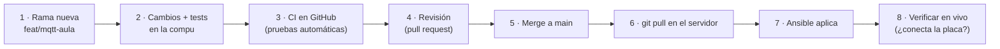
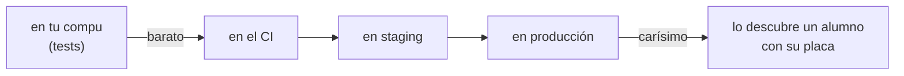

# 8. El pipeline (Git, revisión y pruebas automáticas)

🎯 **Objetivo:** entender cómo se cuida la calidad del sistema **antes** de que un
cambio llegue al servidor: cómo se guardan las versiones, cómo se revisan los
cambios y qué pruebas corren solas.

🧩 **Prerequisitos:** [cap. 4 (Ansible e IaC)](04-ansible-iac.md).

🆕 **Conceptos nuevos:** Git, commit, rama, merge, *pull request*, repositorio
remoto, CI, test, lint, *shift-left*, staging.

---

## 📖 Empecemos por lo cercano: entregar un trabajo práctico

Cuando entregás un trabajo práctico importante, no lo mandás recién escrito:

1. guardás **versiones** ("tp_v1", "tp_v2_corregido") por si tenés que volver atrás,
2. trabajás en un **borrador** sin tocar la versión buena,
3. le pedís a un compañero que lo **lea** antes de entregar,
4. pasás el **corrector ortográfico**,
5. y recién ahí lo **entregás**.

El *pipeline* (la "cañería" por la que pasa cada cambio) es exactamente eso, pero
automático y para código.

---

## Git: las versiones, bien hechas

**Git** es el programa que guarda la **historia** de un proyecto: cada cambio,
quién lo hizo, cuándo y por qué. En vez de "tp_v2_final_ahora_sí", guarda cada
versión con un mensaje.

| Palabra | Qué es | En el TP sería… |
|---|---|---|
| **Repositorio** | la carpeta del proyecto con toda su historia | la carpeta del TP con todas sus versiones |
| **Commit** | una "foto" de los cambios, con un mensaje que explica **por qué** | guardar "tp_v3: agregué la conclusión" |
| **Rama** (*branch*) | una línea de trabajo aparte, para no tocar lo que funciona | un borrador |
| **Merge** | juntar una rama con la principal | pasar el borrador corregido a la versión final |
| **Remoto** (GitHub) | una copia del repositorio en internet | el aula virtual donde se entrega |
| **Push / pull** | subir tus cambios al remoto / bajar los de otros | subir / descargar |

La rama principal se llama **`main`**: es la versión "buena", la que va al
servidor.

---

## El recorrido de un cambio

Un ejemplo real: cuando se armó el broker del aula para las placas.

Un **pull request** (PR, "pedido de incorporación") es pedir formalmente "por
favor, sumen mi rama a `main`": ahí se ven todos los cambios, corren las pruebas y
alguien los revisa.

---

## CI: las pruebas que corren solas

**CI** (*Continuous Integration*, integración continua) es un robot que, **cada
vez** que se sube un cambio, corre todas las pruebas. En este proyecto el robot es
**GitHub Actions**, y su receta está en `.github/workflows/ci.yml`. Hace cinco
trabajos:

| Trabajo | Qué revisa | En el TP sería… |
|---|---|---|
| **Tests unitarios** | la política de Compose del aula, los tableros, y que el broker del pañol, el del aula y la capa de Grafana estén bien armados (por ejemplo: "el broker no acepta conexiones sin clave", "un equipo no puede escribir en otro", "Grafana no confía en cualquiera") | verificar cada cuenta del TP |
| **Búsqueda de secretos** (gitleaks) | que nadie haya subido una contraseña por error, en **toda** la historia | revisar que no quedó tu DNI en el archivo |
| **Lint** (yamllint, ansible-lint) | el estilo y las buenas prácticas | el corrector ortográfico |
| **Chequeo de sintaxis** | que el playbook se pueda leer, en producción y en staging | que el archivo abra |
| **Molecule** | prueba roles **de verdad**, en un Ubuntu 24.04 armado en un contenedor descartable | ensayar la presentación |

Algunas palabras:

- Un **test** (prueba) es un pequeño programa que comprueba que otro hace lo que
  debe. Si falla, avisa **antes** de que el error llegue al servidor.
- **Lint** viene de la pelusa que se le saca a la ropa: es revisar el código
  buscando "pelusas" (errores de estilo, cosas sospechosas) sin ejecutarlo.

> **Caso real:** en octubre de 2026, al revisar la documentación, se encontró que
> los tests nuevos del broker del aula y de Grafana **no estaban en el CI**:
> existían, pero el robot no los corría. Se agregaron. Una prueba que no corre
> sola es una prueba que, tarde o temprano, nadie corre.

---

## Pruebas sobre el servidor de verdad

Algunas cosas solo se pueden comprobar **en el servidor armado**:

| Comando | Qué hace |
|---|---|
| `make verify` | Ansible revisa la postura de seguridad (SSH, firewall, AppArmor) |
| `make test` | **testinfra**: pruebas que miran el servidor real (permisos de carpetas, servicios corriendo, contenedores sanos) |
| `make idempotence` | aplica todo **dos veces** y falla si la segunda cambió algo ([cap. 4](04-ansible-iac.md)) |

---

## Staging: ensayar antes del estreno

**Staging** es un servidor de **ensayo**, con su propio inventario
(`inventories/staging`), donde se prueba un cambio grande antes de llevarlo al
servidor real (**producción**). Es el ensayo general antes del acto.

---

## *Shift-left*: encontrar los errores temprano

*Shift-left* ("correr hacia la izquierda") es la idea de buscar los errores **lo
antes posible** en el recorrido de arriba: cuanto más a la izquierda se encuentra
un error, más barato es arreglarlo.

La regla del proyecto: **nada se declara "funcionando" sin una prueba que lo
demuestre**.

---

## 🧠 Ideas clave

- **Git** guarda la historia; las **ramas** permiten trabajar sin romper `main`.
- Un cambio recorre: rama → pruebas → revisión → merge → servidor → verificación.
- El **CI** corre las pruebas solo, en cada cambio: tests, secretos, lint,
  sintaxis, Molecule.
- **Shift-left:** cuanto antes se encuentra un error, más barato.

## ⚠️ Errores comunes

- Trabajar directo en `main` "porque es un cambio chiquito".
- Escribir un test y no sumarlo al CI.
- Mensajes de commit que dicen **qué** ("cambios") en vez de **por qué**
  ("el broker del pañol quedó sin puerto al mudarse la red").

## ❓ Preguntas de repaso

1. ¿Qué es un commit y qué tiene que decir su mensaje?
2. ¿Para qué sirve trabajar en una rama?
3. Nombrá tres cosas que revisa el CI de este proyecto.
4. ¿Qué es *shift-left* y por qué conviene?

## 🛠️ Ejercicios

1. Abrí `.github/workflows/ci.yml` y ubicá los cinco trabajos de la tabla.
2. Pensá **un test** para tu proyecto (por ejemplo: "si llega `ON`, el relé se
   prende"): qué pondrías a prueba y qué resultado esperás.
3. Escribí un buen mensaje de commit para el último cambio que hiciste en tu
   placa.
