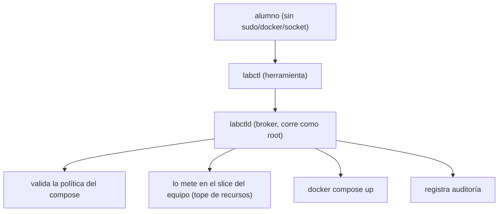

# 9. La plataforma de aula

🎯 **Objetivo:** entender cómo varios equipos de alumnos despliegan sus propias
aplicaciones en un **único** servidor, aislados entre sí y **sin** acceso a
Docker, sudo ni al socket.

🧩 **Prerequisitos:** [cap. 3 (Docker)](03-docker.md),
[cap. 2 (Linux)](02-fundamentos.md).

🆕 **Conceptos nuevos:** aislamiento multiusuario, broker, política de Compose,
cuota de disco, slice de recursos.

---

## 📖 El problema

Querés que 5 equipos desplieguen stacks de Docker Compose reales (por ejemplo un
stack IoT con Mosquitto + Node-RED + n8n), en **una sola máquina modesta**, sin
que:

- puedan **romper** el servidor,
- se **vean entre sí**,
- ni tengan **acceso directo a Docker** (que equivale a ser root).

## La solución: tres barreras de aislamiento



1. **Linux:** cada alumno es un usuario común, en el grupo de su equipo
   (`grp-equipo-NN`). La carpeta del equipo (`/srv/classroom/equipo-NN`) es `2770`
   con **setgid**: solo su equipo entra. Está respaldada por un **filesystem
   loopback** que le pone una **cuota de disco dura** (no puede pasarse de 20 GB).
2. **Recursos (cgroups):** cada equipo tiene un **slice de systemd**
   (`classroom-equipo-NN.slice`) con topes de RAM/CPU/procesos. El broker corre
   los contenedores **dentro** de ese slice, así el **kernel** garantiza el tope
   pase lo que pase.
3. **La herramienta `labctl`:** los alumnos **no** tocan Docker. Usan `labctl`,
   que le habla a un daemon (`labctld`) por un socket. El daemon:
   - identifica **quién** llama (por el UID del kernel, no falsificable),
   - **enjaula** todo a la carpeta del equipo,
   - **valida** el compose contra una política (rechaza `privileged`, el socket de
     Docker, imágenes `latest`, puertos públicos, falta de límites, más de 5
     servicios, etc.),
   - inyecta el **slice** del equipo,
   - **audita** cada acción.

## Comandos del alumno

```bash
cd /srv/classroom/equipo-01
labctl validate    # revisa el compose contra la política
labctl up          # despliega
labctl ps | logs | usage | status | restart | down
```

> **Guía práctica:** el paso a paso para trabajar en tu proyecto (conectarte por
> túnel, rutas, ejemplos de `compose.yml` verificados, base compartida y cómo salir a
> la web) está en la [Guía práctica del equipo](guia-equipo.md).

## Servicios compartidos

Los alumnos **no** levantan su propia base de datos: el laboratorio les da
**Postgres/Redis/Mailpit** compartidos, con **credenciales propias por equipo**
(en `.shared-services.env`). El broker conecta esos servicios a la **red privada**
de cada equipo en el `up`, así los alcanzan por hostname **sin verse entre sí**.

## Publicación

Los alumnos **nunca** exponen puertos públicos. Si un proyecto tiene que verse
desde afuera, lo publica el **operador** con un registro declarativo
(`student_exposures`) → un vhost de Caddy.

---

## 🧠 Ideas clave

- **Tres barreras:** permisos Linux (2770+setgid+loopback), cgroups (slice por
  equipo) y el broker `labctl` (validación + auditoría).
- Los alumnos **nunca** tienen Docker/sudo/socket.
- Servicios de datos **compartidos**, con aislamiento por red y credenciales por
  equipo.

## ⚠️ Errores comunes

- Querer usar `privileged`, el socket de Docker o volúmenes con nombre → la
  política los rechaza (y te dice por qué).
- Publicar en `0.0.0.0` → rechazado; solo `127.0.0.1`.
- Guardar datos fuera de la carpeta del equipo → no cuenta contra la cuota y se
  rechaza si es fuera del proyecto.

## ❓ Preguntas de repaso

1. Nombrá las tres barreras de aislamiento y qué garantiza cada una.
2. ¿Por qué los alumnos usan `labctl` en vez de `docker` directamente?
3. ¿Cómo llega un equipo a su base de datos sin ver a los otros equipos?

## 🛠️ Ejercicios

1. Escribí un `compose.yml` que la política **rechace** y explicá por qué.
2. Escribí uno que la política **acepte** y que use la Postgres compartida
   (`env_file: .shared-services.env`).
