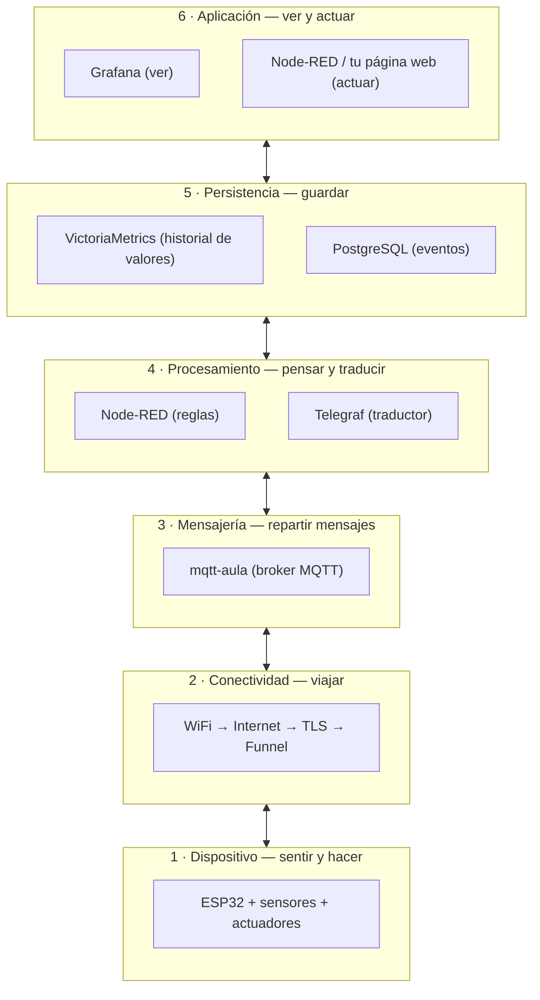
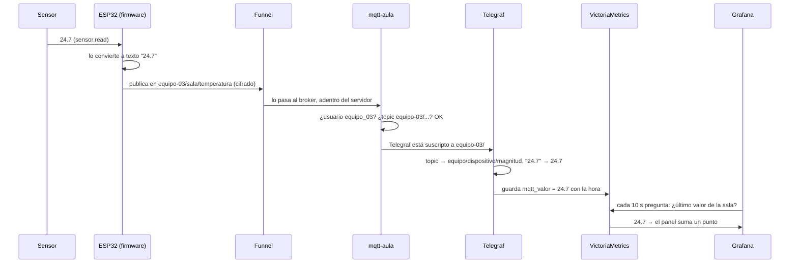
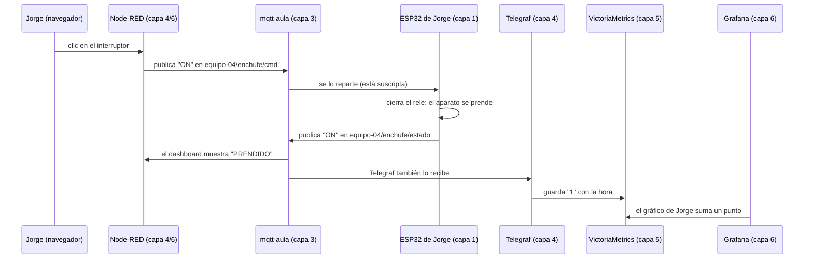

# 11. Arquitectura IoT del aula

🎯 **Objetivo:** entender **cómo está pensado** el sistema con el que trabajan sus
placas: de qué partes está hecho, cómo viaja un dato desde un sensor hasta una
pantalla, y **por qué** se eligió cada pieza. Al terminar vas a poder dibujar tu
propio proyecto con estas mismas partes.

🧩 **Prerequisitos:** ninguno. Si querés el contexto del servidor, leé antes el
[capítulo 1 (Visión general)](01-vision-general.md).

🆕 **Conceptos nuevos:** IoT, arquitectura de software, capa, sensor, actuador,
microcontrolador, MQTT, broker, topic, mensaje, publicar/suscribir, mensaje
retenido, último deseo (*Last Will*), TLS, contrato, serie temporal.

---

## 📖 Empecemos por algo que ya usás: un grupo de WhatsApp

Pensá en el grupo de WhatsApp del curso:

- Cuando alguien **manda un mensaje al grupo**, no le escribe a cada persona una
  por una. Lo manda **al grupo**, y le llega a todos los que están adentro.
- Quien manda **no necesita saber** quién lo va a leer, ni si están conectados en
  ese momento.
- Hay un **servidor de WhatsApp** en el medio que recibe el mensaje y lo reparte.
- Podés **fijar** un mensaje arriba de todo, para que quien entre después lo vea
  primero.
- Cada grupo tiene **nombre**, y solo leés los grupos en los que estás.

**El sistema de las placas del aula funciona exactamente así.** Las placas, en vez
de personas, mandan mensajes como "la temperatura es 23.5" o "la puerta está
abierta" a "grupos" con nombre. Un servidor en el medio los reparte a quien esté
escuchando: un tablero, una base de datos, otra placa. Todo lo que sigue en este
capítulo es ponerle nombre técnico a esta idea y entender por qué está bien
pensada.

---

## ¿Qué es IoT?

**IoT** son las siglas en inglés de *Internet of Things*: **Internet de las
Cosas**. Es la idea de conectar a una red **objetos físicos** (no computadoras ni
celulares) para que:

- **midan** algo del mundo real (temperatura, si una puerta está abierta, si hay
  alguien), o
- **hagan** algo en el mundo real (prender una luz, abrir una cerradura, cortar un
  enchufe).

Ejemplos que ya conocés: un portón que se abre desde el celular, una alarma que
avisa al teléfono, un medidor de luz inteligente. Los proyectos de ustedes (el
enchufe de Jorge, el sensor de puerta de Jessi, el LED de Mijael) son IoT.

## ¿Qué es "arquitectura de software"?

Antes de construir una casa, un arquitecto decide **qué ambientes tiene, cómo se
conectan y por qué** (la cocina cerca del comedor, el baño lejos del living). No
pone ladrillos: dibuja los planos y justifica cada decisión.

La **arquitectura de software** es lo mismo para un sistema: decidir **qué partes
tiene, cómo se comunican y por qué se eligió cada una** frente a otras opciones.
Un buen diseño hace que el sistema:

- se pueda **entender** (cada parte tiene un trabajo claro),
- se pueda **cambiar** sin romper todo (cambiar una parte no obliga a tocar las
  demás),
- **aguante fallas** (si algo se cae, lo demás sigue o se recupera solo).

En este capítulo vamos a mirar el sistema del aula con ojos de arquitecto.

---

## Las capas: cada parte con un solo trabajo

Una forma clásica de ordenar un sistema IoT es en **capas**: como los pisos de un
edificio, cada piso tiene su función y solo habla con el de arriba y el de abajo.
Así, si cambiás un piso (por ejemplo, otra placa), los demás no se enteran.



Las vemos de abajo hacia arriba, siempre con un ejemplo de ustedes.

### Capa 1 — Dispositivo: sentir y hacer

Es la parte que **toca el mundo físico**. Tiene tres piezas, y la analogía con el
cuerpo ayuda:

| Pieza | Como en el cuerpo | Qué es | Ejemplo del aula |
|---|---|---|---|
| **Sensor** | los sentidos | mide algo y lo convierte en un dato | el *reed switch* de Jessi (un interruptor que se cierra cuando le acercás un imán: sirve para saber si una puerta está cerrada) |
| **Actuador** | los músculos | hace algo cuando recibe una orden | el LED de Mijael, el relé del enchufe de Jorge (un **relé** es un interruptor que se acciona con una señal eléctrica chica y puede cortar un aparato grande) |
| **Microcontrolador** | un cerebro chico | una computadora mínima que lee sensores, maneja actuadores y se conecta a la red | la **ESP32** |

La **ESP32** es una placa barata con WiFi incorporado. Sus patas de conexión se
llaman **GPIO** (*General Purpose Input/Output*: entrada/salida de uso general):
cada pata puede **leer** (¿hay corriente o no?) o **escribir** (dar corriente o
no). Cuando el código dice `Pin(2, Pin.OUT)`, está diciendo "la pata número 2 la
uso para dar corriente": ahí va el LED.

Al microcontrolador se le carga un programa llamado **firmware** (el software que
vive adentro de un aparato). Ustedes lo escriben en **MicroPython** (una versión
chica de Python para placas) o en **Arduino** (C++ con librerías para placas).

### Capa 2 — Conectividad: cómo viaja el dato

El dato tiene que salir de la placa y llegar al servidor del aula. El viaje es:

1. **WiFi:** la placa se conecta a la red de la casa o del colegio (tiene que
   ser de **2.4 GHz**; la ESP32 no ve redes de 5 GHz).
2. **Internet:** el dato sale a internet, como cuando mandás un mensaje desde tu
   celular.
3. **TLS** (*Transport Layer Security*, "seguridad de la capa de transporte"):
   el dato viaja **cifrado**, como una carta en **sobre cerrado** en vez de una
   postal. Cualquiera en el camino ve que pasa una carta, pero no puede leerla.
   Es lo mismo que pone el candado 🔒 en el navegador.
4. **Tailscale Funnel:** el servidor del aula está en una casa, detrás de un
   router (el aparatito que da internet) que no deja entrar a nadie desde afuera.
   **Funnel** es un servicio de la empresa Tailscale que funciona como un
   **portero**: recibe al visitante en una dirección pública
   (`homelab-01.tail4eda13.ts.net`, puerto `10000`) y lo hace pasar al servidor
   por un pasillo seguro. Así no hay que abrir puertas del router.

Un **puerto** es como el número de departamento dentro de un edificio: la
dirección lleva al edificio (el servidor) y el puerto al servicio exacto (el
`10000` es el de los mensajes de las placas).

> **Para ustedes como personas** (no para las placas) hay otro camino:
> **Tailscale**, una red privada que conecta sus computadoras con el servidor como
> si estuvieran en la misma casa. **Por qué dos caminos, qué es un túnel y por qué
> te piden tantas contraseñas** → [Red y accesos](red-y-accesos.md).

### Capa 3 — Mensajería: el que reparte los mensajes

Acá vive el "servidor de WhatsApp" del principio. La tecnología se llama **MQTT**
(*Message Queuing Telemetry Transport*): un idioma muy liviano, pensado para
aparatos chicos con poca batería y redes malas, para mandar mensajes cortos.

| Palabra MQTT | Qué es | En WhatsApp sería… |
|---|---|---|
| **Broker** | el programa del medio que recibe y reparte | el servidor de WhatsApp |
| **Topic** (tema) | el "nombre del grupo" al que se manda un mensaje | el nombre del grupo |
| **Publicar** (*publish*) | mandar un mensaje a un topic | escribir en el grupo |
| **Suscribirse** (*subscribe*) | anotarse para recibir lo de un topic | estar en el grupo |
| **Payload** (carga) | el contenido del mensaje (`23.5`, `ON`) | el texto del mensaje |
| **Mensaje retenido** (*retained*) | el broker guarda el último y se lo da al que llega | un mensaje fijado |
| **Último deseo** (*Last Will*) | lo que el broker publica por vos si te desconectás de golpe | "si no contesto, avisen que me quedé sin batería" |
| **QoS** (*Quality of Service*, calidad de servicio) | cuánto esfuerzo pone en que llegue (0 = una vez, sin confirmar) | el doble tilde |

El broker del aula se llama **`mqtt-aula`**. Es uno solo para todos los equipos,
pero cada equipo tiene **su usuario y su clave**, y una **ACL** (*Access Control
List*, lista de control de acceso: las reglas de "quién puede hacer qué") que lo
deja escribir y leer **solo** en los topics que empiezan con su nombre. El
equipo-04 puede usar `equipo-04/...`, y nada más.

Un topic se escribe como una ruta de carpetas, separada por `/`:

```
equipo-04 / enchufe / estado
  └ equipo   └ aparato  └ qué cosa
```

### Capa 4 — Procesamiento: pensar y traducir

Los mensajes crudos hay que **usarlos**. En el aula hay dos piezas:

- **Node-RED:** una herramienta donde armás la lógica **conectando cajitas** en
  vez de escribir código ("cuando llega esto, hacé aquello"). Es la que usan
  para el interruptor del dashboard y para la página de Mijael.
- **Telegraf:** un programa que hace de **traductor y escribano**. Escucha los
  mensajes de todos los equipos, los traduce a números (`ON` → 1, `abierto` → 1,
  `"23.5"` → 23.5) y los anota en la base de datos con la hora exacta.

Ojo con un detalle que confunde: **Telegraf escucha el broker directamente**. Los
datos llegan a Grafana **sin pasar por Node-RED**. Node-RED es para **reglas y
botones**, y es opcional para graficar. Cuándo usar cada uno →
[¿Node-RED, Grafana o ambos?](node-red-o-grafana.md).

### Capa 5 — Persistencia: guardar para después

**Persistir** quiere decir **guardar de forma que no se pierda** aunque se apague
todo. Se usan bases de datos distintas según el tipo de dato, como en una casa se
guarda la ropa en el placard y la comida en la heladera:

- **VictoriaMetrics** guarda **series temporales**: listas de valores con su hora,
  como una planilla de "hora | temperatura". Es lo ideal para sensores: "¿cómo
  cambió la temperatura en las últimas 3 horas?". Guarda **15 días**.
- **PostgreSQL** guarda **eventos y registros**, como un libro de actas: "a las
  10:32 entró Jorge al pañol". Se usa donde importa quién hizo qué.

### Capa 6 — Aplicación: lo que ve y usa la persona

- **Grafana** es un programa para **ver** datos en gráficos. Pensalo como el
  **tablero de un auto**: te muestra velocidad, nafta y temperatura, pero no
  maneja. Cada equipo tiene su propio tablero (*dashboard*). Ver
  [capítulo 13](13-usar-grafana.md).
- **Node-RED o tu página web** son el **volante**: desde ahí se **mandan
  órdenes** (prender el LED, cortar el enchufe).

### Lo que atraviesa todas las capas

Algunas cosas no son un piso del edificio sino **las instalaciones** que pasan
por todos (como la electricidad o las cañerías):

- **Seguridad:** cada equipo con su identidad, el cifrado en el viaje, y cada
  programa con el **mínimo permiso** que necesita (Telegraf puede leer, pero no
  escribir).
- **Observabilidad:** poder saber qué está pasando adentro mirando desde afuera
  (los tableros, los registros o *logs*).
- **Infraestructura como código:** todo el servidor está descripto en archivos
  que se pueden volver a aplicar (ver [capítulo 4](04-ansible-iac.md)). Si mañana
  se rompe, se reconstruye igual.

---

## Seguí un dato de punta a punta: 24,7 °C

Las capas explican **qué** hay. Ahora seguimos **un dato concreto** por todas
ellas, con los nombres reales del sistema. Supongamos que el equipo-03 tiene un
sensor de temperatura en la sala y mide **24,7 °C**.

### El ciclo completo, en una imagen

Ida (el dato, del sensor a tu pantalla) y vuelta (la orden, de tu botón al
actuador), con **el protocolo de cada tramo** y las herramientas con las que
trabajás:


### Paso a paso



| # | ¿Quién? | ¿Qué hace con el dato? | ¿En qué formato está? |
|---|---|---|---|
| 1 | **Sensor** | mide la temperatura | una señal eléctrica |
| 2 | **Firmware de la ESP32** | lo lee (`sensor.read()`) y lo pasa a texto | número `24.7` → texto `"24.7"` (con **punto**, no coma) |
| 3 | **Firmware** | lo **publica** en el topic `equipo-03/sala/temperatura` | mensaje MQTT: *topic* + *payload* `"24.7"` |
| 4 | **WiFi → internet** | lleva el mensaje cifrado hasta el portero | MQTT dentro de **TLS** (el sobre cerrado) |
| 5 | **Funnel** | recibe en `homelab-01.tail4eda13.ts.net:10000`, saca el sobre y lo entrega adentro del servidor | MQTT sin cifrar, pero ya **dentro** del servidor |
| 6 | **mqtt-aula** | comprueba que el usuario sea `equipo_03` y que el topic empiece con `equipo-03/`; se lo reparte a **todos los suscriptos** | el mismo mensaje |
| 7 | **Telegraf** | separa el topic en partes (`equipo-03` / `sala` / `temperatura`) y convierte `"24.7"` en el número 24.7 | `mqtt_valor{equipo="equipo-03", dispositivo="sala", magnitud="temperatura"} = 24.7` |
| 8 | **VictoriaMetrics** | lo **guarda** con la hora exacta, durante 15 días | una fila más en la serie temporal |
| 9 | **Grafana** | cada 10 segundos le pregunta a VictoriaMetrics y dibuja | un punto en el gráfico |

**Tiempo total:** el mensaje llega al broker en menos de un segundo; Telegraf
escribe cada 5 segundos; Grafana se actualiza cada 10. En unos **15 segundos** el
24,7 está en tu panel.

> **El mismo camino, con un dato real del aula:** cuando el enchufe de Jorge
> publica `ON` en `equipo-04/enchufe/estado`, recorre exactamente los pasos 3 a 9.
> En el paso 7, Telegraf convierte la palabra `ON` en el número **1** (y `OFF` en
> **0**) para poder graficarla.

### ¿Quién conoce a quién?

Una de las ideas más importantes de este diseño: **cada pieza conoce solo a su
vecina**.

| Pieza | Conoce a… | NO conoce a… |
|---|---|---|
| ESP32 | la dirección del broker, su usuario y su topic | a Telegraf, a Grafana, a Node-RED |
| mqtt-aula | quién está suscripto a qué (en ese momento) | qué hace cada uno con los mensajes |
| Telegraf | el broker (para escuchar) y VictoriaMetrics (para escribir) | a las placas |
| VictoriaMetrics | nada: solo guarda y responde preguntas | de dónde vienen los datos |
| Grafana | VictoriaMetrics (su *datasource*) | a las placas y al broker |
| Node-RED | el broker | a Telegraf y a Grafana |

Por eso se pudo **sumar Grafana sin tocar ninguna placa**: la placa sigue
publicando igual que antes, y alguien nuevo se suscribió (decisión 1, abajo).

### ¿Qué pasa si se cae cada pieza?

| Si se cae… | Pasa esto | Lo que sigue andando |
|---|---|---|
| el **WiFi** de la placa | no sale nada; la placa reintenta sola | todo lo demás |
| **Funnel** (el portero) | ninguna placa llega al broker | Grafana muestra lo ya guardado; Node-RED sigue abierto |
| **mqtt-aula** | nadie recibe ni manda mensajes | Grafana muestra el historial hasta ese momento |
| **Node-RED** | no hay botones ni reglas | los datos **siguen llegando a Grafana** (no pasan por Node-RED) |
| **Telegraf** | los datos llegan al broker pero **no se guardan** | Node-RED y las placas funcionan; Grafana muestra un hueco |
| **VictoriaMetrics** | no se guarda ni se puede consultar | las placas y Node-RED |
| **Grafana** | no se puede **ver** | los datos se siguen guardando: al volver, aparecen |

Cuando no sabés cuál se cayó, el [diagnóstico](diagnostico.md) lo recorre paso a paso.

## El viaje completo de un mensaje: Jorge prende su enchufe

Seguimos un clic, paso a paso, por todas las capas:



Fijate en algo importante: el dashboard muestra **"PRENDIDO" recién cuando la
placa confirma**, no cuando Jorge hace clic. Esa es la primera de las decisiones
de diseño que vemos ahora.

---

## Las decisiones de diseño (y por qué)

Cada decisión sigue el mismo formato: **qué problema había**, **qué opciones
existían**, **qué se eligió** y **qué pasaría si no**.

### Decisión 1 — Publicar/suscribir en vez de que cada uno hable con cada uno

- **Problema:** hay placas, tableros, una base de datos y páginas web. Si cada
  uno tuviera que conocer la dirección de cada otro, sería una telaraña: sumar un
  tablero obligaría a reprogramar todas las placas.
- **Opciones:** que la placa le hable directo a cada programa, o poner un
  **intermediario** (el broker).
- **Elección:** intermediario. La placa publica **una vez** y no sabe ni le
  importa quién escucha. Sumar Grafana no requirió tocar ninguna placa.
- **Si no:** cada cambio en el servidor obligaría a reprogramar las placas.
- **Nombre técnico:** **desacople** (las partes no dependen unas de otras).

### Decisión 2 — El topic es un contrato

- **Problema:** si cada equipo inventa sus topics y sus mensajes como quiere,
  nadie más puede entenderlos (ni Grafana ni otro equipo).
- **Opciones:** dejarlo libre, o acordar **reglas** de antemano.
- **Elección:** un **contrato**, que es un acuerdo escrito de cómo se habla:
  `equipo/dispositivo/magnitud`, y mensajes que son un número, una palabra de
  estado o un JSON (las [3 reglas del capítulo 12](12-conectar-a-grafana.md#las-3-reglas)).
  En software, a un contrato así se le llama **interfaz** o **API** (*Application
  Programming Interface*: la forma acordada en que dos programas se hablan).
- **Si no:** pasa lo que le pasó al reed de Jessi. Publicaba en `equipo-01/reed`
  (dos partes), y por eso no aparece en Grafana (ver
  [capítulo 14](14-proyectos-de-los-equipos.md)).

### Decisión 3 — Separar la orden del estado confirmado

- **Problema:** que mandes "prendé" no significa que se haya prendido. La placa
  puede estar desconectada, o el relé trabado.
- **Opciones:** mostrar lo que se pidió, o mostrar lo que la placa **confirma**.
- **Elección:** dos topics. `.../cmd` es la **orden**; `.../estado` es la
  **confirmación** que publica la placa después de hacerlo. El tablero muestra la
  confirmación.
- **Si no:** el tablero diría "PRENDIDO" con la placa apagada. En un enchufe o en
  una cerradura, mentirle al usuario es peligroso.
- **Ojo, un nivel más (estado medido):** la confirmación dice lo que **hizo la
  placa** ("puse el pin en alto"), no lo que **pasó en el mundo**. Si el relé está
  roto o el aparato desenchufado, la placa igual publica `ON`. Para saber si el
  aparato **de verdad** prendió hace falta **medirlo** con un sensor (de
  corriente, de luz, de temperatura) y publicar esa medición aparte, por ejemplo
  en `equipo-04/enchufe/consumo`. Hay tres niveles, de menos a más confiable:

  | Nivel | Qué sabés | Ejemplo |
  |---|---|---|
  | **Orden** | lo que **pediste** | `…/cmd = ON` |
  | **Estado confirmado** | lo que la **placa hizo** | `…/estado = ON` (pin en alto) |
  | **Estado medido** | lo que **pasó de verdad** | `…/consumo = 0.4` (el aparato consume) |

  Para una muestra, el confirmado alcanza. En una cerradura o un sistema de
  seguridad (como el del pañol), conviene el **medido**: por eso la puerta del pañol
  tiene un sensor (reed) que dice si de verdad se abrió.

### Decisión 4 — Ver y actuar, separados

- **Problema:** ¿desde dónde se prende el LED? ¿Desde Grafana?
- **Elección:** Grafana **solo muestra** (el tablero del auto); las órdenes salen
  de Node-RED o de tu página (el volante).
- **Por qué:** el que mira no necesita permiso para mandar. Así se le puede dar
  Grafana a mucha gente (incluso mostrarlo en público) sin que nadie pueda tocar
  un aparato.

### Decisión 5 — La red falla: diseñar para reconectar

- **Problema:** el WiFi se corta, el servidor se reinicia, una entrada de
  internet se cae. **Va a pasar**, no es "si pasa".
- **Elección:** el firmware **reintenta solo** (cada 5 segundos), arranca en un
  estado seguro (relé apagado), y avisa con el **último deseo** si se desconecta
  de golpe (`equipo-NN/placa/conexion` = `offline`).
- **Si no:** cada corte necesitaría que alguien vaya a reiniciar la placa a mano.
- **Nombre técnico:** diseño **a prueba de fallos** (*fail-safe*). Casos reales
  de este mes en el [capítulo 10](10-casos-practicos.md).

### Decisión 6 — Cada equipo en su carril

- **Problema:** un solo broker para todos. ¿Qué impide que un equipo prenda el LED
  de otro, sin querer o a propósito?
- **Elección:** usuario y clave por equipo, más una ACL que lo encierra en
  `equipo-NN/#` (el `#` significa "todo lo que siga"). Un mensaje fuera de su
  carril el broker lo **descarta**.
- **Nombre técnico:** **multitenencia** (muchos "inquilinos" en un mismo sistema,
  cada uno en lo suyo).

### Decisión 7 — Mínimo privilegio

- **Idea:** cada programa tiene **solo** el permiso que necesita para su trabajo.
- **En el aula:** Telegraf puede **leer** los topics de los equipos, pero no
  **escribir**. Si alguien lo engañara, no podría prender nada.

### Decisión 8 — Ponerle límites al error

- **Problema:** una placa con un error de código puede publicar **miles de
  mensajes por segundo**, o inventar topics nuevos sin parar, y llenar el disco.
- **Elección:** **topes** en todo el camino. La base acepta un máximo de series
  nuevas por día, los nombres tienen un largo máximo y un JSON se lee hasta 20
  valores.
- **Si no:** el error de un equipo tumbaría el sistema de todos.

### Decisión 9 — Todo escrito, nada "a mano"

- **Elección:** el servidor, el broker, Grafana y hasta los permisos de cada
  equipo están descriptos en archivos (Ansible) dentro del repositorio.
- **Por qué:** sumar un equipo es agregar una línea y aplicar. Si el servidor se
  rompe, se reconstruye igual. Y cualquiera puede **leer** cómo está hecho.

---

## 🧠 Ideas clave

- IoT = objetos físicos que **miden** (sensores) o **hacen** (actuadores),
  conectados a una red.
- El sistema se ordena en **6 capas**: dispositivo, conectividad, mensajería,
  procesamiento, persistencia y aplicación. Cada una tiene un solo trabajo.
- **MQTT** funciona como un grupo de WhatsApp: se publica en un **topic** y le
  llega a quien esté suscripto, a través de un **broker**.
- El **topic es un contrato**: `equipo/dispositivo/magnitud`.
- **Orden** (`cmd`) y **estado confirmado** (`estado`) van separados; y la
  confirmación dice lo que **hizo la placa**: para saber lo que **pasó de verdad**,
  hay que **medirlo**.
- **Grafana mira, Node-RED actúa.**
- La red **va a fallar**: la placa tiene que reconectar sola.

## ⚠️ Errores comunes

- Publicar sin respetar el contrato (`equipo-01/reed`, `casa/enchufe/cmd`): el
  mensaje se pierde o no aparece en Grafana.
- Mostrar en el tablero la **orden** en vez del **estado confirmado**.
- Querer manejar un actuador desde Grafana.
- Escribir firmware que, si se cae el WiFi, se queda trabado esperando para
  siempre.

## ❓ Preguntas de repaso

1. ¿Qué diferencia hay entre un sensor y un actuador? Da un ejemplo de cada uno
   de los proyectos del aula.
2. Explicá con la analogía de WhatsApp qué es un broker, un topic y un mensaje
   retenido.
3. ¿Por qué el dashboard de Jorge espera la confirmación de la placa antes de
   mostrar "PRENDIDO"?
4. ¿Qué pasaría si un equipo pudiera publicar en los topics de otro?
5. ¿Para qué sirve el "último deseo" (*Last Will*)?

## 🛠️ Ejercicios

1. Dibujá **tu proyecto** con las 6 capas: qué pieza va en cada una.
2. Escribí los topics de tu proyecto respetando el contrato
   `equipo-NN/dispositivo/magnitud`. Marcá cuáles son **órdenes** y cuáles
   **estados**.
3. Elegí una de las 9 decisiones y escribí qué le pasaría a **tu** proyecto si no
   se hubiera tomado.

---

## Ahora deberías entender

- **Qué problema resuelve** cada capa, y **dónde está** cada pieza del aula.
- El **recorrido de un dato**: sensor → firmware → WiFi → Funnel → broker →
  Telegraf → VictoriaMetrics → Grafana, con Node-RED al costado.
- **Quién conoce a quién**, y qué sigue andando cuando una pieza se cae.

**Seguí por acá:**

- Si querés entender **la parte invisible de la red** (Tailscale, túneles, por qué
  tantas contraseñas) → [Red y accesos](red-y-accesos.md).
- Si querés **conectar tu placa ya** → [capítulo 12](12-conectar-a-grafana.md).
- Si no sabés **si usar Node-RED, Grafana o los dos** → [¿Node-RED, Grafana o ambos?](node-red-o-grafana.md).
- Si tu dato **no aparece** → [Diagnóstico](diagnostico.md).

