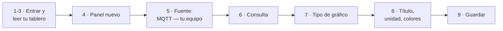
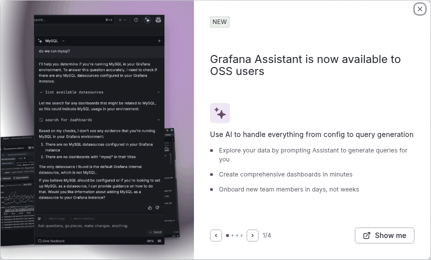
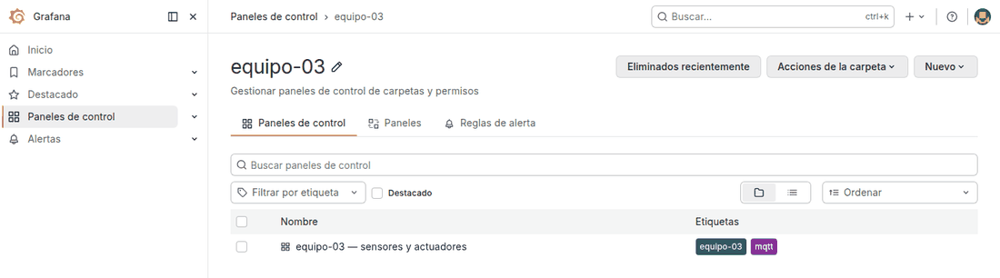
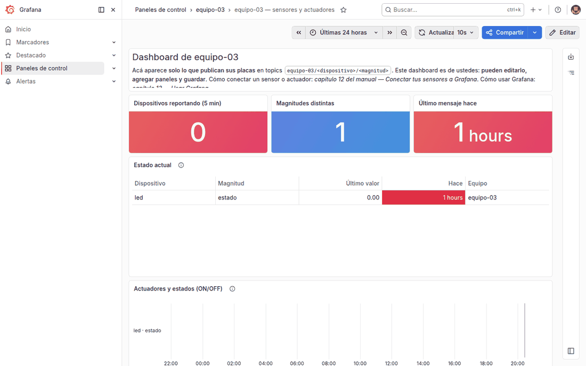
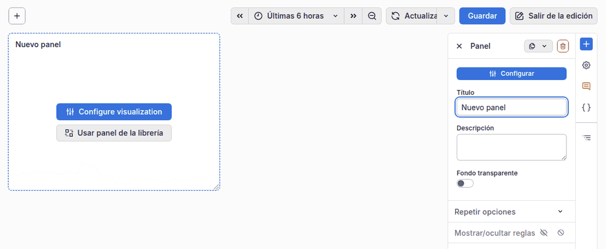
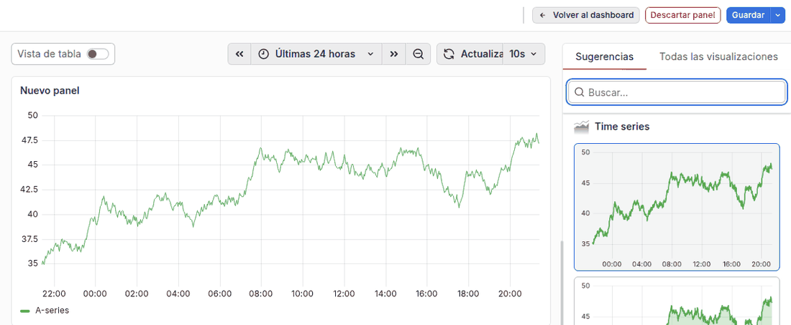
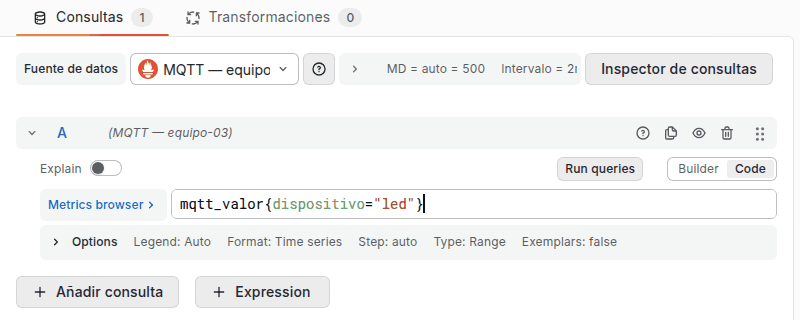
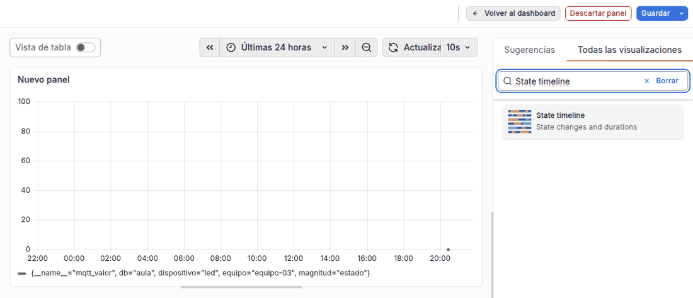
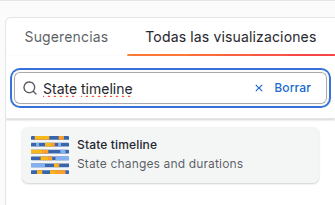
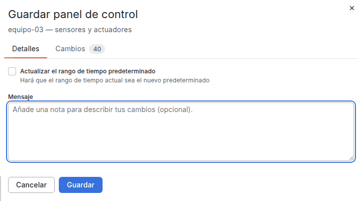

# 13. Grafana paso a paso

🎯 **Objetivo:** entrar al Grafana del aula, entender el tablero de tu equipo y
**armar tus propios gráficos** con los datos de tus placas, paso a paso.

🧩 **Prerequisitos:** Tailscale conectado, tu **usuario y contraseña del aula**,
y (para ver algo) tu placa publicando como explica el
[capítulo 12](12-conectar-a-grafana.md). Sin datos igual podés hacer todos los
pasos: los gráficos van a decir *No data* hasta que tu placa publique.

## Primero, la idea: el tablero de un auto

El tablero de un auto te muestra velocidad, nafta y temperatura del motor de un
vistazo, con agujas y luces de colores. No maneja el auto: **te deja ver** cómo
anda. **Grafana** es eso para tus placas.

> **Palabras de este capítulo:**
>
> - **Dashboard o panel de control (tablero):** una pantalla con varios
>   gráficos. Grafana en español les dice **"paneles de control"**.
> - **Panel:** cada cuadro del tablero (un gráfico, un número grande, una tabla).
> - **Consulta (*query*):** la pregunta que el panel le hace a la base de datos
>   ("dame la temperatura de la sala de las últimas 3 horas").
> - **Fuente de datos (*datasource*):** la base de datos a la que se le pregunta.
>   La de tu equipo se llama **MQTT — equipo-NN**.
> - **PromQL:** el idioma en que se escriben esas consultas. No hace falta
>   aprenderlo entero: abajo hay **ejemplos completos** y un **recetario** para
>   copiar.
> - **Serie temporal:** una lista de valores con su hora, como una planilla
>   "hora | valor".

**El recorrido completo**, para ubicarte:



> Grafana está **en español**, pero algunos botones del editor siguen en inglés
> (*Run queries*, *Code*, *Builder*). Acá van escritos tal cual los vas a ver.

---

## Paso 1 — Entrar

1. Prendé **Tailscale** en tu compu (la app tiene que decir *Connected*).
2. Abrí en el navegador:

    ```
    https://grafana-aula.lucasland.duckdns.org
    ```

3. Te pide **usuario y contraseña del aula**: son los mismos que usás para
   entrar por SSH. Entrás directo a Grafana, no hay otro login.
4. **La primera vez** aparece un aviso en inglés que dice *Grafana Assistant is
   now available*. No lo necesitás: cerralo con la **✕** de arriba a la derecha.
   No vuelve a salir.



> **Si el navegador dice "No se puede conectar":** casi siempre es Tailscale
> apagado. Si Tailscale está prendido y sigue igual, avisale al profe: es la
> configuración de nombres del aula (*Split DNS*), y la arregla él.
>
> **Si vuelve a pedirte la clave una y otra vez:** usuario o contraseña mal
> escritos. Después de varios intentos fallidos el login te bloquea **5
> minutos**: esperá y probá de nuevo con calma.

---

## Paso 2 — Encontrar el tablero de tu equipo

1. Menú de la izquierda → **Paneles de control**.
2. Entrá a la carpeta **equipo-NN** (la de tu equipo).
3. Abrí **equipo-NN — sensores y actuadores**.



Ese tablero lo creó el sistema para tu equipo **y es de ustedes**: lo pueden
cambiar, agregarle paneles y guardarlo. Las carpetas de los otros equipos no
aparecen, y no podés modificar sus tableros (ni ellos el tuyo).

---

## Paso 3 — Leer el tablero



| Panel | Qué te dice |
|---|---|
| **Dispositivos reportando (5 min)** | cuántas placas mandaron algo en los últimos 5 minutos |
| **Magnitudes distintas** | cuántas cosas distintas midió tu equipo alguna vez (temperatura, estado…) |
| **Último mensaje hace** | cuánto pasó desde el último dato. **Rojo** = hace más de 15 minutos |
| **Estado actual** | tabla con el **último valor** de cada dispositivo y magnitud, y hace cuánto llegó |
| **Actuadores y estados (ON/OFF)** | barras de color en el tiempo: verde = ON/abierto, gris = OFF/cerrado |
| **Todas las magnitudes** | gráfico de líneas con la historia de cada valor |
| **Mensajes por minuto** | cuánto publica cada placa (sirve para detectar bucles) |

En la captura, el equipo-03 tiene la placa **apagada**: por eso *Dispositivos
reportando* da **0** y *Último mensaje hace* está en **rojo**. Pero la tabla
**Estado actual** recuerda el último valor que llegó (`led · estado = 0`, hace 1
hora). **No es un error:** Grafana te muestra lo **guardado**, y lo guardado no se
borra cuando apagás la placa (se guarda 15 días).

**Mover el tiempo** (arriba a la derecha):

- El reloj 🕒 (dice **Últimas 24 horas** o parecido) elige el rango:
  *Últimos 15 minutos*, *Últimas 24 horas*, etc.
- Hacé **clic y arrastrá** sobre un gráfico para hacer zoom en ese tramo.
- **Actualizar** ⟳ trae lo último. El tablero ya se actualiza solo cada **10 s**.

**Pasá el mouse** sobre un gráfico: ves el valor exacto en ese momento.

---

## Paso 4 — Crear un panel nuevo

1. Arriba a la derecha, **Editar**. El tablero pasa a **modo edición** (aparece
   una columna a la derecha y el botón **Guardar**).
2. En la columna derecha, **Añadir panel**. Aparece un cuadro **Nuevo panel**.
3. Tocá **Configurar** (en la columna derecha) o **Configure visualization**
   (dentro del cuadro). Se abre el **editor del panel**.



El editor tiene tres zonas:

- **Arriba al centro:** cómo se ve el gráfico.
- **Abajo:** la **consulta** (qué datos traer).
- **A la derecha:** el **tipo de gráfico** y sus **opciones** (título, unidad,
  colores).

---

## Paso 5 — Elegir la fuente de datos (¡el paso que más se olvida!)

Un panel nuevo arranca con la fuente **-- Grafana --**, que **no son tus datos**:
son números de prueba que Grafana inventa. Se ven así, una línea que sube y baja
sola:



1. Abajo, en **Fuente de datos**, abrí la lista.
2. Elegí **MQTT — equipo-NN**, la de **tu** equipo (podés escribir `equipo-03`
   para encontrarla rápido).

> **Siempre la de tu equipo.** Es la que filtra solo tus datos: con ella, tus
> consultas no necesitan decir de qué equipo son. Las otras de la lista son de
> los demás equipos y del profe: no son para tu tablero.

---

## Paso 6 — Escribir la consulta

1. En la fila de la consulta (la **A**), a la derecha, cambiá **Builder** por
   **Code**. *Builder* arma la consulta con menús; *Code* te deja escribirla, y
   es más fácil copiar del recetario.
2. En el renglón de texto escribí la consulta. Para empezar, todo lo de un
   dispositivo:

    ```
    mqtt_valor{dispositivo="led"}
    ```

    Cambiá `led` por el nombre de **tu** dispositivo: es la **parte 2 de tu
    topic** (`equipo-03/`**`led`**`/estado`).

3. Tocá **Run queries** (o **Shift + Enter**). Arriba aparece el gráfico.





> Si arriba dice **No data**: o tu placa no publicó en el rango de tiempo elegido
> (probá **Últimas 24 horas**), o el nombre del dispositivo no coincide. Mirá cómo
> se llama exactamente en la tabla **Estado actual** del tablero: va en
> minúsculas, y los espacios y guiones se convierten en `_` (`sala-1` → `sala_1`).

---

## Paso 7 — Elegir cómo se ve

En la columna derecha, pestaña **Todas las visualizaciones**, buscá el tipo de
gráfico y hacé clic:



| Tipo (en inglés en la lista) | Para qué | Ejemplo |
|---|---|---|
| **Time series** | valores que cambian en el tiempo | temperatura, humedad, luz |
| **Stat** | un número grande | temperatura **ahora** |
| **Gauge** | un reloj de aguja | nivel de un tanque, % de batería |
| **State timeline** | encendido/apagado en el tiempo | relé, LED, puerta |
| **Table** | lista de valores | último valor de cada sensor |

La pestaña **Sugerencias** te propone tipos según tus datos: también sirve.

---

## Paso 8 — Título, unidad y colores

Con el tipo elegido, la columna derecha muestra sus **opciones**. Arriba hay un
**buscador de opciones**: escribí lo que buscás en vez de recorrer todo.

- **Título:** el nombre del panel ("Temperatura de la sala", no "Nuevo panel").
- **Unidad** (buscá *unidad* o *unit*): °C está en *Temperature → Celsius*; % en
  *Misc → Percent (0-100)*. Un "23.5" no dice nada; "23.5 °C" sí.
- **Umbrales** (*thresholds*): colores según el valor, por ejemplo **rojo arriba
  de 30**. Sirve para que se note de lejos cuando algo está mal.
- **Leyenda:** para que la línea diga algo útil en vez de todas las etiquetas,
  en la fila de la consulta abrí **Options → Legend → Custom** y poné
  `{{dispositivo}} · {{magnitud}}`.

---

## Paso 9 — Guardar

**Si no guardás, se pierde.**

1. Arriba, **Volver al dashboard**: ves tu panel nuevo junto a los otros.
   Arrastralo de la barra del título para moverlo, y de la esquina de abajo a
   la derecha para cambiarle el tamaño.
2. **Guardar** (botón azul, arriba a la derecha). Se abre **Guardar panel de
   control**:



3. En **Mensaje** contá en una línea qué cambiaste ("agrego temperatura de la
   sala"). Es opcional, pero después te ayuda a volver atrás.
4. **Guardar**. Después, **Salir de la edición**.

> **¿Te arrepentiste antes de guardar?** En el editor del panel, **Descartar
> panel**. Fuera del editor, recargá la página: se pierde lo que no guardaste.

---

## Tres paneles de ejemplo, completos

Cada uno es el recorrido de los pasos 4 a 9 con valores concretos. Cambiá
`sala`, `led` y los nombres por los de tus placas.

### A. "¿Qué temperatura hace ahora?" (número grande)

| Paso | Qué poner |
|---|---|
| 5 · Fuente | **MQTT — equipo-NN** |
| 6 · Consulta | `mqtt_valor{dispositivo="sala", magnitud="temperatura"}` |
| 7 · Tipo | **Stat** |
| 8 · Opciones | Título *Temperatura de la sala* · Unidad *Celsius* · umbral rojo en 30 |

### B. "¿Cuándo estuvo prendido el LED?" (barras ON/OFF)

| Paso | Qué poner |
|---|---|
| 5 · Fuente | **MQTT — equipo-NN** |
| 6 · Consulta | `mqtt_valor{dispositivo="led", magnitud="estado"}` |
| 7 · Tipo | **State timeline** |
| 8 · Opciones | Título *LED del tablero* |

Tu placa manda `ON`/`OFF` (o `abierto`/`cerrado`); el sistema lo guarda como
**1** y **0**. Por eso en el gráfico vas a ver números: **1 = prendido**.

### C. "¿Mi placa está viva?" (hace cuánto mandó algo)

| Paso | Qué poner |
|---|---|
| 5 · Fuente | **MQTT — equipo-NN** |
| 6 · Consulta | `time() - tlast_over_time(mqtt_valor{dispositivo="sala"}[15d])` |
| 7 · Tipo | **Stat** |
| 8 · Opciones | Título *Última señal de la sala* · Unidad *seconds (s)* · umbral rojo en 900 (15 min) |

---

## Recetario de consultas

Tus datos se llaman siempre **`mqtt_valor`** y tienen dos **etiquetas** (datos
que acompañan a cada valor para poder filtrarlo, como las columnas de una
planilla): `dispositivo` y `magnitud`, que son las partes 2 y 3 de tu topic.

Cómo se lee una consulta: `mqtt_valor{dispositivo="sala"}` quiere decir "los
valores **cuyo** dispositivo sea `sala`". Las llaves `{}` son el filtro.
`avg_over_time(...[1h])` quiere decir "el **promedio** (*average*) de la última
hora".

| Quiero ver… | Consulta |
|---|---|
| todo lo de mi equipo | `mqtt_valor` |
| una magnitud de un dispositivo | `mqtt_valor{dispositivo="sala", magnitud="temperatura"}` |
| todo lo de un dispositivo | `mqtt_valor{dispositivo="sala"}` |
| el promedio de la última hora | `avg_over_time(mqtt_valor{magnitud="temperatura"}[1h])` |
| el máximo del día | `max_over_time(mqtt_valor{magnitud="temperatura"}[24h])` |
| cuántas veces se abrió la puerta hoy | `changes(mqtt_valor{magnitud="reed"}[24h]) / 2` |
| hace cuánto llegó el último dato (s) | `time() - tlast_over_time(mqtt_valor{dispositivo="sala"}[15d])` |
| si la placa está conectada (1/0) | `mqtt_valor{magnitud="conexion"}` |

---

## Buenas prácticas

- **Antes de cambiar mucho, hacé una copia:** en modo edición, la flechita al
  lado de **Guardar** (**Más opciones de guardado**) → **Guardar como**, con otro
  nombre. Si rompés algo, tenés el original.
- **Guardá seguido, con mensaje.** Grafana guarda cada versión: desde la
  configuración del tablero (⚙️ en la columna derecha, en modo edición) →
  **Versiones** podés volver a una anterior.
- **Un panel = una idea.** Mejor varios paneles chicos que uno con 20 líneas.
- **Poné unidades y títulos.** Que alguien que no armó el tablero lo entienda.

---

## Si algo no anda

| Pasa esto | Probá esto |
|---|---|
| "No se puede conectar" al abrir la dirección | prendé Tailscale; si sigue, avisale al profe ([paso 1](#paso-1-entrar)) |
| Me pide la clave una y otra vez | usuario o clave mal escritos; tras varios intentos, esperá 5 minutos |
| No veo la carpeta de mi equipo | entraste con otro usuario, o no estás en el equipo: avisale al profe |
| El gráfico sube y baja solo, con números raros | la fuente es **-- Grafana --**: elegí **MQTT — equipo-NN** ([paso 5](#paso-5-elegir-la-fuente-de-datos-el-paso-que-mas-se-olvida)) |
| El panel dice **No data** | ampliá el rango a **Últimas 24 horas**; revisá el nombre del dispositivo en **Estado actual** ([paso 6](#paso-6-escribir-la-consulta)) |
| Tu dato no aparece ni en **Estado actual** | el problema está antes de Grafana: [capítulo 12, "Si no aparece"](12-conectar-a-grafana.md#si-no-aparece) |
| Hice cambios y desaparecieron | no guardaste ([paso 9](#paso-9-guardar)); si guardaste mal, volvé a una versión anterior |
| Me equivoqué y borré un panel | sin guardar: recargá la página. Ya guardado: ⚙️ → **Versiones** → la anterior → **Restaurar** |
| ¿Puedo prender el LED desde Grafana? | no: Grafana es para **ver**. Las órdenes se mandan desde Node-RED o tu página |

---

## Ahora deberías entender

- Qué es un **tablero**, un **panel**, una **consulta** y una **fuente de datos**.
- Que siempre hay que elegir la fuente **MQTT — equipo-NN**: la que viene por
  defecto son datos de prueba.
- Que Grafana **consulta lo guardado** (no recibe los mensajes directo): por eso
  muestra historia aunque la placa esté apagada, y por eso no prende LEDs.

**Seguí por acá:**

- Si un panel dice **"No data"** → [Diagnóstico, paso 9](diagnostico.md#paso-9-grafana-consulta-lo-correcto).
- Si querés graficar un valor **calculado** (no lo manda la placa) → [Caso C](node-red-o-grafana.md#caso-c-los-dos-node-red-procesa-grafana-muestra).
- Si querés entender **de dónde salen** los datos que ves → [Seguí un dato](11-arquitectura-iot.md#segui-un-dato-de-punta-a-punta-247-c).
