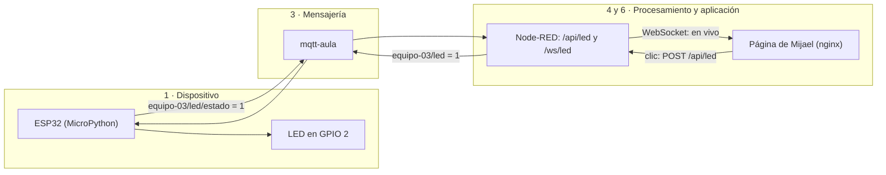
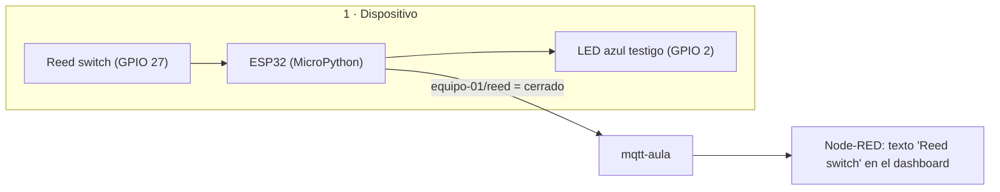
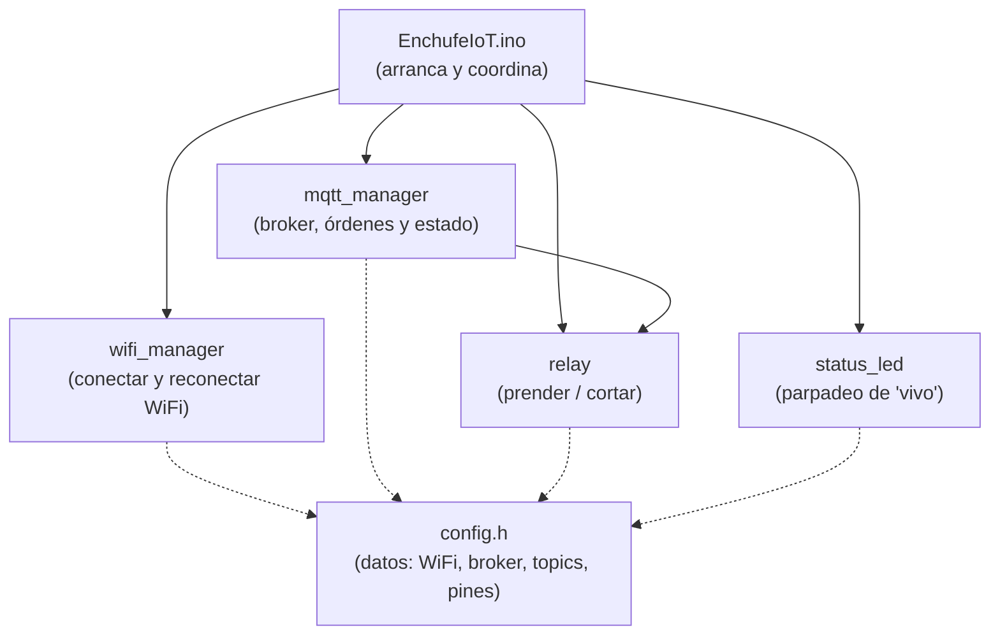
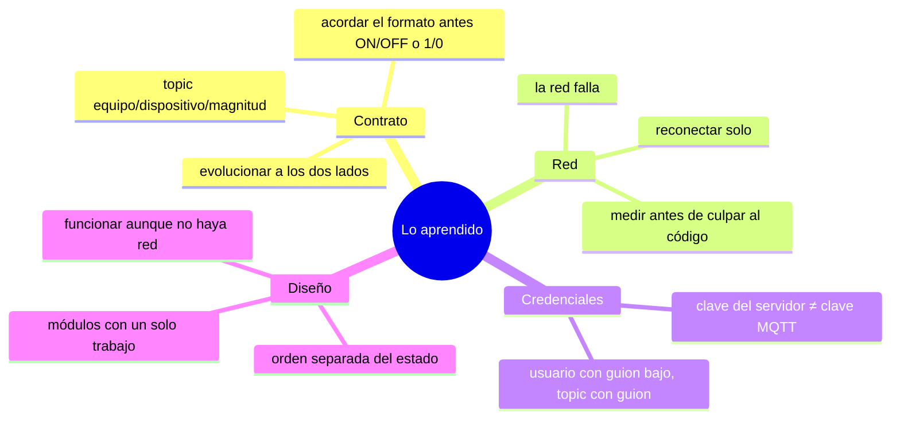

# 14. Los proyectos de los equipos (casos de diseño)

🎯 **Objetivo:** mirar los proyectos reales del aula con los ojos del
[capítulo 11](11-arquitectura-iot.md): qué pieza va en cada capa, qué decisiones
se tomaron, **qué falló y qué aprendimos**. Son proyectos hechos por ustedes,
con errores reales: por eso enseñan más que un ejemplo inventado.

🧩 **Prerequisitos:** [capítulo 11 (Arquitectura IoT)](11-arquitectura-iot.md).

🆕 **Conceptos nuevos:** caso de diseño, evolución de un contrato, firmware
modular, dashboard propio.

> Los proyectos son de sus autores: **Mijael** (equipo-03), **Jessi** (equipo-01)
> y **Jorge** (equipo-04), con sus compañeros de equipo. Se cuentan tal como
> pasaron, errores incluidos.

---

## Vista rápida

| | Mijael · equipo-03 | Jessi · equipo-01 | Jorge · equipo-04 |
|---|---|---|---|
| **Qué hace** | prende y apaga un LED desde la web | avisa si una puerta está abierta o cerrada | enchufe inteligente: prende y corta un aparato |
| **Tipo** | actuador | sensor | actuador |
| **Lenguaje** | MicroPython | MicroPython | Arduino (C++) |
| **Pieza física** | LED en GPIO 2 | *reed switch* en GPIO 27 + LED azul de la placa como testigo | relé (simulado con un LED) en GPIO 5 + LED de "vivo" en GPIO 4 |
| **Mensajes** | `1` / `0` | `abierto` / `cerrado` | `ON` / `OFF` |
| **Interfaz** | dashboard de Node-RED + **página propia** (nginx) | dashboard de Node-RED | dashboard de Node-RED + **página propia** (nginx) |

---

## Caso 1 — El LED de Mijael (equipo-03)

### Qué hace

Desde el navegador, un botón prende o apaga un LED que está en la placa. La
página muestra el estado **que confirma la placa**, en vivo.

### Las capas



Palabras nuevas del dibujo:

- **nginx** (se pronuncia "engine-x"): un **servidor web**, el programa que le
  entrega la página (los archivos HTML) al navegador.
- **`/api/led`**: una dirección dentro de Node-RED que recibe la orden de la
  página. **API** es la puerta acordada para que dos programas se hablen.
- **WebSocket**: una conexión que **queda abierta** entre la página y el
  servidor, para que los cambios lleguen solos sin recargar. Es como una llamada
  telefónica abierta en vez de mandar cartas.

### Decisiones que se tomaron

- **Orden y confirmación separadas** (decisión 3 del capítulo 11): la página no
  pinta el foco cuando hacés clic, sino cuando la placa avisa por
  `equipo-03/led/estado`.
- **La página habla con Node-RED, no con el broker:** el navegador no tiene que
  saber nada de MQTT ni tener la clave. Node-RED hace de **intermediario**.

### Qué falló y qué aprendimos

| Qué pasó | Por qué | Qué aprendimos |
|---|---|---|
| `OSError: Wifi Internal State Error` al reiniciar | un reinicio "suave" dejó el WiFi a medio conectar | apagar y prender el WiFi antes de conectar ([caso 4](10-casos-practicos.md#caso-4-wifi-internal-state-error-despues-de-reiniciar)) |
| `Error ... 5` en cada intento | en `MQTT_PASS` estaba la clave de **entrar al servidor**, no la del broker | son dos claves distintas ([caso 5](10-casos-practicos.md#caso-5-el-error-5-o-not-authorised-claves-mezcladas)) |
| `MBEDTLS_ERR_SSL_CONN_EOF` | una de las dos "puertas" de internet de Funnel estaba caída | el problema no siempre es tuyo: medir antes de cambiar código ([caso 7](10-casos-practicos.md#caso-7-mbedtls_err_ssl_conn_eof-una-puerta-de-entrada-caida)) |

### En Grafana

`equipo-03/led/estado` cumple el contrato (3 partes) → aparece como dispositivo
**`led`**, magnitud **`estado`**. En cambio la orden `equipo-03/led` tiene **2
partes** y no se guarda. Para la página no importa, pero si Mijael quiere graficar
también las órdenes, conviene pasarla a `equipo-03/led/cmd`.

---

## Caso 2 — La puerta de Jessi (equipo-01)

### Qué hace

Un **reed switch** (un interruptor que se cierra con un imán) detecta si una
puerta está cerrada. El LED azul de la placa hace de **testigo**: prendido =
cerrada. El estado viaja al dashboard.

### Las capas



### Decisiones que se tomaron

- **Pull-up interno:** el pin se "tira" hacia arriba por dentro de la placa, así
  no hace falta una resistencia externa. Cerrado (imán cerca) = `0`; abierto = `1`.
- **Antirrebote:** un contacto mecánico, al cerrarse, "rebota" varias veces en
  milésimas de segundo. El código **lee dos veces con 30 ms** de diferencia y
  solo cree si coinciden.
- **Publicar solo cuando cambia, y retenido:** no llena el broker de mensajes
  iguales, y quien abre el dashboard tarde igual ve el último estado.
- **Testigo local:** el LED azul funciona **aunque no haya WiFi**. Si la red se
  cae, la placa sigue cumpliendo su función básica (decisión 5: diseño a prueba de
  fallos).

### Qué falló y qué aprendimos

| Qué pasó | Por qué | Qué aprendimos |
|---|---|---|
| `Error, reintento en 5 s: 5` sin parar | clave MQTT equivocada (la del otro equipo) | cada equipo tiene la suya ([caso 5](10-casos-practicos.md#caso-5-el-error-5-o-not-authorised-claves-mezcladas)) |
| `& was unexpected at this time` en Windows | el comando era para PowerShell y se corrió en CMD | cada terminal tiene su sintaxis |

### En Grafana: un contrato que tiene que evolucionar

El topic `equipo-01/reed` tiene **2 partes**: cumple con el broker pero **no** con
el contrato de Grafana (`equipo/dispositivo/magnitud`). Por eso **todavía no
aparece** en el dashboard de Grafana. El cambio es de una línea:

```python
T_REED = b"equipo-01/puerta/reed"
```

y en Node-RED, cambiar el topic del nodo que lo escucha. Esto se llama **evolución
de un contrato**: cuando las reglas cambian, hay que actualizar a **los dos
lados** (el que publica y el que escucha) al mismo tiempo.

---

## Caso 3 — El enchufe de Jorge (equipo-04)

### Qué hace

Un enchufe inteligente: desde la web se prende o se corta un aparato. Un relé
(acá simulado con un LED) hace el corte, y otro LED parpadea para mostrar que el
sistema "está vivo".

### Un firmware bien organizado

Jorge separó el programa en **módulos**, cada uno con un solo trabajo. Es la
misma idea de las capas, pero adentro de la placa:



**Por qué está bueno:** para cambiar de broker se tocó **solo** `config.h` y
`mqtt_manager`. El relé, el LED y el WiFi no se enteraron. Eso es **desacople**
adentro del firmware.

### Qué falló y qué aprendimos

| Qué pasó | Por qué | Qué aprendimos |
|---|---|---|
| `Error 4` y en el servidor no aparecía **ningún** intento | `config.h` seguía apuntando a **otro broker** (`192.168.18.17:1883`), sin cifrado ni clave | si el servidor no ve tus intentos, tu placa está hablando con otro lado ([caso 6](10-casos-practicos.md#caso-6-el-error-4-y-en-el-servidor-no-aparece-nada)) |
| El dashboard mandaba `1`/`0` y la placa esperaba `ON`/`OFF` | las dos puntas no habían acordado el formato de los mensajes | el contrato se acuerda **antes** ([caso 8](10-casos-practicos.md#caso-8-on-y-off-contra-1-y-0-el-contrato-sin-acordar)) |

### En Grafana

`equipo-04/enchufe/estado` = `ON` → se guarda como **1**; `OFF` → **0**. Aparece
en el panel **Actuadores y estados** como barras verdes y grises en el tiempo: se
ve exactamente cuándo estuvo prendido el aparato.

---

## Lo que tienen en común (y lo que aprendimos como grupo)



## 🛠️ Ejercicios

1. Elegí **uno** de los tres proyectos y proponé una mejora usando una de las 9
   decisiones del capítulo 11.
2. Jessi tiene que pasar de `equipo-01/reed` a `equipo-01/puerta/reed`. Listá
   **todo** lo que hay que cambiar, en qué archivo y en qué máquina.
3. Dibujá el viaje de un mensaje de **tu** proyecto como el diagrama del caso 1.

---

## Ahora deberías poder

- Ubicar cada pieza de **tu** proyecto en las capas del capítulo 11.
- Explicar qué decisiones tomó tu equipo y qué aprendieron de sus errores.

**Seguí por acá:**

- Si tu proyecto necesita **reglas o botones** además de gráficos → [¿Node-RED, Grafana o ambos?](node-red-o-grafana.md).
- Si querés ver **tu proyecto en su ciclo de vida** (del código a la muestra) → [capítulo 15](15-ciclo-de-vida-y-madurez.md#el-ciclo-de-vida-de-tu-proyecto).
- Si algo de tu proyecto **dejó de andar** → [Diagnóstico](diagnostico.md).
