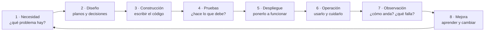
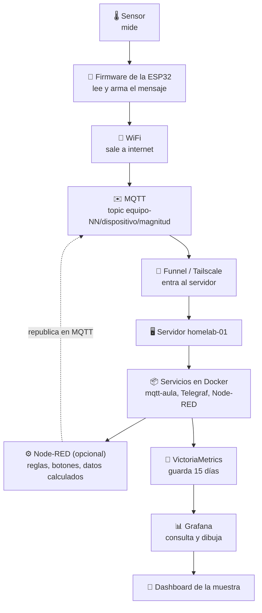
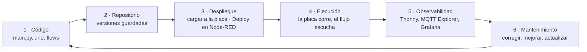
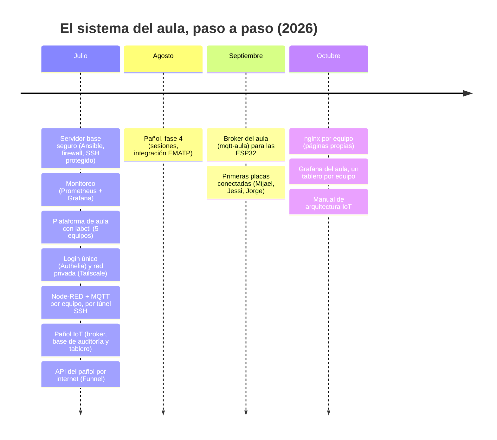
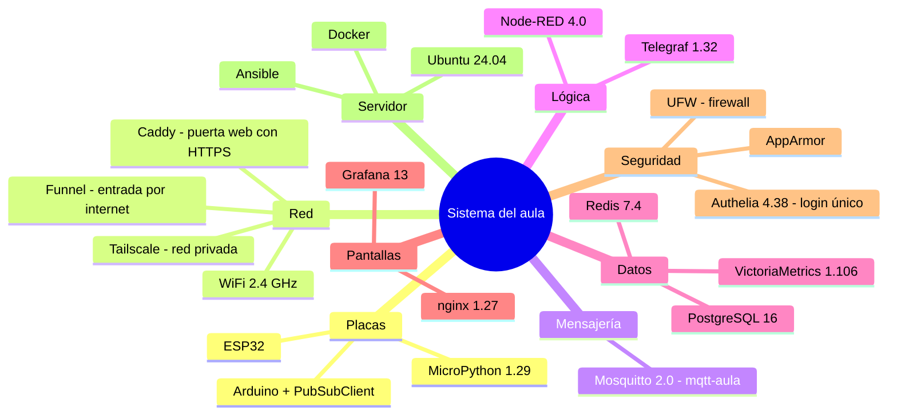
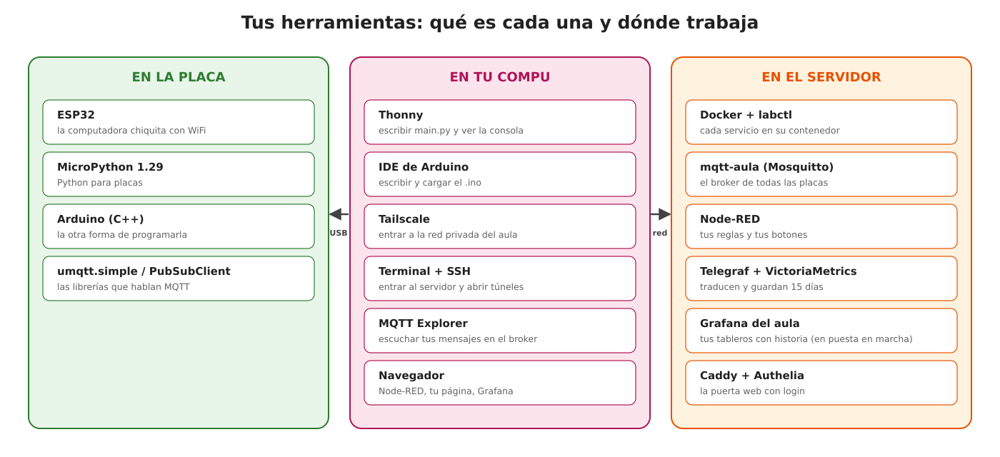
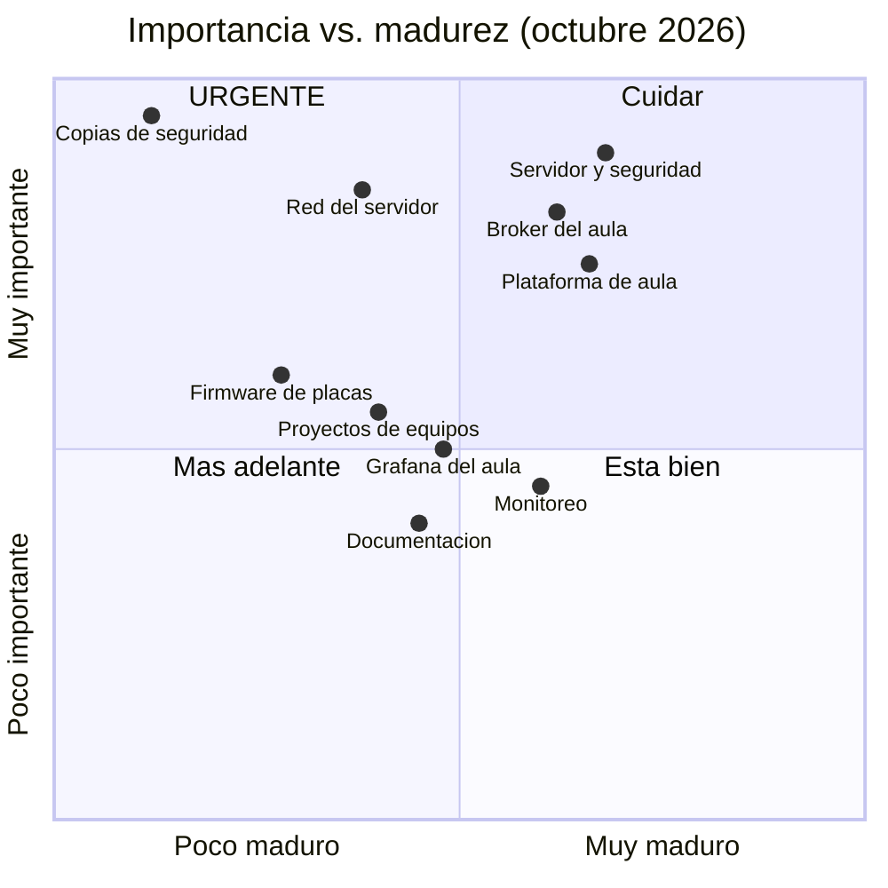

# 15. Ciclo de vida y madurez del sistema

🎯 **Objetivo:** entender que un sistema **no se "termina"**: nace, crece, se usa,
se arregla y cambia. Vas a ver **en qué etapa** está cada parte del sistema del
aula, **con qué tecnologías** está hecho, y **qué tan madura** es cada una.

🧩 **Prerequisitos:** [capítulo 1 (Visión general)](01-vision-general.md) y
[capítulo 11 (Arquitectura IoT)](11-arquitectura-iot.md).

🆕 **Conceptos nuevos:** ciclo de vida, versión, stack, madurez, deuda técnica,
hoja de ruta.

---

## 📖 Empecemos por algo cercano: una bici, o una huerta

Nadie arma una bici una vez y se olvida. La usás, se pincha una goma, le cambiás
la cadena, le agregás una luz, un día le ponés cambios. Una **huerta** igual: se
planifica, se siembra, se riega, se mira cómo crece, se corrige lo que sale mal
y la temporada siguiente se planta mejor.

Un sistema de software vive igual. A ese recorrido se le llama **ciclo de vida**.

---

## El ciclo de vida de un sistema

Es un **círculo**, no una línea: lo que se aprende al **operar** (etapa 6) y al
**observar** (etapa 7) se convierte en una necesidad nueva (etapa 1). Ejemplos
del aula:

| Etapa | Ejemplo real |
|---|---|
| 1 · Necesidad | "Las ESP32 no pueden abrir un túnel SSH: no llegan al broker de su equipo." |
| 2 · Diseño | Un broker **compartido** del aula, con un usuario por equipo y reglas (ACL), publicado por Funnel. |
| 3 · Construcción | Rol `shared_services` + `mqtt-aula` en el repositorio. |
| 4 · Pruebas | Tests automáticos: "el broker no acepta conexiones sin clave", "un equipo no puede escribir en otro". |
| 5 · Despliegue | Se levantó en el servidor y se conectó la placa de Mijael. |
| 6 · Operación | Jessi y Jorge conectan las suyas. |
| 7 · Observación | El registro del broker muestra un `not authorised` repetido → claves mezcladas. |
| 8 · Mejora | Se escribe el caso en el manual y se agrega Grafana para **ver** los datos. → vuelve a empezar |

> **Nombre técnico:** en la industria se le dice **SDLC** (*Software Development
> Life Cycle*, ciclo de vida del desarrollo de software). Cuando las etapas de
> construir y operar se juntan y se repiten muy seguido, se le dice **DevOps**
> (*Development + Operations*: desarrollo y operación como un solo trabajo).

---

## El ciclo de vida de tu proyecto

Tu proyecto también tiene dos ciclos de vida, y al terminar el año los vas a
poder explicar los dos.

### El ciclo de vida del **dato**: de lo que mide el sensor a la pantalla

Cada flecha está explicada: el recorrido completo en el
[capítulo 11](11-arquitectura-iot.md#segui-un-dato-de-punta-a-punta-247-c), la red en
[Red y accesos](red-y-accesos.md), el contrato en el [capítulo 12](12-conectar-a-grafana.md)
y la parte de Node-RED en [¿Node-RED, Grafana o ambos?](node-red-o-grafana.md).

### El ciclo de vida del **software**: de tu código a algo que funciona y se cuida

| Etapa | En tu proyecto | Si la salteás… |
|---|---|---|
| **1 · Código** | el `main.py` o el `.ino` de la placa; los flujos de Node-RED; tu página | — |
| **2 · Repositorio** | guardar **cada versión** que anda (en git, o como mínimo copias con fecha) | el día que algo se rompe, no tenés a qué volver |
| **3 · Despliegue** | cargar el firmware a la placa (Thonny / IDE de Arduino); el botón **Deploy** de Node-RED; `labctl up` | "en mi compu andaba": lo que corre no es lo que escribiste |
| **4 · Ejecución** | la placa conectada y publicando; tu stack `Up` | — |
| **5 · Observabilidad** | Thonny / Monitor Serie, **MQTT Explorer**, tu dashboard, Grafana, `labctl logs` | te enterás de que no anda en el medio de la muestra |
| **6 · Mantenimiento** | ajustar el topic al contrato, cambiar una clave, mejorar un flujo | el proyecto envejece y deja de andar solo |

El salto que queremos que des este año: dejar de pensar **"hice andar un sensor"**
y poder decir **"construí un pequeño sistema IoT y entiendo el ciclo de vida del
dato y del software"**.

---

## La historia de este sistema (hasta hoy)

Cada punto es un cambio real, sacado del historial del repositorio (git guarda
**qué** cambió, **cuándo** y **por qué**).

---

## Los stacks: con qué está hecho

Un **stack** (pila) es el **conjunto de tecnologías** que usa un sistema, una
arriba de la otra, como los pisos de un edificio. Este es el del aula, con la
**versión** de cada pieza. La versión es el número que identifica una edición
exacta, como "Android 14": la fijamos para que el sistema no cambie solo de un
día para el otro.

Y vistas desde el lado de quien las usa:

| Capa (cap. 11) | Pieza | Versión | Para qué, en una frase |
|---|---|---|---|
| Dispositivo | ESP32 | — | la placa con WiFi |
| | MicroPython | 1.29 | Python para placas (Mijael, Jessi) |
| | Arduino + PubSubClient | — | C++ para placas y su librería MQTT (Jorge) |
| Conectividad | Tailscale / Funnel | 1.102 | red privada / entrada desde internet |
| | Caddy | (compilación propia) | puerta web: pone el HTTPS y pide el login |
| Mensajería | Mosquitto (`mqtt-aula`) | 2.0.20 | el broker que reparte los mensajes |
| Procesamiento | Node-RED | 4.0 | lógica con cajitas, botones |
| | Telegraf | 1.32 | traduce mensajes a números y los guarda |
| Persistencia | VictoriaMetrics | 1.106.1 | historial de valores (15 días) |
| | PostgreSQL | 16.4 | base de datos de eventos y de los equipos |
| Aplicación | Grafana | 13.0.2 | tableros para **ver** |
| | nginx | 1.27 | sirve las páginas propias de los equipos |
| Transversal | Authelia | 4.38 | un solo login para todo |
| | Ubuntu Server | 24.04 LTS | el sistema operativo |
| | Docker / Compose | — | cada servicio en su "caja" (contenedor) |
| | Ansible | — | describe todo el servidor en archivos |

> **LTS** (*Long Term Support*, soporte de largo plazo): una versión que recibe
> arreglos de seguridad durante años. Para un servidor se elige siempre una LTS.

---

## ¿Qué tan maduro está cada parte?

**Madurez** es qué tan **confiable y cuidada** está una parte del sistema. Usamos
una escala simple, como los niveles de un videojuego:

| Nivel | Nombre | Cómo se reconoce | En una bici sería… |
|---|---|---|---|
| **0** | Idea | está pensado, nada más | "quiero una bici" |
| **1** | Prototipo | anda en la mesa de alguien | la armé y doy una vuelta a la manzana |
| **2** | Funciona | anda en el servidor, pero se hizo **a mano** | la uso todos los días, la arreglo como puedo |
| **3** | Repetible | está **escrito en el repositorio**: se puede reconstruir igual | tengo el manual y las piezas: la armo igual otra vez |
| **4** | Confiable | además tiene **pruebas, monitoreo, alertas y copias de seguridad** | service, luces, candado y seguro |
| **5** | Mejora sola | se mide su uso y se mejora con esos datos | sé cuántos km hago y cambio piezas antes de que fallen |

### Cómo está hoy (octubre 2026)

| Parte del sistema | Nivel | | Qué le falta para subir |
|---|---|---|---|
| Servidor y seguridad (Ansible, firewall, SSH) | 3 | 🟩🟩🟩⬜⬜ | el firewall quedó con la red vieja; faltan alertas |
| Plataforma de aula (`labctl`, reglas de Compose) | 3 | 🟩🟩🟩⬜⬜ | pruebas sobre el servidor real, alertas de cuota |
| Monitoreo del servidor (Prometheus + Grafana) | 3 | 🟩🟩🟩⬜⬜ | alertas; fijar versiones (hoy algunas son `latest`) |
| Broker del aula (`mqtt-aula`) | 3 | 🟩🟩🟩⬜⬜ | alerta si se cae; copia de seguridad de su config |
| Pañol IoT | 3 | 🟩🟩🟩⬜⬜ | recuperar el acceso por la red local |
| Grafana del aula (este manual) | 2→3 | 🟩🟩🟨⬜⬜ | está escrito en el repositorio; falta **desplegarlo y probarlo** |
| Proyectos de los equipos (Node-RED, páginas) | 2 | 🟩🟩⬜⬜⬜ | se armaron a mano: pasarlos al repositorio |
| Firmware de las placas | 1–2 | 🟩🟨⬜⬜⬜ | guardarlo en git, versiones, contrato de topics |
| Robustez ante caídas (watchdog, guardián de red) | 3 | 🟩🟩🟩⬜⬜ | armado y probado (oct 2026); falta el cable de red, el BIOS "encender al volver la luz" y alertas |
| Red del servidor (WiFi USB) | 2 | 🟩🟩⬜⬜⬜ | adaptador de 15 años (RTL8187B): cable de red o un adaptador nuevo |
| **Copias de seguridad** | **1** | 🟩⬜⬜⬜⬜ | están diseñadas pero **no corren**: falta el disco |
| Documentación | 2–3 | 🟩🟩🟨⬜⬜ | capítulos 4 a 8 incompletos |

### El mapa: qué tan importante vs. qué tan maduro

Lo urgente es lo que está **arriba a la izquierda**: muy importante y poco maduro.

> **Deuda técnica:** cuando algo se hace "rápido y a mano" para salir del paso
> (como los flows de Node-RED de los equipos), queda una **deuda**: algún día hay
> que volver a hacerlo bien, y mientras tanto genera "intereses" (más trabajo,
> más riesgo). No es malo tener deuda; es malo **no anotarla**. Esta tabla es la
> forma de anotarla.

---

## Hoja de ruta: cómo sube de nivel

Una **hoja de ruta** es el plan de qué se hace primero. Se ordena por el mapa de
arriba: primero lo urgente.

```mermaid
flowchart LR
  subgraph AHORA["Ahora"]
    a1["Desplegar Grafana del aula"]
    a2["Firewall con la red nueva"]
    a3["Disco para copias de seguridad"]
    a4["BIOS: encender al volver la luz"]
  end
  subgraph PRONTO["Pronto"]
    p1["Red del servidor por cable"]
    p2["Alertas: placa o broker caídos"]
    p3["Firmware y flows de los equipos en git"]
  end
  subgraph DESPUES["Después"]
    d1["Tablero público para la muestra"]
    d2["Versiones fijas en todo"]
    d3["Capítulos 4 a 8 del manual"]
  end
  AHORA --> PRONTO --> DESPUES
```

---

## 🧠 Ideas clave

- Un sistema **no se termina**: vive un **ciclo** (necesidad → diseño →
  construcción → pruebas → despliegue → operación → observación → mejora).
- El **stack** es el conjunto de tecnologías; cada pieza tiene una **versión**
  fija para que nada cambie solo.
- **Madurez** = qué tan confiable y cuidada está una parte. Pasar de "anda" (2) a
  "está escrito y se reconstruye" (3) es el salto más importante.
- La **deuda técnica** no es mala si está **anotada** y tiene plan.

## ❓ Preguntas de repaso

1. ¿Por qué el ciclo de vida se dibuja como un círculo y no como una línea?
2. ¿Qué diferencia hay entre el nivel 2 y el nivel 3 de madurez?
3. ¿Por qué las copias de seguridad están en la zona "URGENTE"?
4. ¿Qué es la deuda técnica? Da un ejemplo del aula.

## 🛠️ Ejercicios

1. Ubicá **tu proyecto** en el ciclo de vida: ¿en qué etapa está hoy?
2. Calificá tu proyecto con la escala de madurez (0 a 5) y escribí **una** cosa
   concreta que lo subiría un nivel.
3. Armá el **stack** de tu proyecto como la tabla de arriba: pieza, versión y
   para qué sirve.
