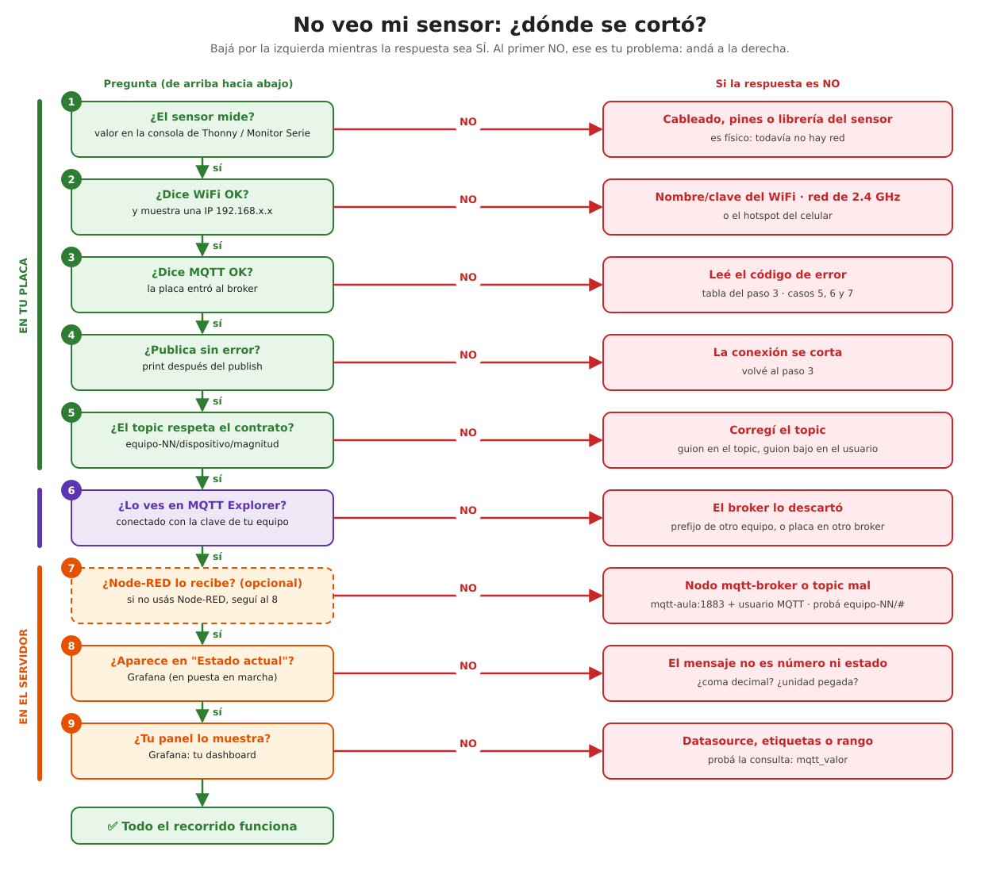
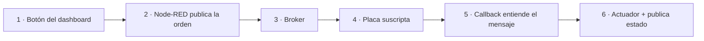
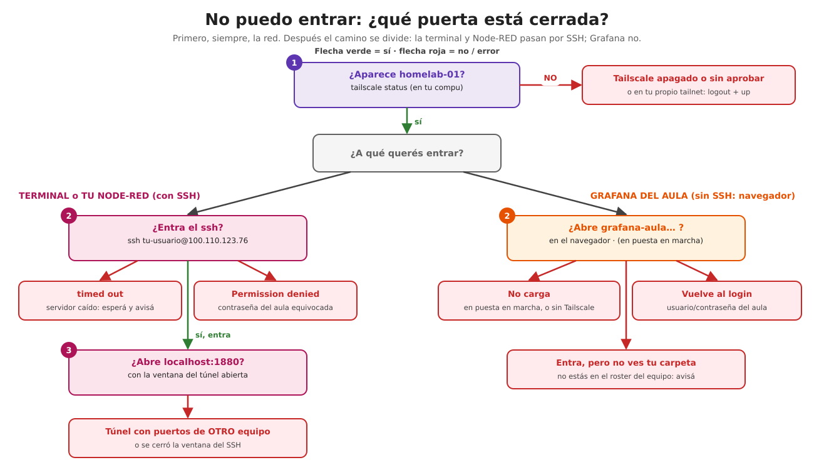

# Diagnóstico: ¿dónde se cortó el recorrido?

🎯 **Objetivo:** que puedas encontrar **vos mismo**, paso a paso, en qué punto del
camino se pierde tu dato (o tu orden), incluso en medio de la muestra.

🧩 **Antes de empezar:** el recorrido completo está explicado en
[el capítulo 11, "Seguí un dato"](11-arquitectura-iot.md#segui-un-dato-de-punta-a-punta-247-c).
Acá lo recorremos **al revés**: buscando dónde se rompió.

**Palabras que vas a usar:** [broker](glosario.md#broker-mqtt) ·
[topic](glosario.md#topic) · [payload](glosario.md#payload-carga) ·
[MQTT Explorer](glosario.md#mqtt-explorer) · [túnel](glosario.md#tunel) ·
[datasource](glosario.md#datasource-fuente-de-datos).

**Elegí tu problema:**

- 📉 [Mi ESP32 mide, pero no veo los datos](#mi-esp32-mide-pero-no-veo-los-datos)
- 🔌 [Aprieto el botón y mi actuador no responde](#aprieto-el-boton-y-mi-actuador-no-responde)
- 🔐 [No puedo entrar a algo (servidor, Node-RED, Grafana)](#no-puedo-entrar-a-algo)
- ⏱️ [Chequeo rápido antes de la muestra](#chequeo-rapido-antes-de-la-muestra)

---

## La herramienta clave: escuchar el broker desde tu compu

Casi todo el diagnóstico se resuelve con una pregunta: **¿el mensaje llegó al
broker?** Si llegó, el problema está "después" (Node-RED, Grafana). Si no llegó,
está "antes" (la placa, el WiFi, la clave).

Para responderla sin pedirle nada al profe, usá **MQTT Explorer**: un programa
gratuito (Windows, Linux, Mac) que se conecta al broker **como si fuera otra placa
de tu equipo** y te muestra todo lo que pasa en tus topics. Descargalo de
<https://mqtt-explorer.com> y configuralo así:

| Campo | Valor |
|---|---|
| Protocolo | `mqtt://` con **Encryption (tls)** activado |
| Host | `homelab-01.tail4eda13.ts.net` |
| Port | `10000` |
| Username | `equipo_NN` (con **guion bajo**) |
| Password | tu `MQTT_PASSWORD` (de `.shared-services.env`) |
| *Advanced* → Topic | borrá los que vienen y poné **`equipo-NN/#`** (con **guion**) |

Conectá. Cada mensaje de tu equipo aparece en el árbol, con su valor y la hora.

> No necesitás Tailscale para esto: MQTT Explorer entra por el mismo camino que tu
> placa (Funnel). Y como usa la clave de tu equipo, solo ve **tus** topics.

---

## Mi ESP32 mide, pero no veo los datos

### Paso 1 — ¿El sensor mide?

- **Qué compruebo:** que la placa **lee** el sensor, antes de cualquier red.
- **Cómo:** agregá un `print(valor)` (MicroPython) o `Serial.println(valor)`
  (Arduino) justo después de leer, y mirá la consola de Thonny o el Monitor Serie
  (115200 baudios).
- **Qué debería pasar:** un número razonable (`24.7`, no `0`, `-127` ni `nan`).
- **Si falla:** es un problema **físico o de la librería**: cables, pin equivocado,
  alimentación (3.3 V o 5 V), librería del sensor. Todavía no tiene nada que ver
  con el servidor.

### Paso 2 — ¿La ESP32 tiene WiFi?

- **Qué compruebo:** que la placa se conectó a la red y tiene una dirección IP.
- **Cómo:** en la consola tiene que aparecer `WiFi OK` y una IP (`192.168.x.x`).
- **Qué debería pasar:** aparece en pocos segundos.
- **Si falla:**
  - se queda en `Conectando…` → nombre o clave del WiFi mal, o la red es de
    **5 GHz** (la ESP32 solo ve **2.4 GHz**);
  - `Wifi Internal State Error` → [caso 4](10-casos-practicos.md#caso-4-wifi-internal-state-error-despues-de-reiniciar);
  - red del colegio que pide usuario en una página → la ESP32 no la puede usar:
    usá el hotspot del celular en 2.4 GHz.

### Paso 3 — ¿Llega al broker?

- **Qué compruebo:** que la placa **sale a internet**, llega al portero (Funnel) y
  el broker **la acepta**.
- **Cómo:** la consola tiene que decir `MQTT OK`. Si no, el **código de error**
  dice qué pasó:

| Lo que ves | Qué significa | Ir a… |
|---|---|---|
| `5` / `not authorised` / `4` (Arduino) | **llegó**, pero usuario o clave MQTT mal | [caso 5](10-casos-practicos.md#caso-5-el-error-5-o-not-authorised-claves-mezcladas) · [tabla de credenciales](red-y-accesos.md#tus-credenciales-en-una-tabla) |
| `-2` (Arduino) / `ECONNREFUSED` / no resuelve | **no llega**: host, puerto o internet | revisá `homelab-01.tail4eda13.ts.net` y puerto `10000` |
| `-4` (Arduino) | conectó **sin cifrado** a un puerto que lo exige | usá `WiFiClientSecure` + `setInsecure()` ([cap. 12](12-conectar-a-grafana.md#ejemplo-b-arduino-sensor-actuador)) |
| `MBEDTLS_ERR_SSL_CONN_EOF` | cortaron la conexión mientras se armaba el cifrado | [caso 7](10-casos-practicos.md#caso-7-mbedtls_err_ssl_conn_eof-una-puerta-de-entrada-caida) |
| error y **el profe no ve ningún intento** en el broker | tu placa habla con **otro** broker | [caso 6](10-casos-practicos.md#caso-6-el-error-4-y-en-el-servidor-no-aparece-nada): revisá `MQTT_BROKER` |

- **Qué debería pasar:** `MQTT OK` una vez, y que no se repita cada pocos segundos
  (si se repite, se está desconectando y reconectando).

### Paso 4 — ¿Publica?

- **Qué compruebo:** que el código **llega** a la línea del `publish` y no tira error.
- **Cómo:** poné un `print("publiqué", valor)` justo después del `publish`.
- **Qué debería pasar:** aparece cada vez que mide (por ejemplo, cada 10 segundos).
- **Si falla:** si aparece `Error, reintento…` después de publicar, la conexión se
  corta: volvé al paso 3. Si nunca llega al `print`, el programa se quedó antes
  (¿un `while` sin salida?).

### Paso 5 — ¿El topic es correcto?

- **Qué compruebo:** que el topic respeta el **contrato** del aula.
- **Cómo:** compará tu topic con estas reglas:

| ✅ Bien | ❌ Mal | Por qué |
|---|---|---|
| `equipo-04/sala/temperatura` | `equipo_04/sala/temperatura` | el topic va con **guion**; el guion bajo es el **usuario** |
| `equipo-04/sala/temperatura` | `equipo-04/temperatura` | faltan partes: ¿de qué dispositivo? |
| `equipo-04/enchufe/estado` | `casa/enchufe/estado` | no empieza con tu equipo: **el broker lo tira** |

- **Si falla:** corregí el topic en el código **y** en Node-RED si lo escucha
  ([reglas completas](12-conectar-a-grafana.md#las-3-reglas)).

### Paso 6 — ¿El servidor lo recibe?

- **Qué compruebo:** que el mensaje **entró al broker** del servidor.
- **Cómo:** abrí **MQTT Explorer** ([arriba](#la-herramienta-clave-escuchar-el-broker-desde-tu-compu))
  y buscá tu topic en el árbol.
- **Qué debería pasar:** aparece tu topic con el valor que mandó la placa, y se
  actualiza cuando mide de nuevo.
- **Si falla** (la placa dice que publicó pero MQTT Explorer no lo ve):
  - el topic **no empieza con tu equipo** → el broker lo descarta **sin avisar**;
  - la placa usa el usuario de **otro** equipo (mira otro carril);
  - la placa se conectó a **otro broker** ([caso 6](10-casos-practicos.md#caso-6-el-error-4-y-en-el-servidor-no-aparece-nada)).

### Paso 7 — ¿Node-RED lo recibe?

*Solo si tu proyecto usa Node-RED para este dato. Para que llegue a Grafana **no
hace falta** ([por qué](node-red-o-grafana.md#como-estan-conectados-hoy-en-el-aula)).*

- **Qué compruebo:** que tu Node-RED está conectado al broker y escucha el topic.
- **Cómo:** abrí tu Node-RED por el túnel ([guía, paso 1.2](guia-equipo.md#12-el-tunel-ssh-traer-tus-servicios-a-tu-compu)).
  Abajo del nodo `mqtt in` tiene que decir **"connected"** en verde. Conectale un
  nodo `debug` y mirá la pestaña de debug (el ícono del bichito, a la derecha).
- **Qué debería pasar:** cada mensaje aparece en el panel de debug.
- **Si falla:**
  - dice **"disconnected"** → el nodo *mqtt-broker* tiene que apuntar a
    `mqtt-aula`, puerto `1883`, con el usuario y la clave MQTT del equipo;
  - está "connected" pero no llega nada → el topic del nodo no coincide (probá
    `equipo-NN/#` para escuchar todo lo de tu equipo).

### Paso 8 — ¿Llega al almacenamiento?

- **Qué compruebo:** que el valor se **guardó** (Telegraf lo tradujo y lo escribió).
- **Cómo:** en Grafana, tu dashboard → tabla **Estado actual**.
- **Qué debería pasar:** aparece tu **dispositivo** y tu **magnitud** con el
  último valor, y la columna **Hace** en pocos segundos.
- **Si falla** (MQTT Explorer lo ve pero Grafana no):
  - el mensaje **no es un número ni una palabra de estado**: `23,5` (coma),
    `23.5C` (unidad pegada) o un texto libre se descartan
    ([regla 2](12-conectar-a-grafana.md#regla-2-el-mensaje-es-un-numero-una-palabra-de-estado-o-un-json));
  - el topic tiene **menos de 3 partes** (se descarta).

### Paso 9 — ¿Grafana consulta lo correcto?

- **Qué compruebo:** que **tu panel** pregunta por tu dato.
- **Cómo:** editá el panel (menú ⋮ → *Edit*) y revisá tres cosas:
  1. **Data source:** `MQTT — equipo-NN` (el de **tu** equipo);
  2. **Consulta:** `mqtt_valor{dispositivo="sala", magnitud="temperatura"}`, con los
     nombres **en minúsculas** y con `_` donde había espacios o guiones;
  3. **Rango de tiempo** (arriba a la derecha): que incluya el momento en que
     publicaste.
- **Si falla:** probá la consulta más simple, `mqtt_valor`: si así aparece, el
  problema está en el filtro ([recetario](13-usar-grafana.md#6-recetario-de-consultas)).

---

## Aprieto el botón y mi actuador no responde

El camino de una **orden** es al revés: de la pantalla a la placa
([el enchufe de Jorge, paso a paso](11-arquitectura-iot.md#el-viaje-completo-de-un-mensaje-jorge-prende-su-enchufe)).

| Paso | Qué compruebo | Cómo | Si falla |
|---|---|---|---|
| 1-2 | ¿Node-RED manda la orden? | MQTT Explorer: ¿aparece `equipo-NN/…/cmd` al apretar? | nodo `mqtt out` sin conectar o con otro topic |
| 3-4 | ¿La placa está escuchando ese topic? | en el código, el `subscribe` usa **exactamente** el mismo topic | corregir el topic (mayúsculas, guiones) |
| 5 | ¿La placa entiende el mensaje? | `print` del mensaje recibido en el callback | el formato no coincide: `ON` contra `1` ([caso 8](10-casos-practicos.md#caso-8-on-y-off-contra-1-y-0-el-contrato-sin-acordar)) |
| 6 | ¿El actuador se mueve y confirma? | el LED/relé cambia; aparece `…/estado` en MQTT Explorer | pin equivocado; no publica el estado confirmado |

> **Si el dashboard muestra "PRENDIDO" pero la placa está apagada**, el dashboard
> está mostrando la **orden** y no la **confirmación**: ver la
> [decisión 3 del capítulo 11](11-arquitectura-iot.md#decision-3-separar-la-orden-del-estado-confirmado).

---

## No puedo entrar a algo

Las cuatro puertas están explicadas en [Red y accesos](red-y-accesos.md#5-por-que-me-autentico-tantas-veces).
Primero va siempre la **red** (Tailscale). Después, el camino se **divide**: la
terminal y tu Node-RED pasan por **SSH**; Grafana **no**, alcanza con el navegador
([por qué](red-y-accesos.md#por-que-grafana-no-necesita-tunel-y-node-red-si)).

| Mensaje | Qué puerta | Qué hacer |
|---|---|---|
| `Connection timed out` | 1 · red | `tailscale status`; si no ves `homelab-01`, [guía paso 1.1](guia-equipo.md#11-tailscale-la-red-privada-del-aula) |
| `Permission denied` | 2 · servidor | es tu **contraseña del aula**, no la de Google ni la MQTT |
| `bind: Address already in use` | túnel | ya usás ese puerto en tu compu: cambiá el número de la izquierda (`-L 1890:…`) |
| El navegador "no puede conectar" a `localhost` | túnel | la ventana del SSH se cerró: abrila de nuevo y dejala abierta |
| Grafana vuelve al login | 3 · servicio | usuario y contraseña del aula |
| `& was unexpected at this time` | (tu terminal) | el comando era para PowerShell y estás en CMD: sin el `&` |

---

## Chequeo rápido antes de la muestra

Cinco minutos antes, en este orden:

1. ☐ La placa está enchufada y en la consola dice **`WiFi OK`** y **`MQTT OK`**.
2. ☐ En **MQTT Explorer** ves tus topics actualizándose.
3. ☐ El **túnel SSH** está abierto en una ventana que no vas a cerrar.
4. ☐ Tu **dashboard de Node-RED** (`http://localhost:1880/dashboard`) o tu página
   (`http://localhost:8080`) responde, y el botón mueve el actuador.
5. ☐ (Si está activo) tu tablero de **Grafana** muestra el último valor hace pocos
   segundos.
6. ☐ Tenés a mano: la **red WiFi** que usa la placa (¿es la misma del lugar de la
   muestra? ¿es de 2.4 GHz?) y el **hotspot del celular** como plan B.

> **Plan B si se cae la red del lugar:** el hotspot del celular (2.4 GHz) para la
> placa **y** para tu compu. Como todo pasa por internet (Funnel y Tailscale), no
> importa en qué red estés: si hay internet, funciona.

---

## Ahora deberías poder

- Ubicar en qué **tramo** se cortó tu dato: placa, WiFi, broker, topic, Node-RED,
  almacenamiento o panel.
- Usar **MQTT Explorer** para saber si el problema está antes o después del broker.
- Distinguir un problema de **red**, de **credenciales** o de **contrato**.

**Seguí por acá:**

- Para entender **por qué** el recorrido es así → [capítulo 11](11-arquitectura-iot.md).
- Para ver **historias reales** de estos errores → [capítulo 10](10-casos-practicos.md).
- Si el problema es **quién te deja entrar** → [Red y accesos](red-y-accesos.md).
