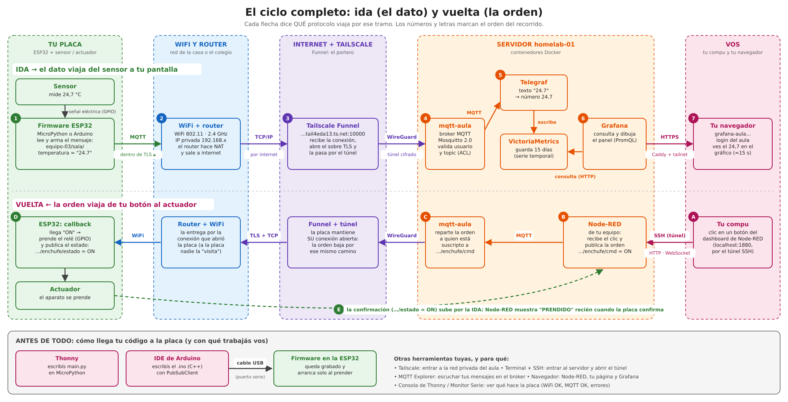
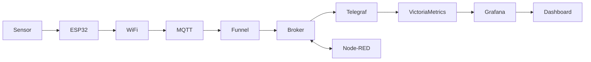
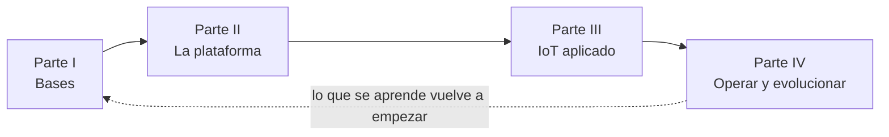

# Manual de Arquitectura del Homelab

> Un libro de estudio de **arquitectura de software aplicada al diseño IoT**:
> cómo se piensa, se construye y se cuida un sistema que conecta placas, mensajes,
> datos y pantallas. Usa como caso real el servidor del aula (este repositorio) y
> los proyectos de los equipos. Está escrito **para principiantes**: no asume que
> sabés nada, y cada sigla se explica la primera vez que aparece.
>
> **Autor:** Lucas D. Gómez, arquitecto de software · [Créditos y autoría](creditos.md)
>
> 📄 **Versión para imprimir o leer sin conexión:** el manual completo en PDF,
> ordenado desde Fundamentos y con todas las imágenes:
> [manual-arquitectura-homelab.pdf](https://github.com/resourceldg/homelab/raw/main/docs/manual-arquitectura-homelab.pdf).

## ¿Qué necesitás hoy?

No hace falta leer todo en orden. Elegí tu camino:

### 🚀 Tengo que hacer funcionar mi proyecto para la muestra

1. [Guía del equipo: conectarte](guia-equipo.md#1-conectarte) (Tailscale + túnel)
2. [Conectar tu placa: las 3 reglas del topic](12-conectar-a-grafana.md#las-3-reglas)
3. [Comprobar que llega, con MQTT Explorer](12-conectar-a-grafana.md#comprobar-que-llega-en-dos-pasos)
4. [Abrir tu dashboard de Node-RED](guia-equipo.md#35-tu-dashboard-de-node-red-y-tu-pagina)
5. [Chequeo rápido antes de la muestra](diagnostico.md#chequeo-rapido-antes-de-la-muestra)

### 🧠 Quiero entender la arquitectura completa

1. [Visión general](01-vision-general.md) → los planos del sistema
2. [Arquitectura IoT](11-arquitectura-iot.md) → las 6 capas y las 9 decisiones
3. [Seguí un dato: 24,7 °C](11-arquitectura-iot.md#segui-un-dato-de-punta-a-punta-247-c) → el recorrido real
4. [Red y accesos](red-y-accesos.md) → la parte invisible
5. [Ciclo de vida y madurez](15-ciclo-de-vida-y-madurez.md) → cómo nace y crece

### 📊 Necesito visualizar mis sensores

1. [Las 3 reglas del topic](12-conectar-a-grafana.md#las-3-reglas) → MQTT
2. [Seguí un dato](11-arquitectura-iot.md#segui-un-dato-de-punta-a-punta-247-c) → cómo se guarda
3. [Usar Grafana](13-usar-grafana.md) → tu dashboard
4. [Recetario de consultas](13-usar-grafana.md#6-recetario-de-consultas)

### 🔀 Necesito procesar datos o automatizar algo

1. [¿Node-RED, Grafana o ambos?](node-red-o-grafana.md) → decidir
2. [Caso B: reglas y órdenes](node-red-o-grafana.md#caso-b-hace-falta-node-red)
3. [Caso C: calcular y graficar](node-red-o-grafana.md#caso-c-los-dos-node-red-procesa-grafana-muestra)
4. [Los proyectos de los equipos](14-proyectos-de-los-equipos.md) → cómo lo hicieron otros

### 🔐 No puedo acceder al servidor

1. [Diagnóstico: no puedo entrar](diagnostico.md#no-puedo-entrar-a-algo) → paso a paso
2. [Red y accesos](red-y-accesos.md) → Tailscale, túneles y las 4 capas
3. [Tus credenciales, en una tabla](red-y-accesos.md#tus-credenciales-en-una-tabla)

### 🔧 Algo dejó de funcionar

1. [Diagnóstico](diagnostico.md) → dónde se cortó el recorrido
2. [Casos prácticos](10-casos-practicos.md) → errores reales y cómo se resolvieron
3. [¿Qué pasa si se cae cada pieza?](11-arquitectura-iot.md#que-pasa-si-se-cae-cada-pieza)

---

## Lo que vas a poder explicar al terminar

> "Mi **ESP32** toma el dato del **sensor**, lo **publica por MQTT** en el topic de
> mi equipo; viaja por **WiFi e internet** y entra al servidor por **Funnel**; el
> **broker** lo reparte; **Telegraf** lo guarda en **VictoriaMetrics**, y **Grafana**
> lo consulta para dibujar mi dashboard. **Node-RED**, al costado, recibe los
> eventos, aplica mis reglas y manda órdenes a mis actuadores. Yo llego a todo eso
> por **Tailscale**, con un **túnel** para lo que no tiene login."



En versión corta:



Y también el ciclo del software: **código → repositorio → despliegue → ejecución
→ observabilidad → mantenimiento** ([capítulo 15](15-ciclo-de-vida-y-madurez.md#el-ciclo-de-vida-de-tu-proyecto)).

---

## ¿Para quién es este manual?

Está pensado para tres tipos de lectores:

1. **Alguien que nunca vio Docker ni un servidor.** Empezá por el principio y leé
   en orden. Cada concepto se explica desde cero.
2. **Alguien que conoce Linux pero no entiende cómo encaja todo.** Podés saltear
   los fundamentos e ir a los capítulos de arquitectura y servicios.
3. **Alguien con experiencia que quiere entender el diseño rápido.** Leé la
   [Visión general](01-vision-general.md) y los "resúmenes" y diagramas de cada
   capítulo.

## Cómo leerlo

Cada capítulo tiene siempre la misma estructura, para que sepas qué esperar:

- 🎯 **Objetivo** — qué vas a poder hacer/entender al terminar.
- 🧩 **Prerequisitos** — qué conviene haber leído antes.
- 🆕 **Conceptos nuevos** — las palabras nuevas que aparecen.
- 📖 **Desarrollo** — la explicación, con dibujos.
- 🧠 **Ideas clave** — lo que no te tenés que olvidar.
- ⚠️ **Errores comunes** — en qué se tropieza todo el mundo.
- ❓ **Preguntas de repaso** — para chequear que entendiste.
- 🛠️ **Ejercicios** — para practicar.

> **Convención:** cuando veas una palabra en **negrita** por primera vez, casi
> siempre está también en el [Glosario](glosario.md) con una definición simple y
> una técnica.

## Filosofía del manual

**Aprendemos desde lo cercano.** Cada tema arranca por algo que ya conocés (un
grupo de WhatsApp, el tablero de un auto, una bici) o por un proyecto de un
compañero, y recién después aparece la palabra técnica. Ninguna sigla se da por
sabida: la primera vez se explica, y siempre está en el [Glosario](glosario.md).

No describimos archivos: explicamos **por qué existen**. Para cada decisión de
diseño respondemos:

- ¿Qué problema resuelve?
- ¿Cómo interactúa con lo demás?
- ¿Qué pasaría si no existiera?
- ¿Qué alternativas había y por qué se eligió ésta?

Cuando algo es una decisión mejorable, lo marcamos como **💡 Posible mejora
arquitectónica**.

## Índice del libro

El libro se lee en cuatro partes. Si sos alumno y querés **conectar tu placa ya**,
podés ir directo a la Parte III y volver a las otras cuando las necesites.



### Parte I — Bases

| # | Capítulo | De qué trata |
|---|---|---|
| 1 | [Visión general](01-vision-general.md) | Qué es el laboratorio y sus "planos" (host, servicios, aula, IoT) |
| 2 | [Fundamentos](02-fundamentos.md) | Computación, Linux y redes desde cero |
| 3 | [Docker y contenedores](03-docker.md) | Imágenes, contenedores, Compose, redes, volúmenes |
| 4 | [Ansible e IaC](04-ansible-iac.md) | Infraestructura como código |

### Parte II — La plataforma

| # | Capítulo | De qué trata |
|---|---|---|
| 5 | [Los servicios uno por uno](05-servicios.md) | Caddy, Grafana, Tailscale, Postgres, el broker… |
| 6 | [Observabilidad](06-observabilidad.md) | Medir, guardar y mostrar |
| 7 | [Seguridad](07-seguridad.md) | Defensa en capas |
| 8 | [El pipeline](08-pipeline.md) | Git, revisión, pruebas automáticas |
| 9 | [La plataforma de aula](09-plataforma-aula.md) | `labctl`, aislamiento, servicios compartidos |
| — | [Guía práctica del equipo](guia-equipo.md) | **Tu día a día:** conectarte, tus puertos, MQTT, tu página web |

### Parte III — IoT aplicado

| # | Capítulo | De qué trata |
|---|---|---|
| 11 | [Arquitectura IoT del aula](11-arquitectura-iot.md) | **La columna del libro:** las 6 capas, el recorrido de un dato y las 9 decisiones |
| — | [Red y accesos](red-y-accesos.md) | Tailscale, Funnel, túneles y por qué hay tantas contraseñas |
| 12 | [Conectar tus sensores a Grafana](12-conectar-a-grafana.md) | Las 3 reglas del topic, ejemplos en MicroPython y Arduino |
| — | [¿Node-RED, Grafana o ambos?](node-red-o-grafana.md) | Quién procesa, quién muestra, y cómo se combinan |
| 13 | [Usar Grafana](13-usar-grafana.md) | Leer y editar el tablero de tu equipo |
| 14 | [Los proyectos de los equipos](14-proyectos-de-los-equipos.md) | El LED, la puerta y el enchufe como casos de diseño |

### Parte IV — Operar y evolucionar

| # | Capítulo | De qué trata |
|---|---|---|
| — | [Diagnóstico](diagnostico.md) | **Dónde se cortó el recorrido:** árbol paso a paso, también para la muestra |
| 10 | [Casos prácticos](10-casos-practicos.md) | Nueve problemas reales y cómo se resolvieron |
| 15 | [Ciclo de vida y madurez](15-ciclo-de-vida-y-madurez.md) | Cómo nace y crece el sistema, sus stacks y qué tan maduro está |

### Para consultar

| | | |
|---|---|---|
| — | [Glosario](glosario.md) | Todas las palabras y siglas, de la A a la Z |
| — | [Créditos y autoría](creditos.md) | Quién hizo qué |
| — | [Mejoras futuras](mejoras-futuras.md) | Lo que falta, anotado |

## Cómo verlo como libro

Este manual está preparado para **[MkDocs Material](https://squidfunk.github.io/mkdocs-material/)**:

```bash
pip install mkdocs-material
mkdocs serve       # abrí http://127.0.0.1:8000
```

También se lee directo en GitHub (los diagramas Mermaid se renderizan solos) y se
puede exportar a PDF.
