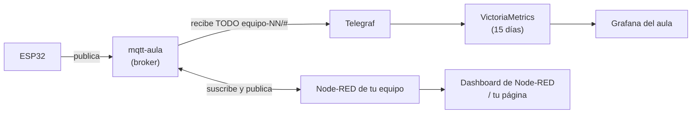
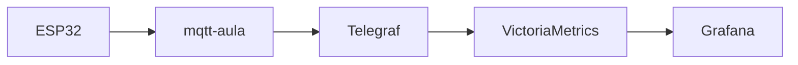
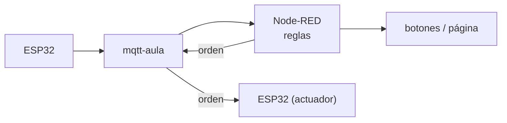
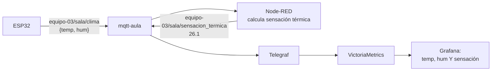

# ¿Node-RED, Grafana o ambos?

🎯 **Objetivo:** decidir, para **tu** proyecto, qué parte hace Node-RED, qué parte
hace Grafana y cómo se combinan. No son dos programas distintos "para hacer
gráficos": tienen **trabajos distintos**.

🧩 **Prerequisitos:** [capítulo 11 (Arquitectura IoT)](11-arquitectura-iot.md) y
[conectar tu placa (cap. 12)](12-conectar-a-grafana.md).

🆕 **Conceptos nuevos:** [flujo (*flow*)](glosario.md#flujo-flow), evento,
transformación, dato derivado, republicar. Repasá también
[broker](glosario.md#broker-mqtt), [topic](glosario.md#topic),
[dashboard](glosario.md#dashboard) y [datasource](glosario.md#datasource-fuente-de-datos).

---

## La idea en una frase

> **Node-RED piensa y actúa. Grafana mira y recuerda.**

Volviendo a la analogía del auto ([cap. 11](11-arquitectura-iot.md)):

- **Node-RED** es el **conductor**: recibe lo que pasa ("se abrió la puerta"),
  decide ("si está abierta hace 5 minutos…") y **hace** algo ("…prendé la luz
  roja").
- **Grafana** es el **tablero con historial**: muestra cómo estuvo todo en las
  últimas horas o días, pero **no maneja**.

### Cómo están conectados HOY en el aula

Fijate en dos cosas importantes:

1. **Los datos llegan a Grafana sin pasar por Node-RED.** Telegraf escucha el
   broker directamente. Si tu placa publica bien, aparece en Grafana aunque no
   tengas ni un nodo en Node-RED.
2. **Lo que Node-RED publique en un topic de tu equipo también llega a Grafana**,
   por el mismo camino. Esa es la llave del caso C.

---

## Caso A — Alcanza con Grafana

**Cuándo:** querés **ver** valores y **cómo cambian en el tiempo**, sin decidir ni
hacer nada.

**Ejemplos del aula:**

- La puerta de Jessi: ¿cuántas veces se abrió hoy y a qué hora? (Con su topic
  pasado a 3 partes, ver [cap. 14](14-proyectos-de-los-equipos.md#caso-2-la-puerta-de-jessi-equipo-01).)
- Una temperatura de la sala: la curva de las últimas 24 horas, el máximo, el promedio.
- El enchufe de Jorge: cuánto tiempo estuvo prendido el aparato.

**Qué hacés:** publicar respetando las [3 reglas](12-conectar-a-grafana.md#las-3-reglas)
y armar el panel en tu dashboard ([cap. 13](13-usar-grafana.md)). Nada más.

---

## Caso B — Hace falta Node-RED

**Cuándo:** algo tiene que **pasar** cuando llega un mensaje: decidir, transformar,
combinar o **responder**.

**Ejemplos del aula:**

- **Recibir una orden de una persona y mandarla a la placa:** el interruptor del
  enchufe de Jorge y los botones de la página de Mijael (Node-RED recibe el clic y
  publica `ON`).
- **Reaccionar a una condición:** "si la puerta de Jessi queda abierta más de 5
  minutos, publicá `ON` en el LED de alarma".
- **Transformar:** la placa manda grados Fahrenheit y vos querés Celsius; o manda
  un número crudo del sensor y hay que convertirlo.
- **Combinar:** "prendé el ventilador si la temperatura pasa de 28 **y** hay alguien
  en la sala".
- **Avisar:** mandar un mensaje cuando algo pasa.

**Por qué Node-RED y no Grafana:** Grafana no recibe órdenes ni ejecuta reglas
sobre cada mensaje. Su trabajo es consultar lo guardado y mostrarlo.

---

## Caso C — Los dos: Node-RED procesa, Grafana muestra

**Cuándo:** querés **ver en el tiempo** un valor que **no manda la placa**, sino
que hay que **calcular**.

La forma de hacerlo en este sistema es **republicar**: Node-RED calcula el valor
nuevo y lo publica en **otro topic de tu equipo**. Como Telegraf escucha todo
`equipo-NN/#`, ese valor calculado se guarda y aparece en Grafana como cualquier
otro.

**Ejemplos:**

- **Dato derivado:** sensación térmica a partir de temperatura y humedad.
- **Estado calculado:** "minutos que la puerta lleva abierta", publicado cada
  minuto en `equipo-01/puerta/minutos_abierta`.
- **Promedio de varios sensores:** tres placas miden la temperatura y Node-RED
  publica el promedio en `equipo-NN/sala/temp_promedio`.

**En Node-RED:** nodo `mqtt in` (escucha) → nodo `function` (calcula) → nodo
`mqtt out` (publica en el topic nuevo, con el **mismo** usuario MQTT del equipo).
El topic nuevo tiene que respetar el [contrato](12-conectar-a-grafana.md#las-3-reglas).

> **¿Y si guardo en mi base de datos (PostgreSQL)?** Tu Node-RED puede guardar en
> la base de tu equipo, y sirve para registros (quién, cuándo). Pero hoy el
> **Grafana del aula no lee esas bases**: para que algo se vea en Grafana, tiene
> que pasar por MQTT.

---

## La tabla para decidir

| Necesito… | Node-RED | Grafana | Ambos | Por qué |
|---|:-:|:-:|:-:|---|
| ver la temperatura de las últimas horas | | ✅ | | historial: lo guarda Telegraf, lo muestra Grafana |
| un botón que prenda el LED | ✅ | | | es una **orden**: Grafana no manda órdenes |
| ver cuándo la placa prendió el enchufe | | ✅ | | el estado confirmado ya llega por MQTT (para saber si **de verdad** consumió, hay que medirlo) |
| apagar algo si pasa una condición | ✅ | | | es una **regla** que reacciona a cada mensaje |
| graficar un valor **calculado** | | | ✅ | Node-RED calcula y republica; Grafana lo muestra |
| convertir unidades antes de guardar | | | ✅ | o mejor: que la placa ya mande la unidad correcta |
| una pantalla con botones para la muestra | ✅ | | | dashboard de Node-RED (ver la [guía](guia-equipo.md#35-tu-dashboard-de-node-red-y-tu-pagina)) |
| mostrar en la muestra cómo evolucionó todo | | ✅ | | Grafana del aula (cuando esté activo) |
| avisar si la placa se desconectó | ✅ | ✅ | | Node-RED reacciona al `offline`; Grafana muestra hace cuánto |

**No es una regla absoluta.** Node-RED también tiene gráficos en su dashboard, y
para una demo rápida en vivo pueden alcanzar. La diferencia es que Node-RED
**no guarda historial** (si recargás la página, empieza de cero) y Grafana sí.

---

## Para la muestra

Lo más completo es **mostrar las dos pantallas**, porque cuentan dos partes de la
historia de tu sistema:

| Pantalla | Qué cuenta | Cómo se abre |
|---|---|---|
| **Dashboard de Node-RED** (o tu página) | "puedo **controlar** mi sistema en vivo" | túnel SSH → `http://localhost:1880/dashboard` |
| **Grafana del aula** | "mi sistema **registra** lo que pasa y lo puedo analizar" | `https://grafana-aula.lucasland.duckdns.org` (cuando esté activo) |

---

## Ahora deberías entender

- **Node-RED** recibe eventos, decide, transforma y **actúa**. **Grafana** consulta
  lo guardado y **muestra**.
- En el aula, los datos llegan a Grafana **directo desde el broker**, sin pasar por
  Node-RED.
- Para graficar algo calculado, Node-RED lo **republica** en un topic de tu equipo.

**Seguí por acá:**

- Si querés **armar tu dashboard de Grafana** → [capítulo 13](13-usar-grafana.md).
- Si querés **abrir tu Node-RED** → [guía del equipo, paso 1.2](guia-equipo.md#12-el-tunel-ssh-traer-tus-servicios-a-tu-compu).
- Si querés ver **cómo lo resolvieron otros equipos** → [capítulo 14](14-proyectos-de-los-equipos.md).
- Si **algo no aparece** → [Diagnóstico](diagnostico.md).
