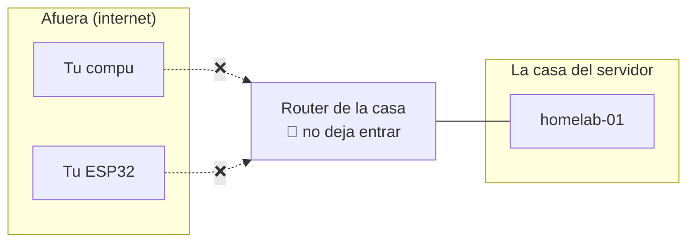
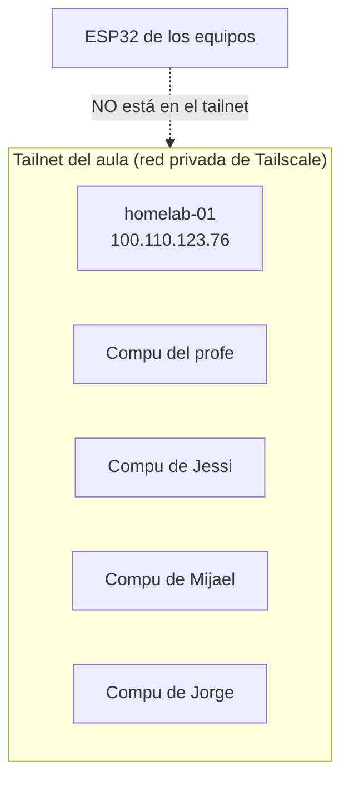
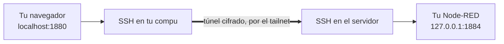
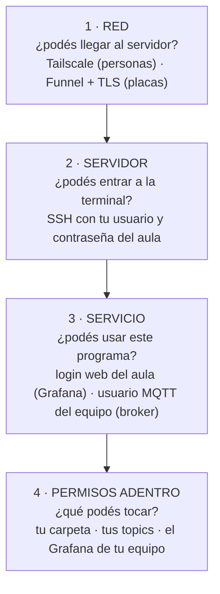
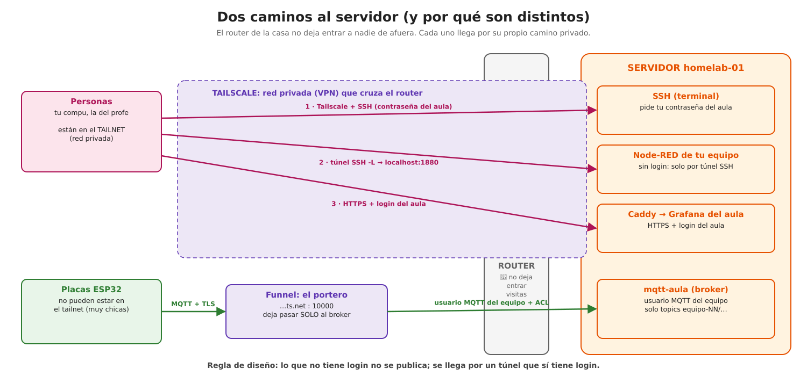
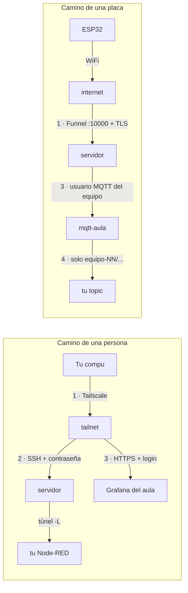

# Red y accesos: cómo llegás a cada cosa (y por qué hay tantas contraseñas)

🎯 **Objetivo:** entender la parte "invisible" que empieza después de que tu
ESP32 se conecta al WiFi: **por dónde viajan** tu placa y tu compu hasta el
servidor, **qué es Tailscale** y por qué lo usamos, **qué es un túnel**, y por qué
te piden **distintas** autenticaciones en cada paso.

🧩 **Prerequisitos:** [capítulo 11 (Arquitectura IoT)](11-arquitectura-iot.md).

🆕 **Conceptos nuevos** (cada uno con su definición en el glosario):
[VPN](glosario.md#vpn-virtual-private-network) ·
[Tailscale / tailnet](glosario.md#tailscale-tailnet) ·
[Funnel](glosario.md#funnel-tailscale-funnel) ·
[túnel](glosario.md#tunel) ·
[proxy inverso](glosario.md#proxy-inverso) ·
[autenticación](glosario.md#autenticacion) ·
[autorización](glosario.md#autorizacion) ·
[credencial](glosario.md#credencial).

> **Si tenés apuro:** ¿solo necesitás conectarte ya? → [guía del equipo, paso 1](guia-equipo.md#1-conectarte).
> ¿No podés entrar a algo? → [Diagnóstico de accesos](diagnostico.md#no-puedo-entrar-a-algo).

---

## 1. El problema: el servidor está en una casa

El servidor del aula es una computadora que está en una **casa**, conectada a un
**router** común (el aparatito que da internet). Pensá en tu propia casa: desde
afuera, nadie puede entrar a tu compu. El router funciona como la **puerta de
calle**: deja **salir** todo, pero no deja **entrar** a nadie que no haya sido
invitado.

Eso es bueno para la seguridad, pero nos deja un problema: ustedes, desde sus
casas o desde el colegio, **necesitan llegar** a Node-RED, a Grafana o a la
terminal del servidor. Y sus placas necesitan llegar al broker MQTT.



### ¿Por qué no "abrimos la puerta" y listo?

Se podría configurar el router para que deje entrar todo (eso se llama
**redirección de puertos**). No lo hacemos por tres razones:

1. **Internet está lleno de robots** que prueban contraseñas en cualquier
   computadora que encuentran abierta, todo el día.
2. **Algunos servicios no tienen contraseña**. El editor de Node-RED, por ejemplo,
   permite ejecutar **cualquier cosa** en el servidor: abierto a internet, sería
   regalarle el servidor a cualquiera.
3. **No siempre se puede.** El router de esta casa (y muchos proveedores de
   internet) ni siquiera lo permite.

**La decisión de arquitectura:** no abrir puertas al público, y en cambio armar
**caminos privados** para cada uno que necesita entrar. Son dos caminos, uno para
**personas** y otro para **placas**.

---

## 2. El camino de las personas: Tailscale, una red privada

### La idea

Imaginá que el servidor, tu compu y las de tus compañeros estuvieran enchufados al
**mismo router**, como en una sala de computación, aunque cada uno esté en su
casa. Eso es una **red privada**: un "club" de máquinas que se ven entre ellas, y
nadie de afuera las ve.

A una red privada que viaja **por adentro de internet**, cifrada, se le dice
**VPN** (*Virtual Private Network*, red privada virtual). **Tailscale** es el
programa que arma esa VPN de forma muy simple: lo instalás, te unís con una clave,
y listo. A la red privada que arma Tailscale se le dice **tailnet**.

### Qué máquinas participan



- **Están en el tailnet:** el servidor (`homelab-01`, IP privada `100.110.123.76`),
  la compu del profe y las compus de los alumnos que se sumaron con su clave.
- **No están:** las ESP32. Tailscale es un programa para computadoras y celulares;
  una placa tan chica no lo puede correr. Por eso las placas tienen **su propio
  camino** (sección 3).

### Qué puede ver cada uno

Estar en el tailnet te deja **llegar** al servidor, pero llegar no es entrar:

- Ves al servidor en su IP privada (`100.110.123.76`).
- En el servidor solo responde lo que está habilitado para el tailnet: la
  **terminal** (SSH) y la **puerta web** (Caddy, que pide login).
- Los servicios **sin login propio** (tu Node-RED, tu página nginx) **no** responden
  al tailnet: escuchan **solo adentro del servidor** (`127.0.0.1`). Para llegar a
  ellos hace falta un túnel (sección 4).

> **Error típico real:** si entraste a Tailscale con tu cuenta de Google antes de
> usar la clave del aula, Tailscale te armó **tu propio** tailnet vacío, sin el
> servidor. Por eso el primer comando es `tailscale logout`
> ([caso real](10-casos-practicos.md) y [guía, paso 1.1](guia-equipo.md#11-tailscale-la-red-privada-del-aula)).

---

## 3. El camino de las placas: Funnel, un portero en internet

La ESP32 no puede estar en el tailnet, pero necesita llegar al broker. La solución
es **Tailscale Funnel**: un servicio de Tailscale que pone un **portero** en
internet, con una dirección pública, y le abre la puerta **solo a un servicio**
del servidor:

```
homelab-01.tail4eda13.ts.net : 10000   →   broker MQTT del aula (mqtt-aula)
```

Ese portero no deja pasar a cualquiera a cualquier lado. Del otro lado está el
broker, que exige:

- **cifrado** (TLS: el sobre cerrado), y
- **usuario y clave del equipo**, y además
- solo deja usar los **topics de tu equipo** (`equipo-NN/...`).

Por eso es razonable dejar **solo el broker** en internet: tiene tres protecciones
propias. El editor de Node-RED, que no tiene ninguna, **nunca** sale por acá.

---

## 4. El túnel: llegar a lo que no está publicado

Tu Node-RED escucha **solo adentro del servidor**. ¿Cómo lo abrís en tu navegador?
Con un **túnel**.

Un **túnel** es un **pasillo privado y cifrado** entre tu compu y el servidor: lo
que entra por una punta sale por la otra. Lo arma **SSH** (la conexión segura a la
terminal del servidor) con la opción `-L`:



`ssh -L 1880:localhost:1884 jorge@100.110.123.76` se lee:

> "Abrí un pasillo: lo que mande al **1880 de mi compu** que salga en el **1884
> del servidor**."

Por eso en el navegador escribís `localhost:1880` (que significa "mi propia
compu") y ves **tu Node-RED, que está en el servidor**. Los números de cada equipo
están en la [guía, paso 1.2](guia-equipo.md#12-el-tunel-ssh-traer-tus-servicios-a-tu-compu).

### ¿Por qué Grafana no necesita túnel y Node-RED sí?

| | Node-RED de tu equipo | Grafana del aula |
|---|---|---|
| ¿Tiene login propio? | **no**: cualquiera que llega, lo maneja | **sí**: pasa por el login del aula |
| ¿Dónde escucha? | solo adentro del servidor (`127.0.0.1`) | detrás de Caddy, la puerta web con login |
| ¿Cómo llegás? | tailnet **+ túnel SSH** (el SSH hace de login) | tailnet + navegador (`https://grafana-aula…`) |

La regla de diseño: **lo que no tiene login, no se publica; se llega por un túnel
que sí tiene login.**

---

## 5. ¿Por qué me autentico tantas veces?

Porque cada puerta protege **una cosa distinta**, y una no reemplaza a la otra.
Pasa lo mismo en un edificio: la llave de la puerta de calle no abre tu
departamento, y la de tu departamento no abre el de al lado.

Dos palabras para no mezclar:

- **Autenticación:** probar **quién sos** (usuario y contraseña, una clave).
- **Autorización:** decidir **qué podés hacer** una vez que se sabe quién sos.

### Las 4 capas



| Capa | Pregunta | En este sistema | Qué protege | Si falla… |
|---|---|---|---|---|
| **1 · Red** | ¿podés llegar? | **Tailscale** (compus) · **Funnel + TLS** (placas) | que nadie de internet llegue a los servicios privados | `Connection timed out` → [diagnóstico](diagnostico.md#no-puedo-entrar-a-algo) |
| **2 · Servidor** | ¿podés entrar a la terminal? | **SSH** con tu usuario del aula | la terminal, tus archivos, los túneles | `Permission denied` |
| **3 · Servicio** | ¿podés usar este programa? | Grafana: **login del aula** (Authelia) · broker: **usuario MQTT del equipo** · Node-RED: protegido por el túnel SSH | cada programa por separado | Grafana te devuelve al login · la placa da error `5` |
| **4 · Permisos** | ¿qué podés tocar adentro? | Linux: solo tu carpeta · broker: solo `equipo-NN/...` · Grafana: solo la organización de tu equipo | que un equipo no toque lo de otro | el mensaje se descarta sin aviso · no ves la carpeta |

### Tus credenciales, en una tabla

Este es el origen de la mayoría de los errores de este año (ver los
[casos 5 y 6](10-casos-practicos.md#caso-5-el-error-5-o-not-authorised-claves-mezcladas)):

| Para… | Usuario | Clave | Quién la usa |
|---|---|---|---|
| Entrar al **tailnet** | — | la *auth key* de Tailscale (`tskey-auth-…`), una vez | tu compu |
| Entrar al **servidor** (SSH) y a **Grafana** | tu nombre (`jorge`) | tu **contraseña del aula** | vos |
| Que la **placa** entre al **broker** | el del equipo, con **guion bajo** (`equipo_04`) | `MQTT_PASSWORD` de tu `.shared-services.env` | tu ESP32 y tu Node-RED |
| Que la **placa** entre al **WiFi** | el nombre de la red | la clave del WiFi | tu ESP32 |

> **La confusión más común:** poner la contraseña del aula en la placa, o la
> clave MQTT en el SSH. Son puertas distintas con llaves distintas.

### ¿Por qué no una sola contraseña para todo?

Porque **cada capa protege algo distinto y la puede usar alguien distinto**. La
clave MQTT la tienen que conocer **una placa** y **un Node-RED**: si fuera tu
contraseña del aula, quien vea el código de tu placa podría entrar a tu terminal.
Separarlas hace que perder una llave no abra todas las puertas (ver
**defensa en profundidad** en el [capítulo 7](07-seguridad.md)).

---

## 6. Los dos caminos, completos



El mismo dibujo, paso a paso:



---

## Ahora deberías entender

- **Qué problema resolvemos:** el servidor está detrás de un router que no deja
  entrar, y no queremos abrirlo a internet.
- **Dónde está cada cosa:** las personas entran por **Tailscale**; las placas, por
  **Funnel**; lo que no tiene login, por un **túnel SSH**.
- **Qué protege cada autenticación:** red → servidor → servicio → permisos.

**Seguí por acá:**

- Si necesitás **conectarte ahora** → [guía del equipo, paso 1](guia-equipo.md#1-conectarte).
- Si querés **seguir un dato** desde la placa hasta Grafana → [capítulo 11, "Seguí un dato"](11-arquitectura-iot.md#segui-un-dato-de-punta-a-punta-247-c).
- Si **llegás al servidor pero algo no te deja entrar** → [Diagnóstico: no puedo entrar](diagnostico.md#no-puedo-entrar-a-algo).
- Si querés **las capas de seguridad del servidor** en detalle → [capítulo 7](07-seguridad.md).

> **Para profundizar (operador):** las reglas reales están en
> `ansible/roles/users_ssh/templates/sshd_config.j2` (bloque `Match Group
> classroom`), en el `Caddyfile` y en `configuration.yml.j2` de Authelia. El
> Funnel y el Split DNS se explican en [`docs/deployment-guide.md`](https://github.com/resourceldg/homelab/blob/main/docs/deployment-guide.md#13-cómo-se-llega-a-los-servicios).
