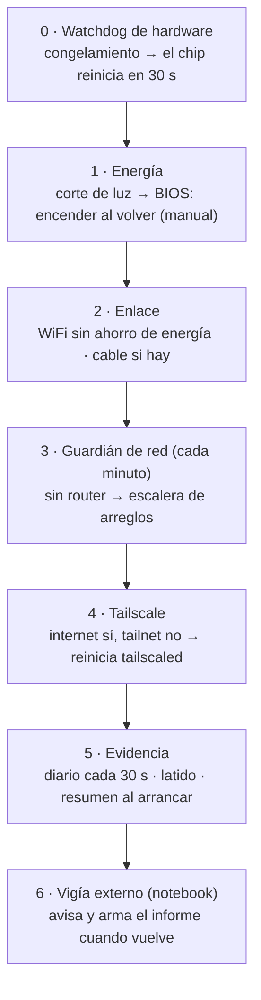

# Robustez ante caídas (`vigia_red`)

El servidor está en una casa, con un WiFi USB viejo y sin nadie cerca para
reiniciarlo. Este rol hace que **se recupere solo** de las caídas que puede
arreglar, y que **deje evidencia** de las que no, para entender cada una después.

Se aplica con `--tags vigia-red` (también entra en `--tags network`).

## Por qué existe

El 2026-10-03 el servidor estuvo **dos horas fuera de línea**. El diario del
sistema se cortó en seco a las 12:48:30, sin apagado, y recién volvió cuando
alguien lo prendió a las 14:40. La máquina **se congeló o se quedó sin luz**: no
fue la red. Ningún programa puede actuar en una máquina congelada, así que hace
falta una capa **por debajo** del sistema operativo: el watchdog de hardware.

Caso completo, para alumnos: [capítulo 10, caso 10](handbook/10-casos-practicos.md).

## Las capas



| Capa | Ante qué | Qué hace | Dónde |
|---|---|---|---|
| **0 · Watchdog de hardware** | la máquina se **congela** | systemd le da señal al chip iTCO de la placa (ASRock H81M) cada pocos segundos; si deja de llegar 30 s, el chip **reinicia** el equipo. Si un reinicio se cuelga, lo fuerza a los 5 min | `/etc/modules-load.d/vigia-watchdog.conf`, `/etc/systemd/system.conf.d/50-vigia-watchdog.conf` |
| **1 · Energía** | corte de luz | BIOS: **Restore on AC/Power Loss → Power On** (ver abajo, es manual) | BIOS |
| **2 · Enlace** | el WiFi USB "se duerme"; el router arranca más lento | ahorro de energía del WiFi **apagado**; cada red guardada **reintenta para siempre** (`autoconnect-retries 0`) | `/etc/NetworkManager/conf.d/zz-vigia-wifi-powersave.conf` |
| **3 · Guardián de red** | no responde el router | escalera (minutos seguidos sin router): **2** reconectar, o si quedó sin conexión, buscar redes y conectar a la mejor guardada → **6** reiniciar NetworkManager → **10** resetear el USB del adaptador → **14** probar otras redes guardadas → **30** reiniciar el servidor (último recurso) | `/usr/local/sbin/vigia-red`, timer `vigia-red.timer` |
| **4 · Tailscale** | hay internet pero no tailnet | 3 min así → reinicia `tailscaled` (y cada 10 min si sigue) | idem |
| **5 · Evidencia** | entender después | diario en disco cada 30 s; **latido** por minuto; **resumen** del arranque anterior en cada arranque | `/var/lib/vigia-red/latido`, `/var/log/homelab/arranques/`, `/var/log/homelab/vigia-red.log` |
| **6 · Vigía externo** | el servidor no está | desde la notebook: avisa, y cuando vuelve arma el informe | `scripts/diagnosticar-caida.sh` (cron) |

### Decisiones que no se ven en el código

- **Si responde el router pero no internet, no se toca nada.** El problema está
  afuera (router o proveedor): reiniciar nuestro WiFi no lo arregla y suma ruido.
- **El reinicio por falta de red es el último recurso y tiene límites:** recién a
  los 30 min, nunca en los primeros 20 min de encendido (evita bucles de
  reinicio), y como mucho uno cada 6 h. Con `vigia_red_reinicio_min: 0` se apaga.
- **El watchdog solo se arma si el chip existe.** Si `/dev/watchdog0` no aparece,
  la capa queda apagada y el play lo dice.
- **Se probó sin tocar nada real:** `tests/test_vigia_red.py` simula red sana,
  internet caído afuera, la escalera minuto a minuto, el reinicio con sus límites
  y Tailscale caído.
- **El diagnóstico automático también se equivoca.** La primera versión contó el
  cierre de una sesión SSH como "apagado ordenado". Ahora solo cuenta el gestor
  del **sistema** (`systemd[1]`); el caso quedó como test de regresión mental en el
  manual.

## Lo que mostraron los registros (2026-09-17 a 2026-10-03)

Revisando los últimos 12 arranques del servidor:

**Se apaga de golpe muy seguido:** 7 de los últimos 10 arranques terminaron **sin
apagado ordenado**. La pausa hasta volver a arrancar dice mucho:

| Terminó | Volvió | Pausa | Lectura |
|---|---|---|---|
| 01/10 23:27 | 23:28 | 1 min | alguien **apretó el botón de encendido** dos veces (23:27:22 y 23:27:23) |
| 02/10 01:05 | 01:12 | 7 min | corte breve; el BIOS lo prendió al volver la luz |
| 02/10 17:51 | 18:27 | 36 min | después, alguien lo prendió y lo **apagó con el botón** a los 8 s |
| 02/10 19:38 | 19:40 | 1 min | corte muy breve |
| 02/10 21:21 | 21:41 | 20 min | |
| 03/10 12:48 | 14:40 | 2 h | se congeló o se cortó la luz; lo prendió una persona |

**Al arrancar, a veces tarda mucho en tener red:** el 22/09 NetworkManager no
intentó conectarse durante **3 h 26 min**; el 23/09 probó, falló con
`ssid-not-found` ("no encuentro la red") y dejó de intentar: conectó a los 37 min.
**Causa:** después de un corte, el servidor arranca más rápido que el router; NM
prueba 4 veces, no encuentra la red y se rinde un rato. **Arreglo:** cada red
guardada reintenta para siempre, y el guardián busca redes y conecta al minuto 2.

**Lección de configuración (NetworkManager):** el archivo de ahorro de energía se
llamaba `50-vigia-…` y **no tenía efecto**: Ubuntu trae
`default-wifi-powersave-on.conf`, que se lee después (orden alfabético) y lo
pisaba. Se verifica con `sudo NetworkManager --print-config`, no mirando el archivo.

## Lo que hay que hacer a mano (no se puede desde Ansible)

1. **BIOS → encender al volver la luz.** En la ASRock H81M-VG4: entrar al BIOS
   (F2 o Supr al arrancar) → *Advanced* → *Chipset Configuration* →
   **Restore on AC/Power Loss** → **Power On** (ya configurado). Si **a veces no
   prende** igual: revisar que **Deep S5 / ErP** esté **desactivado** (con ErP la
   placa ignora la vuelta de la luz), y tener en cuenta que un **parpadeo** de luz
   muy corto puede apagar la fuente sin que la placa registre "pérdida de energía":
   ahí solo lo salva una UPS.
2. **Un cable de red.** La placa tiene Ethernet (`enp2s0`) sin usar. Enchufado,
   NetworkManager lo prefiere solo (métrica 100 contra 600 del WiFi) y el WiFi
   queda de respaldo. Es la mejora más grande que se puede hacer.
3. **Cambiar el adaptador WiFi.** El actual es un **RTL8187B** (802.11g, 54 Mbps,
   de hace más de 15 años). Cualquier adaptador moderno con buen soporte en Linux
   es más estable.
4. **Una UPS** (batería) chica: con 7 apagados de golpe en dos semanas, es la
   mejora más importante después del cable. También protege la fuente y el disco.
5. **El botón de encendido.** Hubo apagados por el botón. Si no se quiere que un
   toque corto lo apague, se puede configurar que el sistema **ignore** el toque
   corto (`HandlePowerKey=ignore`); mantenerlo apretado 4 s sigue forzando el
   apagado. Es una decisión de la casa: no está aplicada.

## Comprobar que anda

```bash
# En el servidor
systemctl show -p RuntimeWatchdogUSec -p WatchdogDevice   # 30s · /dev/watchdog0
sudo wdctl | grep -E "Timeleft|Timeout"                  # Timeleft baja y se renueva
systemctl list-timers vigia-red.timer                    # corre cada minuto
sudo cat /var/lib/vigia-red/latido                       # hora del último latido
sudo tail /var/log/homelab/vigia-red.log                 # qué hizo (vacío = red sana)
sudo sh -c 'cat $(ls -1t /var/log/homelab/arranques/*.txt | head -1)'   # último resumen
iw dev wlx00085492a428 get power_save                    # Power save: off
```

## Ajustes

Variables en `ansible/roles/vigia_red/defaults/main.yml` (se pisan en el
inventario): minutos de cada paso, reinicio (`vigia_red_reinicio_min`, `0` =
nunca), límite de reinicios, minutos de gracia al arrancar, Tailscale y destinos
para comprobar internet. Se vuelcan en `/etc/default/vigia-red`.
